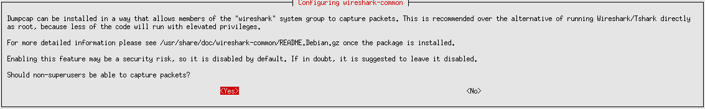
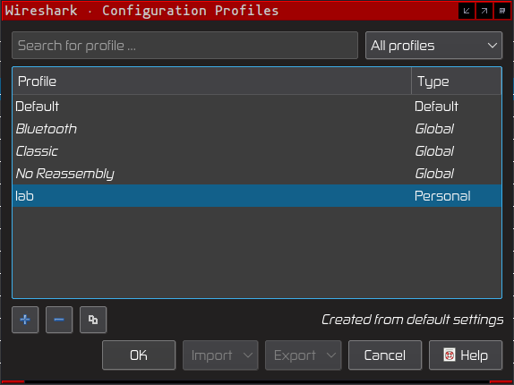

# Introduction

Wireshark allows for real time visualization of a network's traffic.

[Wireshark](https://www.wireshark.org/)

> "Wireshark is the world’s foremost and widely-used network protocol analyzer. It lets you see what’s happening on your network at a microscopic level and is the de facto (and often de jure) standard across many commercial and non-profit enterprises, government agencies, and educational institutions." [Wireshark website](https://www.wireshark.org/)

# Installation

On a Debian or related Linux distribution, type the following in a terminal window:

<pre><code class="bash">sudo add-apt-repository ppa:wireshark-dev/stable -y
sudo apt update
sudo apt -y install wireshark tshark </code></pre>

When Wireshark asks "Should non-superusers be able to capture packets?", select Yes.

To capture packets the user has to added to the "wireshark" group and for the changes to take effect, the user has to logout of the current session:

<pre><code class="bash">sudo usermod -a -G wireshark $USER</code></pre>

For other Operating Systems, Wireshark can be downloaded from [Wireshark website](https://www.wireshark.org/download.html)

# Configuration

## Geolocation

This script downloads a copy of MaxMind GeoLite2 database. You can create a free [MaxMind GeoLite2](https://www.maxmind.com/en/geolite2/signup) account to download the database, useful for Geolocation data details. Replace "YOUR_KEY" with your key value, then execute the following script:

<pre><code class="bash">mkdir -p /lab/tools/geoip && cat <<-'EOF' > "/lab/tools/geoip/update.sh"
#! /bin/bash

KEY="YOUR_KEY"

# Clean-up
rm *.mmdb
# Permalinks for GeoLite2 ASN 
wget "https://download.maxmind.com/app/geoip_download?edition_id=GeoLite2-ASN&license_key="$KEY"&suffix=tar.gz" -O GeoLite2-ASN.tar.gz
# Permalinks for GeoLite2 City 
wget "https://download.maxmind.com/app/geoip_download?edition_id=GeoLite2-City&license_key="$KEY"&suffix=tar.gz" -O GeoLite2-City.tar.gz
# Permalinks for GeoLite2 Country 
wget "https://download.maxmind.com/app/geoip_download?edition_id=GeoLite2-Country&license_key="$KEY"&suffix=tar.gz" -O GeoLite2-Country.tar.gz
ls *.tar.gz | xargs -I {} tar -xvf {} --strip-components=1 --wildcards *.mmdb --directory ./
rm *.tar.gz
EOF
chmod +x /lab/tools/geoip/update.sh</code></pre>

In Wireshark, navigate to Edit -> Preferences -> Name Resolution and set the database directory. Restart Wireshark.

## User profile

To add a new profile, navigate to Edit -> Configuration Profiles. Create a new profile of type Personal by clicking the "+" button and click "Ok" button to save the new profile.

## Disable the Bytes view

Deselect the View -> Packet Bytes checkbox, if necessary re-enable it back when needed. This allows for more information to be displayed on the screen.

# Adding comments to a Trace file for reporting

Laura Chappell's YouTube channel has a great video showing how to comment a PCAP file and use the details to create a network report [here](https://www.youtube.com/watch?v=MB8KHnhpkY0)

# Cheat Sheet

Laura Chappell from Chappell University has a great Wireshark Cheat Sheet available [here](https://www.chappell-university.com/post/network-forensics-cheat-sheet)

# References

https://www.wireshark.org/docs/wsug_html_chunked/
https://www.chappell-university.com/lauras-lab/categories/wireshark
https://unit42.paloaltonetworks.com/tag/wireshark-tutorial/