# Twitter post

Having finished the setup of my lab environment, the time had come to start analysing malware. All I need is samples to play around with. On the 16th of March 2021 I saw the following tweet which seemed like a good starting point:

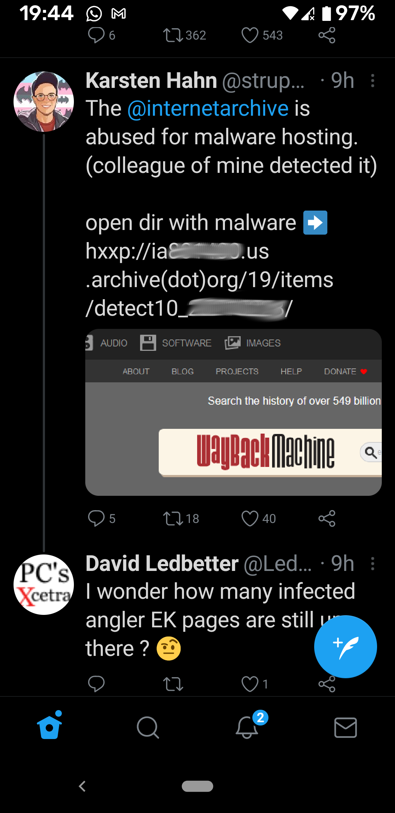

Following on the above tweet I went ahead and quickly downloaded the files from the server and started seeing how far I could go with my analysis.

# Objectives

I felt it was important to have a few objectives and consider outcomes to capitalize on the time I was prepared to spend with the analysis. So, with that in mind I wanted to:

- Improve analysis skills
- Track how long it would take me to analyse
- Identify shortcomings in the toolset available in the lab
- See how far I can go without any prior knowledge of the sample
- Be able to find data from other sources to allow me to progress with the analysis
- Identify gaps in my analysis methodology
- Document the process
- Produce a list of improvements or lessons learned

# Part 1 - Initial assessment
## Aquiring the samples

Using the web browser I typed the URL link and downloaded all files hosted on the website to my Gateway virtual machine. The list of file extensions hosted on the site included txt, xml, sqlite and torrent files. These were stored in different directories named atomic1 and eset_202102:

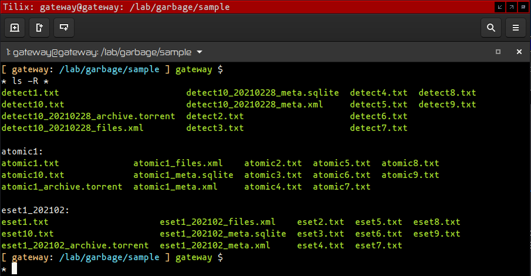

### Improvement needed:

- The analysis environment needs to provide a way to automate downloading of files recursively from a given website.

## A quick first look at the samples

Looking at the files names they followed a similar structure. Using vbindiff to check for differences between files at a binary level, the only difference reported was in the file name. Another observation made was, the files were simple text files:

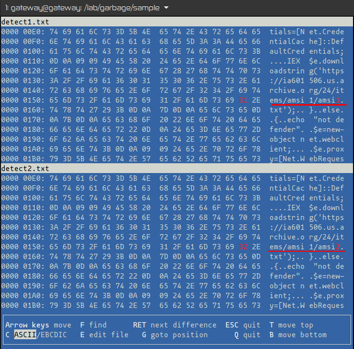

The first text file analysed was named "detect1.txt". This file contained what looked like a PowerShell script with a simple condition, finding the Windows Defender status using [Get-MpComputerStatus](https://docs.microsoft.com/en-us/powershell/module/defender/get-mpcomputerstatus?view=windowsserver2019-ps&viewFallbackFrom=win10-ps). Depending on the result, the script then proceeds to download the "amsi1.txt" or "eset1.txt" file. 

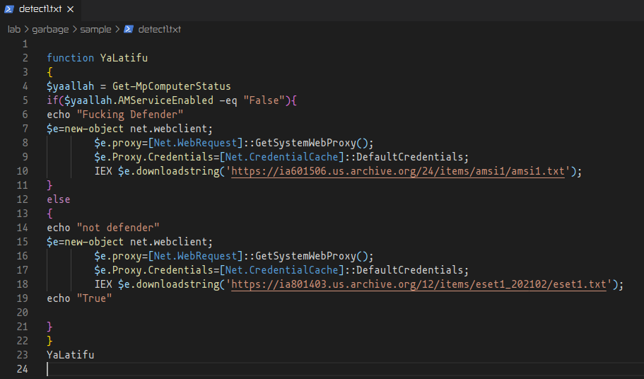

Unfortunately I made a beginner's mistake at this point. I completely forgot to download the file "amsi1.txt" for further investigation (insert face palm here!). By now I'm thinking it's better to pick another some other tweek, but as I already had the files I decided to carry on with the investigation.

### Improvement needed:

- Use a recursive website scraper.

The text file "eset1.txt" also contains what it looks like another PowerShell script:

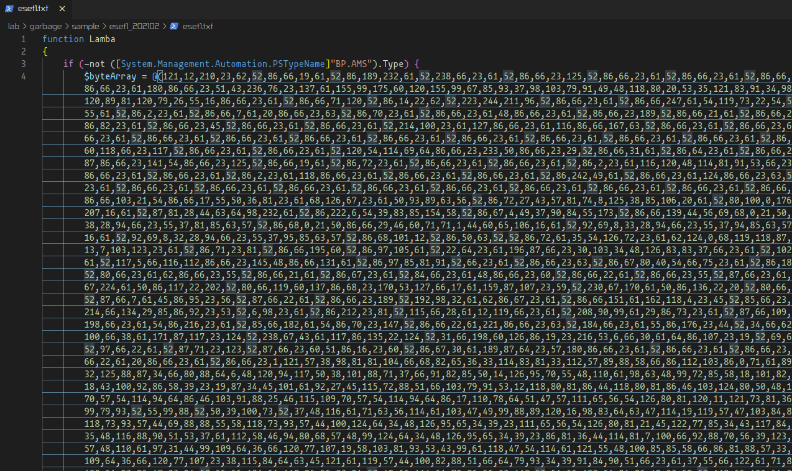

The script starts with a condition, and depending on the result of if (-not ([System.Management.Automation.PSTypeName]"BP.AMS").Type) the script can follow a different execution path. 

In case the condition is false, it executes [BP.AMS]::Disable() to disable the Anti Malware Scan program. Otherwise the script contains 2 variables.

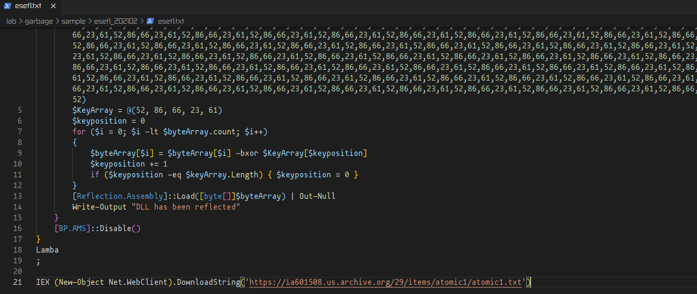

The first variable defines what looks like to be a previously xor'd set of numerical values, while the second variable contains a smaller set of numerical values. As the sample was not obfuscated, the main logic of the code is easily understandable.

A block of instructions that apply the programmed logic for every value in the byte values variable. It xor's the values in the first variable against the predefined set of values in the second variable, according to the cursor position and its counter value. To exemplify the first 6 operations:

1. ByteArray[0] = 121 xor 52 = 77
2. ByteArray[1] = 12 xor 86 = 90
3. ByteArray[2] = 210 xor 66 = 144
4. ByteArray[3] = 23 xor 23 = 0
5. ByteArray[4] = 62 xor 61 = 3
6. ByteArray[5] = 52 xor 52 = 0

To prevent malicious operations, I commented a few of the script lines of code in order to be able to output the results of the operation to a file:

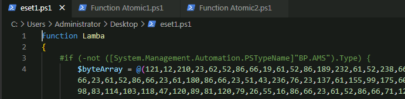

I've added the following lines on to the PowerShell script:

<pre><code class="bash">$string = [System.Text.Encoding]::Unicode.GetString($byteArray)
Write-Output $string | Out-File -FilePath c:\output\eset1.bin</code></pre>

The first line converts the variable to Unicode string (using 16 bits), while the second line allows to output the results to a file. 

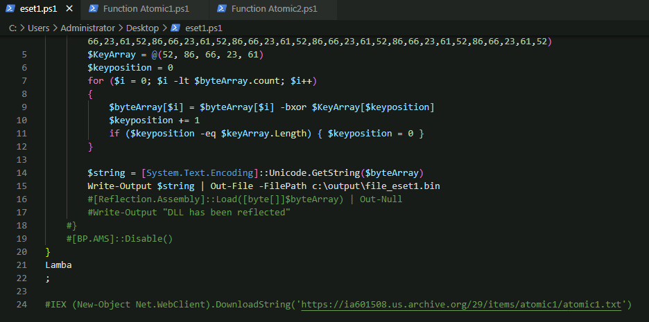

I also commented the last command IEX (New-Object Net.WebClient).DownloadString, as I previously had downloaded the file.

The "atomic1.txt" file is another PowerShell script, a longer one than the one contained in the previous file. The top of the file:

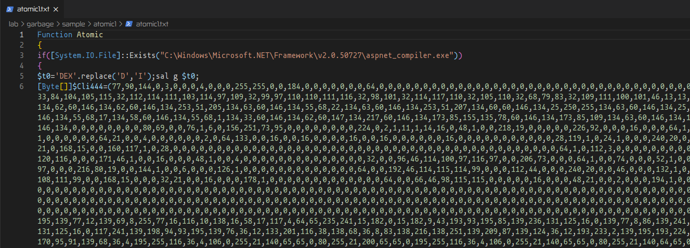

And the end of the file:

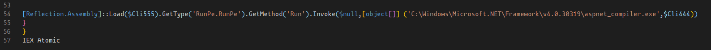

To increase the readability of the data contained in the file, I've searched for any occurrence of ";" and added a marker followed by 3 empty lines:

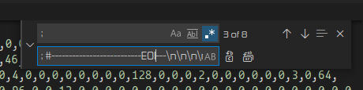

This allows me to quickly use the mini-map to spot large spaces between large variable texts:

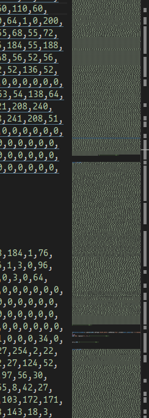

The file contains a condition, depending on if it can find the "aspnet_compiler.exe" file in directory "C:\Windows\Microsoft.NET\Framework\v2.0.50727\" two files are generated. At this point I decided to break the file in two files named "atomic1" and "atomic2", one to generate the positive condition files and another one to generate the negative condition files to be able to analyse them separately.

Taking the same approach, I've commented the if([System.IO.File]::Exists("C:\Windows\Microsoft.NET\Framework\v2.0.50727\aspnet_compiler.exe")) line:

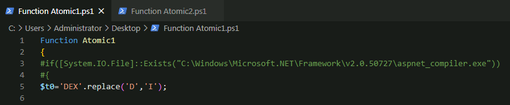

And commented out the what it looks like injection code [Reflection.Assembly]::Load($Cli555).GetType('RunPe.RunPe').GetMethod('Run').Invoke($null,[object[]] ('C:\Windows\Microsoft.NET\Framework\v2.0.50727\aspnet_compiler.exe',$Cli444)), and the | g variable which was defined at the top of the script in $t0='DEX'.replace('D','I'); sal g $t0;, this was done to prevent the execution of the expression as the value DEX gets changed to IEX command. 

I then added output ability on to the script to output the contents of the two variables into two separate files:

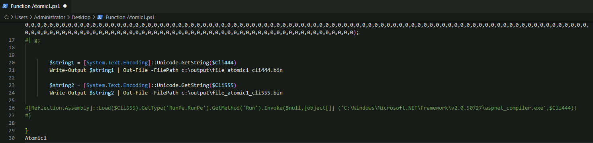

Did the same for atomic 2, and where applicable commented out the relevant instructions:

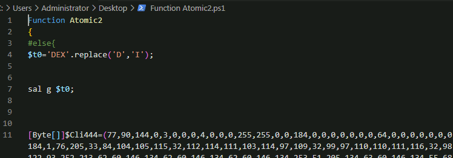

And added output code lines:

## Generating the payloads

Generating the files was a matter of executing the PowerShell scripts inside an isolated Windows virtual machine:

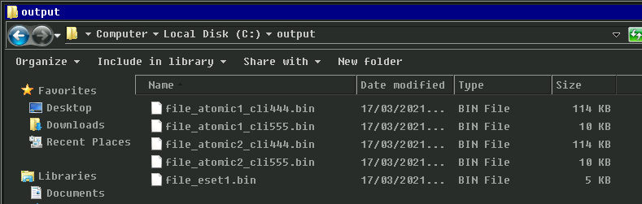

## Basic static analysis

After noticing the same file size of a few of the files, I've opened the files in HashMyFiles application to see the hashes of each individual file. Regardless of the path taken for execution on the "atomic1.txt" file, the resulting files are the same:

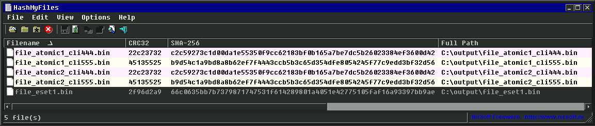

The next image shows the files hash values:

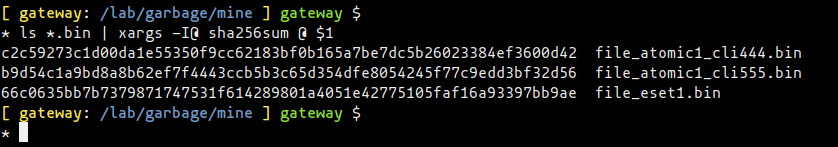

A search for the hash values returned no results. Hybdrid-Analysis, OTX.AlienVault and VirusTotal results were empty:

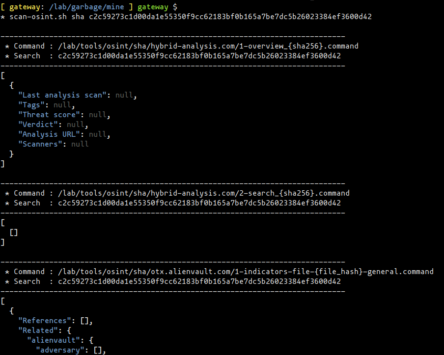

It was time to identify the files. Each file came up as "Unknown" in Detect It Easy:

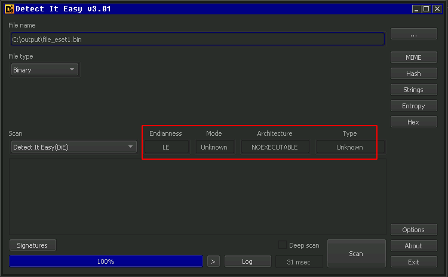

After opening the files in a Hex Editor program, I noticed the first 2 bytes in each file were preventing them from being identified as PE files: 

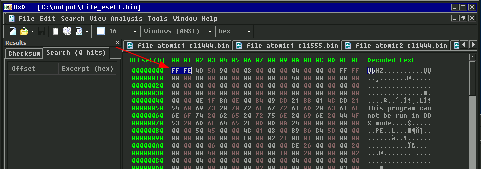

With the first 2 bytes removed from the files, Detect It Easy had no problem in identifying the files. The file generated from "eset1.txt" text file was identified as a .NET(v4.0.30319) file, and the linker used was Microsoft Linker(11.0)[ DLL32 ]:

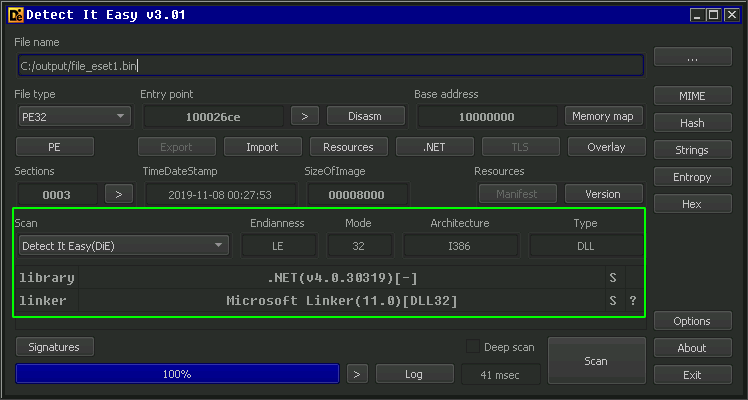

The file "atomic-cli555" reported that a .NET obfuscator named Confuser(1.X) had been used to obfuscate the file:

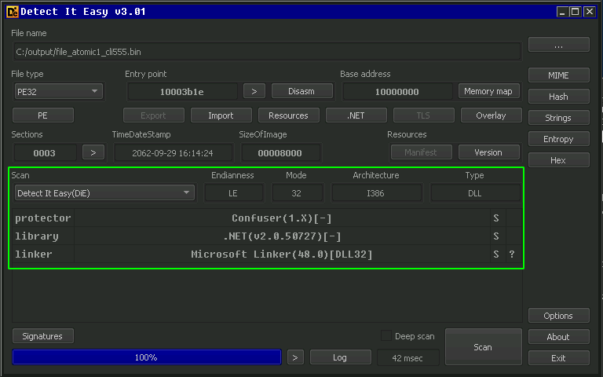

Detect It Easy only reported the linker information while scanning file "atomic1-cli444":

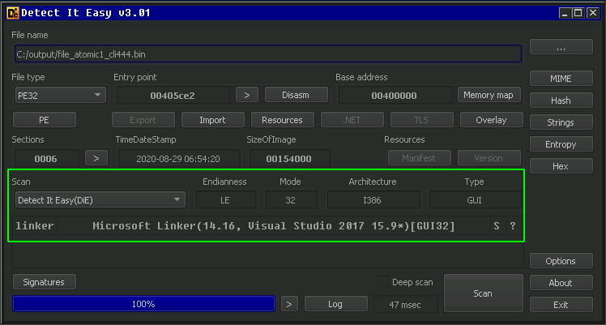

Another observation highlighted was the file "atomic1-cli444" had the .reloc section flagged as packed:

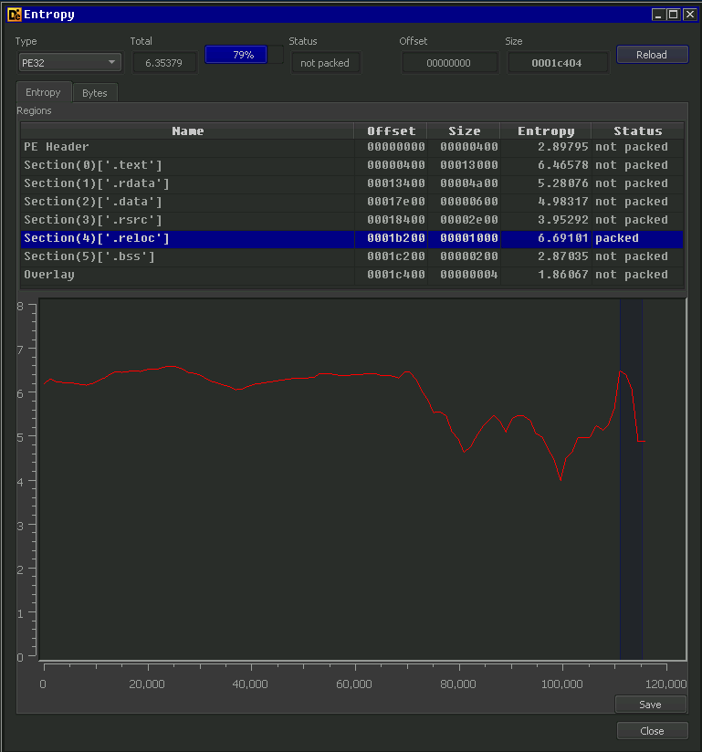

And the file overlay contains 4 bytes:

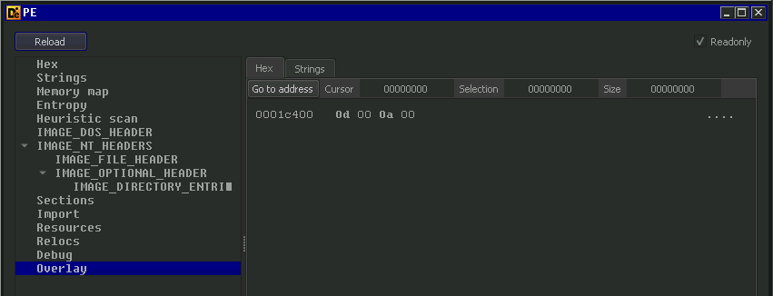

## .NET decompiler and online investigation

Going back to the "eset1" file, using DNSpy decompiler to take a look at the source code:

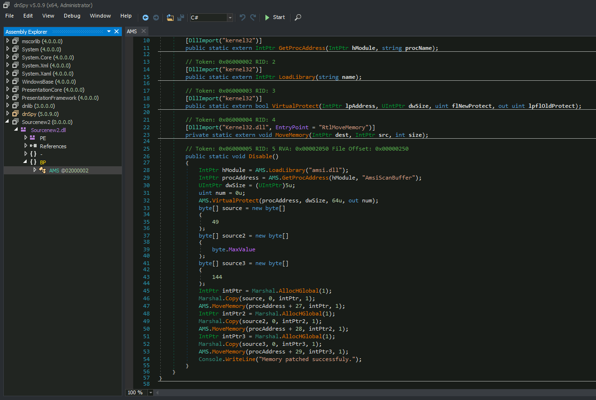

After further online investigation, the source code that served as inspiration for the author of the script was found in this blog post [Citadel Cyber Security](https://www.citadel.co.il/Home/Blog/1008):

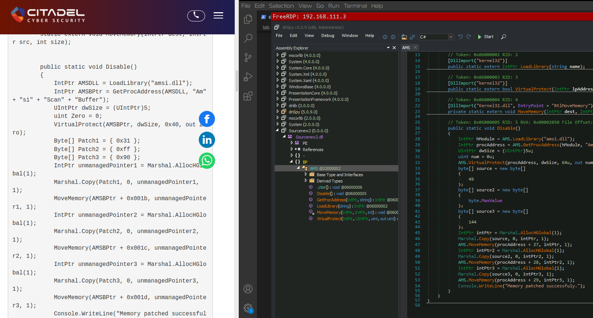

By opening "atomic1-cli555" in DNSpy I was left confused, as expected:

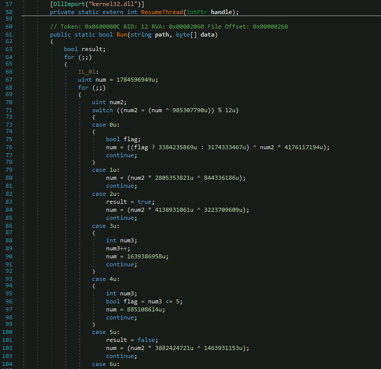

After searching GitHub for an unpacker that could get rid of the obfuscation that has been applied to the file, I found [https://github.com/ViRb3/de4dot-cex/releases](https://github.com/ViRb3/de4dot-cex/releases), which was able to deobfuscate some parts of file before throwing an error message:

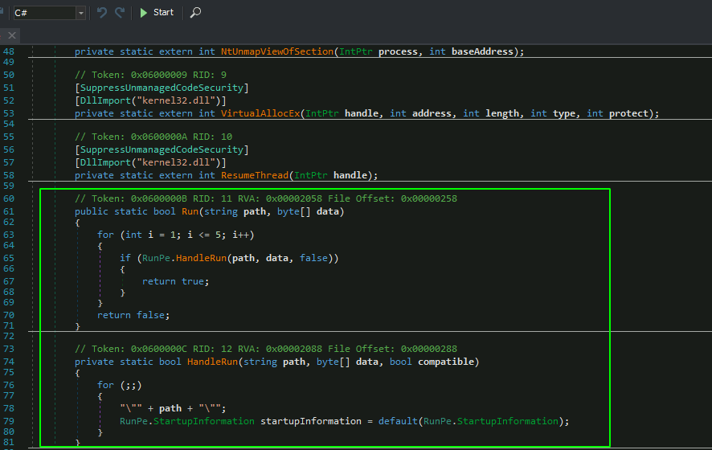

By having part of the deobfuscated file I was able to better understand it by searching online and it seems the functionality in the script is derived from a .NET C# script dating back from 2015 named "Aeonhack RunPE C#" (VB version is also available) in [pastebin](https://pastebin.com/Dzhad8rB):

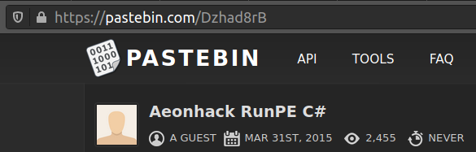

The following image shows the code available in the Pastebin script, side by side with the deobfuscated file:

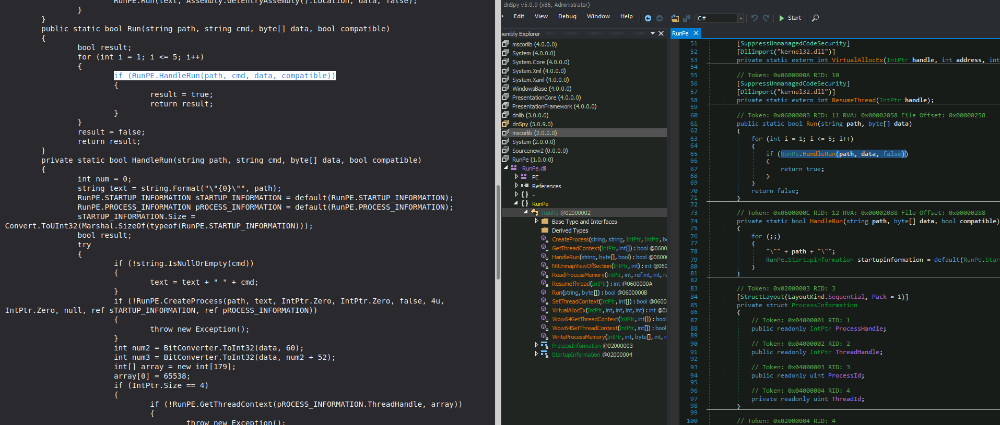

So I decided to upload the files and see if anything would come up:

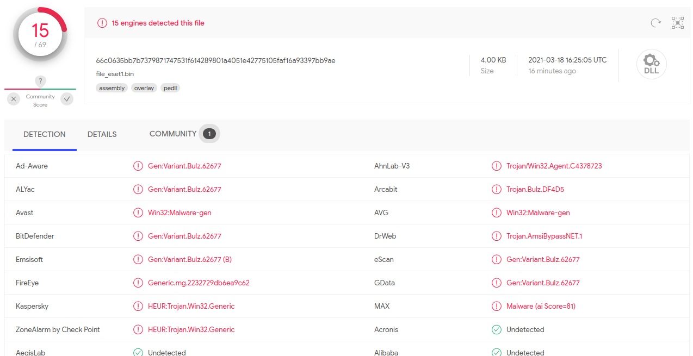
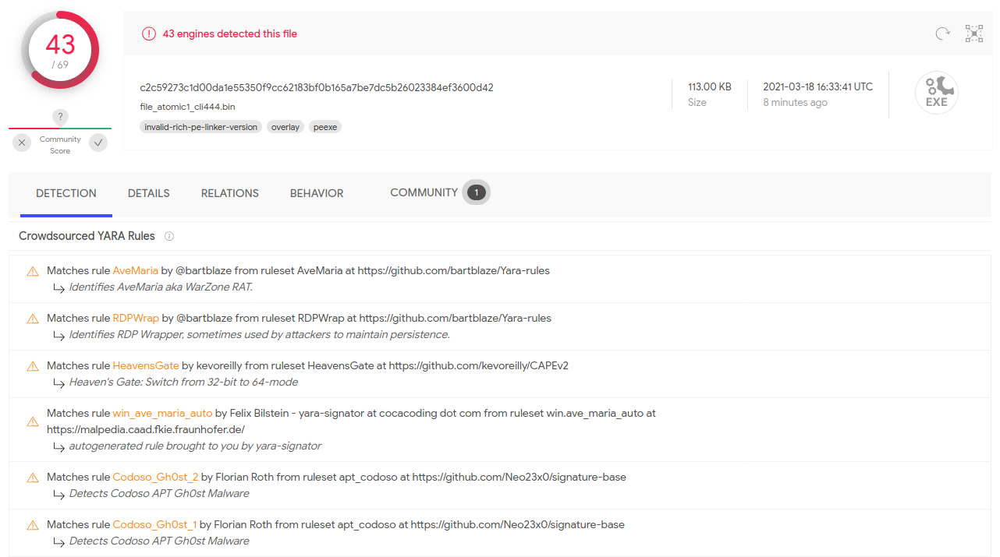
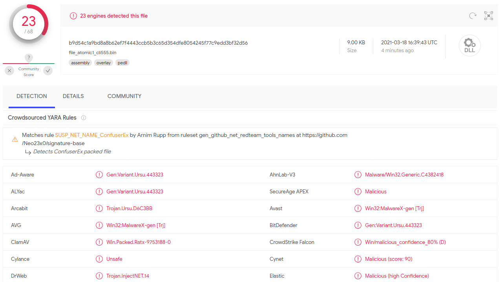

# Part 2 - A deeper look