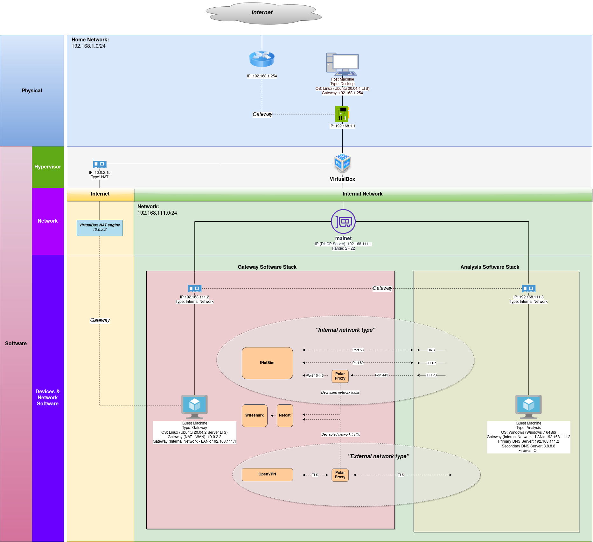
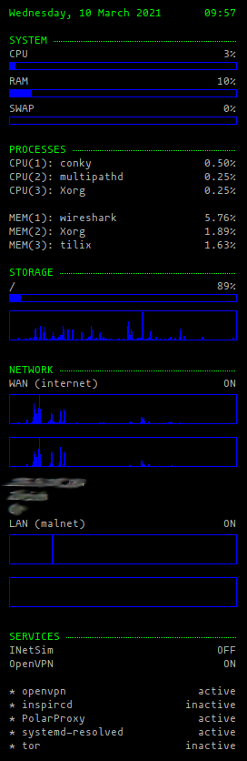
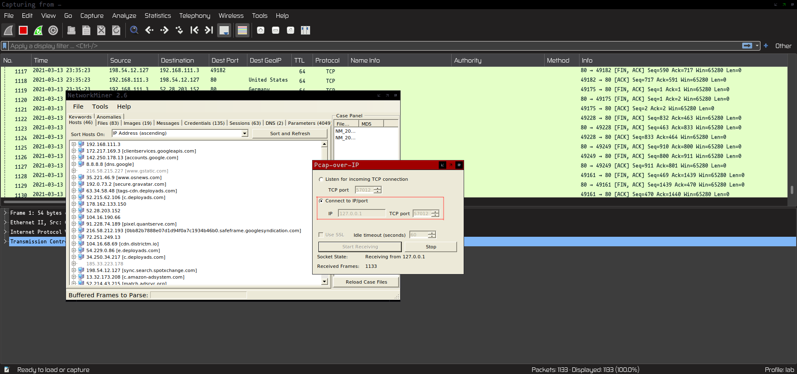
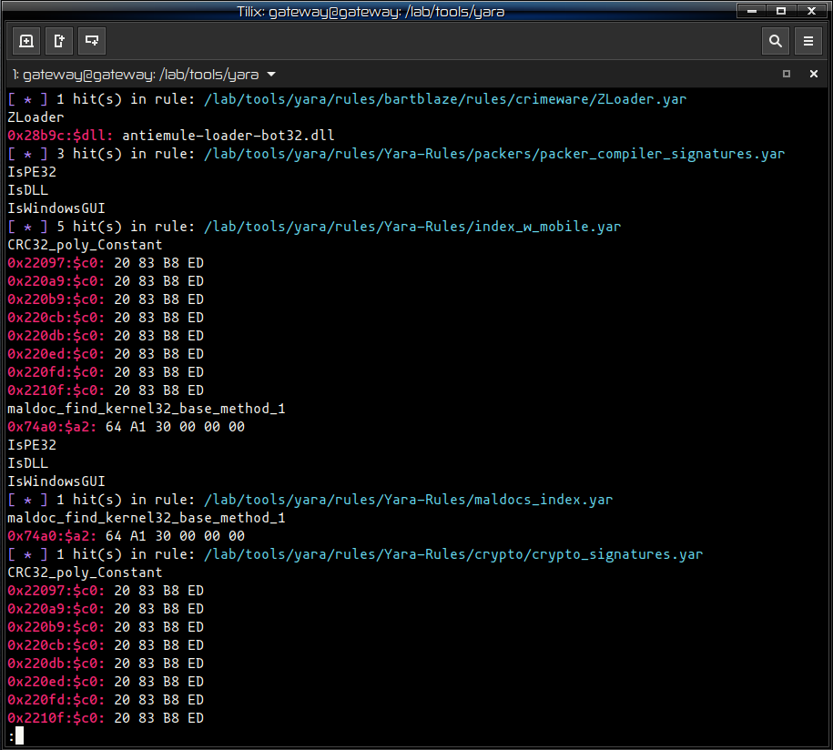
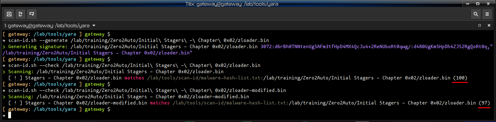
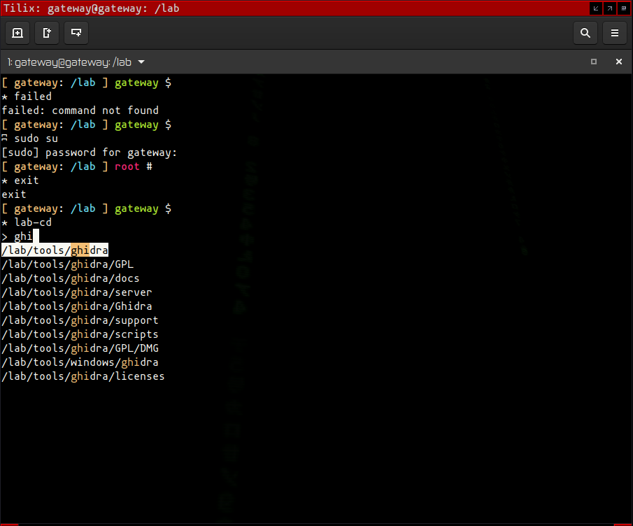

# Introduction

This post details the steps I have taken to build a malware analysis environment where I can execute, analyze and collect indicators of compromise from malware samples.

In this post I will detail the Software needed to setup the lab infrastructure, how to create a malware analysis environment from scratch using Ubuntu 20.04 as a base Operating System. All instructions are expected to be run from a terminal command line. Some sort of familiarity and understanding of Bash scripting is necessary if you are changing the scripts.

I'll begin with how to create a virtual guest machine from a host machine and how to install the Operating System on the virtual guest machine. 

Next, I'll describe the steps necessary to install a working minimal desktop and how to configure the system to install the tools for analysis & monitoring. 

I will cover how to setup a private internal network and also an external network for access to the Internet. This virtual machine will perform the role of a network Gateway. 

The last steps deal with how to configure some of the tools and to take advantage of bash's scripting capabilities to create utilitarian tools on the lab environment. These are followed by my personal visual tweaks I usually perform on a fresh installed system.

A script to perform an unattended installation of the OS automating the manual installation is included at the end of the post.

The virtual machine will be capable of simulating network services in a isolated private network using INetSim, and also be capable of Internet access through the use of a VPN tunnel when needed. PolarProxy will be used to decrypt TLS encrypted traffic from malware. Iptables rules will be used to shape the network traffic flow.

A few selected tools will be installed on the Gateway virtual machine for static analysis, OSINT and network monitoring duties.

## Logical architecture

The following image shows the logical architecture of the lab environment:



## High-level view of the Gateway machine

The following are the list of details that make up the Gateway virtual machine. Please note, although I'm using this configuration, you can customize it according to your specific needs. The objective is to provide a brief overview of the details that I have used and the rationale for choosing these to build the virtual machine:

| Item | Value | Rationale |
| --- | --- | --- |
| Name | Gateway | To be able to uniquely identify the machine |
| Operating System | Linux (Ubuntu 20.04.2 Server LTS) | A different Operating System from the target virtual machine using ELF (Executable and Linkable Format) executable format which prevents the execution of PE malware binaries |
| Architecture | 64 Bits | A modern architecture |
| Number of CPUs | 4 virtual CPUs | For processing power |
| Disk space allocated | 100 GB | To install all necessary software |
| RAM | 4096 Mb | For performance reasons |
| Network Adapter #1 | NAT (Network Address Translation) - IP Address: 10.0.2.15 | To be able to access the Internet to download software, updates or any other necessary activities such as OSINT, C2 communications, progress chain of infection, others... |
| Network Adapter #2 | Internal Network - Name: malnet - Promiscuous Mode: Allow All - IP Address: 192.168.111.2 | Promiscuous mode was set to "Allow All" in order to allow the network adapter to be able to see all network traffic and for network sniffers to work properly |
| Network Gateway | 192.168.111.1 (Internal Network LAN) 10.0.2.2 (NAT WAN) | (N/A) Default values |
| USB | USB Controller disabled | To prevent the hypervisor from automatically mounting any USB device in the guest, when connected to the host machine |
| Shared Folders | Enabled | Not mounted by default, necessary for transferring files from the host machine when needed |
| Guest Additions | Installed | To increase performance and add extra functionality to the hypervisor |

# Software

VirtualBox will be used as the hypervisor. It is free software, easy to use and has all the features I need out of the box to setup a lab environment. 

Other hypervisors are available, and although a small part of the instructions might be different for different virtualization software, you should still be able to use other hypervisor to build your lab.

I'll be using Ubuntu 20.04.2 Long Term Support as the OS on the Gateway Virtual Machine due to the Long Term Support until April 2025. Security updates for the OS will be available throughout that time-frame.

## Operating System image

- You can download an Ubuntu 20.04.2 Server 64 Bit image from [http://www.releases.ubuntu.com/20.04/ubuntu-20.04.2-live-server-amd64.iso](http://www.releases.ubuntu.com/20.04/ubuntu-20.04.2-live-server-amd64.iso)

## Hypervisor

Depending on your guest operating system you have different options to get VirtualBox up and running. VirtualBox is available for the following platforms:

- **Windows/Mac OS**: [https://www.virtualbox.org/wiki/Downloads](https://www.virtualbox.org/wiki/Downloads) (Select "Windows hosts" or "OS X hosts" according to your Operating System)
- **Ubuntu Linux**: Use the version in Ubuntu repositories, it uses Python 3 by default. Run the following command from a terminal to install VirtualBox, VirtualBox Extensions Pack and VirtualBox Guest Additions ISO: 
<pre><code class="bash">sudo apt install virtualbox virtualbox-ext-pack virtualbox-guest-additions-iso -y</code></pre>
- **Other Linux flavors**: [VirtualBox website](https://www.virtualbox.org/wiki/Linux_Downloads) has instructions for other Linux distributions.

If you are looking to see what other hypervisors are out there, please see this [Wikipedia](https://en.wikipedia.org/wiki/Comparison_of_platform_virtualization_software) comparison list.

# Virtual internal network

The Gateway VM (virtual machine) will be setup with two different Network Interface Cards (NIC). The first one will have a "NAT" network type (Network Address Translation), this will enable the virtual machine access to the Internet.

The second network type will be an "Internal Network" type, VMs in this network will be able to communicate with each other but won't be accessible or able to communicate with other VMs or machines not in the network.

A good article detailing the differences between network types available in VirtualBox can be found online at [Intenseschool website](http://resources.intenseschool.com/understanding-the-different-network-types-in-vmware-and-virtualbox/) if you want to research more about it.

If you have a subscription with a VPN provider, the virtual machine has scripts to help setup and use NordVPN VPN in the lab environment. Instructions for other providers should be similar if using OpenVPN.

The first thing to do is to create a virtual private network on the host machine. Execute the following script in the host machine's terminal (please note Window version of the command will have the .exe extension appended to the command name, i.e. "VBoxManage.exe"):

<pre><code class="bash">VBoxManage dhcpserver add --netname malnet --ip 192.168.111.1 --netmask 255.255.255.0 --lowerip 192.168.111.2 --upperip 192.168.111.22 --enable</code></pre>

- <span class="highlight-green">netname</span> is the name of the network,
- <span class="highlight-green">ip</span> is the IP address of the network,
- <span class="highlight-green">netmask</span> is the Network Mask (255.255.255.0 means I can assign IP addresses 192.168.111.2-254 statically),
- <span class="highlight-green">lowerip</span> represents the starting IP address space available for guests (192.168.111.1 is taken),
- <span class="highlight-green">upperip</span> refers to the highest IP address available for guests (192.168.111.22 allows for up to 20 guest virtual machines with a static IP address in the network  -- if you need more guests then increase the value up to 254).

The guest machines will have static IP addresses.

# The Gateway virtual machine

## Creating the Gateway virtual machine

Execute the following script in the host machine’s terminal (please note Window version of the command will have the "```.exe```" extension appended to the command name, i.e. “VBoxManage.exe”):

<pre><code class="bash">VBoxManage createvm --name "Gateway" --basefolder "/backup/LAB/VMs/" --groups "/Malware Lab" --ostype Ubuntu_64 --register</code></pre>

- <span class="highlight-green">name</span> is the name of the new Virtual Machine,
- <span class="highlight-green">basefolder</span> is the directory path where you want to create the Virtual Machine in,
- <span class="highlight-green">groups</span> allows to group VMs in a named group (all the VMs part of group can be started at the same time),
- <span class="highlight-green">ostype</span> is the Operating System type (in this case I'm using Ubuntu 64 Bits, but you can use some other distribution if supported by the Hypervisor),
- <span class="highlight-green">register</span> registers the Virtual Machine with VirtualBox allowing access through the UI.

If you want to use other Linux OS (operating system) as a base image, then the next command will show you a list of which Operating Systems are officially supported by VirtualBox (please note, other Linux distributions may use a different package manager other than apt, scripts dealing with installation of software will have to be changed accordingly for the chosen distribution's package manager):

<pre><code class="bash">VBoxManage list ostypes</code></pre>

## Configuring the Gateway virtual machine

<pre><code class="bash">VBoxManage modifyvm "Gateway" --memory 4096 --vram 128 --nic1 nat --nic2 intnet --intnet2 "malnet" --nicpromisc2 allow-vms --cpus 4 --graphicscontroller vboxsvga --bioslogodisplaytime 0 --clipboard-mode hosttoguest --audioout on</code></pre>

- <span class="highlight-green">memory</span> sets 4 Gigabytes of memory for the Virtual Machine (anything less than 2 Gigabytes is not recommended),
- <span class="highlight-green">vram</span> sets 128 Mega-bytes of Video Card memory (16 Mega-bytes is acceptable),
- <span class="highlight-green">nic1</span> Network Card Interface number 1 is setup as "NAT" for Internet access,
- <span class="highlight-green">nic2</span> Network Card Interface number 2 is setup as "Internal Network",
- <span class="highlight-green">nicproperty2</span> Network Card Interface number 2 is to use the previously created internal network "malnet",
- <span class="highlight-green">nicpromisc2</span> Network Card Interface number 2 will be set the "Promiscuous Mode" setting to "Allow-VMs",
- <span class="highlight-green">cpus</span> I'm using 4 CPUs but depending on your hardware resources you might want to use a lower number of CPUs, do note these map to CPU cores available on your physical hardware,
- <span class="highlight-green">graphicscontroller</span> I generally tend to use "vboxsvga" driver although VirtualBox recommends to use "vmsvga",
- <span class="highlight-green">bioslogodisplaytime</span> set to 0 to disable the BIOS logo,
- <span class="highlight-green">clipboard-mode</span> set to "hosttoguest" to allow copy and paste from the host to the guest for easy copy and paste of scripts (this can be disabled later on, when the functionality is not needed)
- <span class="highlight-green">audioout</span> is set to on for sound.

## Creating the virtual Hard-Disk file

<pre><code class="bash">VBoxManage createhd --filename "/backup/LAB/VMs/Gateway/Gateway.vdi" --size 100000 --format VDI</code></pre>

- <span class="highlight-green">filename</span> location and name where the virtual Hard-Disk file will to be created,
- <span class="highlight-green">size</span> is the size of the virtual Hard-Disk (you can set the value to a big size, it doesn't mean the virtual Hard-Disk file will occupy 100 Gigabytes at creation but it is allowed to grow up to 100 Gigabytes as more data is saved on the virtual Hard-Disk file),
- <span class="highlight-green">format</span> "VDI" as the Hard-Disk file format.

## Setup of the Hard-Disk file

<pre><code class="bash">VBoxManage storagectl "Gateway" --name "SATA Controller" --add sata --controller IntelAhci</code></pre>

- <span class="highlight-green">name</span> is the name of the Storage Device,
- <span class="highlight-green">add</span> refers to the Storage Device type "SATA",
- <span class="highlight-green">controller</span> sets the Storage Device controller type as "IntelAHCI".

## Attaching the Hard-Disk file to the Gateway virtual machine

<pre><code class="bash">VBoxManage storageattach "Gateway" --storagectl "SATA Controller" --port 0 --device 0 --type hdd --medium "/backup/LAB/VMs/Gateway/Gateway.vdi"</code></pre>

- <span class="highlight-green">storagectl</span> is the name of the Storage Device,
- <span class="highlight-green">port</span> is the port identifier,
- <span class="highlight-green">device</span> refers to the device number,
- <span class="highlight-green">type</span> sets the type as "HDD",
- <span class="highlight-green">medium</span> is the location of the virtual Hard-Disk file.

## Setup of the CD-ROM ISO image

<pre><code class="bash">VBoxManage storagectl "Gateway" --name IDE --add ide</code></pre>

- <span class="highlight-green">name</span> is the name of the Storage Device,
- <span class="highlight-green">add</span> refers to the Storage Device type "IDE",

## Attaching the Operating System ISO image to the Gateway virtual machine

<pre><code class="bash">VBoxManage storageattach "Gateway" --storagectl IDE --port 0 --device 0 --type dvddrive --medium "/backup/LAB/ISOs/ubuntu-20.04-live-server-amd64.iso"</code></pre>

- <span class="highlight-green">storagectl</span> is the name of the Storage Device,
- <span class="highlight-green">port</span> is the port identifier,
- <span class="highlight-green">device</span> refers to the device number,
- <span class="highlight-green">type</span> sets the type as "DVDDRIVE",
- <span class="highlight-green">medium</span> is the location of the OS ISO image file.

# Gateway Operating System

Installation of the Operating System is a straightforward process, although depending on the amount of times you end up performing the installation it's better to automate the process. With that in mind, I'm providing a script that you can run, where the OS installation process is fully automated. The script can be found at the end of the post.

## Manually installing the OS

During manual installation of the OS, the installer walks you through various screens. The first screen asks you to select your language, the next one allows you to configure your keyboard. Of special interest is the "Network connections" screen, this is where the network configuration settings are input.

As 2 NICs were added to the Virtual Machine, there should be 2 entries listed for configuration.


The first entry uses IP address 10.0.2.15/24, you can leave it as is. This is VirtualBox virtual router address that VirtualBox uses to communicate with the Internet.

In the second entry we'll change the settings to use a static IP address by "Edit IPV4".


Change the "IPv4 Method" from "Automatic" to "Manual".


Set the "Subnet" to 192.168.111.0/24, "Address" will be 192.168.111.2 and leave all other fields empty. Select "Save".


Select "Done" to continue. In the "Configure Proxy" screen unless you're behind a proxy you can leave it as is. In the next screen select your preferred downloads mirror.

"Storage Configuration" screen allows to customize installation location and file-system options, I've used the default settings for my installation. Select "Done" and the installer will ask you for confirmation, select "Continue" to begin the installation.

In the "Profile Setup" screen enter the server, username and the user password to continue. Select "Done" when ready.


The next screen will ask if you want to install OpenSSH server. Leave this blank as per default value and select "Done". The same on the next screen, leave all extra server options empty as there is no need to use any of that. Select "Done" and finally the installation begins.

After a few minutes, when the installation finishes, reboot the Virtual Machine.

# Post OS installation

## Cleaning up the new OS

After the installation completes, the first thing to do is to remove snapd, cloud-init and vi (yes, you read that right vi is evil). In the guest virtual machine execute the following commands:

<pre><code class="bash">sudo snap remove lxd
sudo snap remove core18
sudo snap remove snapd
sudo apt -y purge snapd cloud-init vim
sudo rm -rf /etc/cloud/ /var/lib/cloud/</code></pre>

## Installing VirtualBox guest additions

If you don't have the VirtualBox guest additions ISO file you can get the file by executing the following command in the host machine:

<pre><code class="bash">sudo apt install virtualbox-guest-additions-iso -y</code></pre>

Alternatively the ISO file can be downloaded directly from [https://download.virtualbox.org/virtualbox](https://download.virtualbox.org/virtualbox)

After you make sure you have access to the file, attach the ISO file to the guest virtual machine by running the following command in the host machine:

<pre><code class="bash">VBoxManage storageattach "Gateway" --storagectl IDE \
--port 0 --device 0 --type dvddrive \
--medium /usr/share/virtualbox/VBoxGuestAdditions.iso</code></pre>

- <span class="highlight-green">storagectl</span> is the name of the Storage Device,
- <span class="highlight-green">port</span> is the port identifier,
- <span class="highlight-green">device</span> refers to the device number,
- <span class="highlight-green">type</span> sets the type as "DVDDRIVE",
- <span class="highlight-green">medium</span> is the location of the VBoxGuestAdditions ISO image file.

In the guest virtual machine update the system and then you can install essential development tools and VirtualBox guest additions packages:

<pre><code class="bash">sudo apt update && sudo apt upgrade -y && sudo apt install build-essential -y
sudo mount /dev/cdrom /mnt
sudo /mnt/./VBoxLinuxAdditions.run</code></pre>

## A minimal graphical workstation

Install a base minimal X graphical system. Having a X display will allow VirtualBox to use the full screen size of the window and copy & paste functionality working. 

<pre><code class="bash">sudo apt -y install xserver-xorg xclip xsel xbindkeys xdm xterm hsetroot openbox --no-install-recommends</code></pre>

When the installation is finished, reboot the system for the changes to take effect.

<pre><code class="bash">reboot</code></pre>

It's time to take a snapshot of the lab. To take a snapshot run the following commands in the host machine with the guest VM running:

<pre><code class="bash">VBoxManage controlvm "Gateway" savestate
VBoxManage snapshot "Gateway" take "OS Installation" --description "Base OS installation with minimal X server and no tools installed"
VBoxManage startvm "Gateway"</code></pre>

# Tools

The lab has no tools installed yet, there is not much we can do with it as is. 

## OS utility tools

 Name | Purpose
------|--------
 tree | Display directory structure
 ncdu | Display disk space usage
 bat | Cat clone with many extra features
 htop | System monitoring
 jq | A command line tool for reading and formatting JSON data
 mc | Terminal file manager, editor, and many more
 arj, zip, unzip, p7zip, unrar | Support for compressed archives
 net-tools | Linux network tools
 resolvconf | A framework for managing multiple DNS configurations
 apt-transport-https | Allows the use of repositories accessed via the HTTP Secure protocol (HTTPS)
 fzy | A fuzzy text selector for the terminal
 icdiff | Improved colored diff
 micro | An enhanced text editor 

Copy & paste functionality between host and guest machines should now be available. Open a terminal and copy & paste the following command into the guest terminal window to install the following tools:

<pre><code class="bash">sudo apt -y install tree ncdu bat htop jq most mc arj zip unzip p7zip unrar net-tools resolvconf apt-transport-https fzy icdiff --no-install-recommends
cd /usr/bin/; curl https://getmic.ro | sudo bash</code></pre>

## Desktop tools

 Name | Purpose
------|--------
caja | Graphical file manager
engrampa | Compressed file handler
eom | Image viewer
mousepad | Text editor
tilix | Terminal emulator
firefox | Web browser
pulseaudio | Sound
pavucontrol | Sound volume application
zim | A desktop wiki to document results from analysis
mate-polkit | Authentication agent for PolicyKit 
speedcrunch | Calculator
flameshot | Screenshot application
conky | Desktop system monitoring
rofi | Application launcher
dunst | Notification daemon
xfreerdp (freerdp2-x11) | RDP client
gvfs-backends | Various user-space virtual file-systems (ftp, samba and others)
caja-open-terminal | Open terminal from file manager in current directory 
fonts-mononoki | Mono-spaced font 
tint3, libc++1 | A lightweight Gtk desktop panel

<pre><code class="bash">sudo apt -y install caja engrampa eom mousepad tilix firefox pulseaudio pavucontrol zim mate-polkit speedcrunch flameshot conky rofi dunst freerdp2-x11 gvfs-backends caja-open-terminal fonts-mononoki libc++1 --no-install-recommends
NAME="$HOME/tint3.deb" && wget $(curl -s https://api.github.com/repos/jmc-88/tint3/releases/latest | grep 'browser_' | cut -d\" -f4 | grep 'deb') -O "$NAME" && sudo dpkg -i "$NAME" && sudo apt --fix-broken install && rm "$NAME"
</code></pre>

### Enabling sound

By default pulse audio is muted, to enable sound in the Guest Virtual Machine execute the following command in the terminal:

<pre><code class="bash">systemctl --user enable pulseaudio && systemctl --user start pulseaudio && pactl set-sink-mute @DEFAULT_SINK@ toggle && pactl -- set-sink-volume @DEFAULT_SINK@ 80%</code></pre>

### Session auto start

The ".xsession" script is executed after a user login is successful. You should match the "setxkbmap -layout" with your keyboard:

<pre><code class="bash">cat <<-'EOF' > "$HOME/.xsession"
exec systemctl --user import-environment DISPLAY &
exec xrdb ~/.Xresources &
exec xset -b &
exec hsetroot -solid '#11122C' &
exec setxkbmap -layout pt &
exec /usr/lib/x86_64-linux-gnu/polkit-mate/polkit-mate-authentication-agent-1 &
exec dunst &
exec conky -c ~/.config/conky/inforc &
exec conky -c ~/.config/conky/authnetrc &
exec xbindkeys &
exec tint3 &
exec flameshot &
exec openbox-session
EOF</code></pre>

The ".Xresources" file configures various aspects of the X server like DPI settings, cursor and font settings:

<pre><code class="bash">cat <<-'EOF' > "$HOME/.Xresources"
Xft.dpi: 96
! == X ==
Xft.autohint: false
Xft.lcdfilter: lcddefault
Xft.hintstyle: hintslight
Xft.hinting: true
Xft.antialias: true
Xft.rgba: rgb
Xcursor.size: 32
! == ROFI ==
rofi.font: mononoki Regular 12
EOF</code></pre>

### Running applications

To execute applications I find Rofi to be quite useful. Rofi is a simple application launcher that allows to quickly execute applications by simply typing the name of the application. 

To be able to use Rofi, first we need to bind the keys to call Rofi. I'm using ```<CTRL> + Space``` but you can use any other combination of keys you like. The next command creates a .xbindkeysrc configuration file with the keyboard bindings: 

<pre><code class="bash">cat <<-'EOF' > "$HOME/.xbindkeysrc"
"rofi -combi-modi run -show combi"
    Control + space
EOF</code></pre>


### Displaying system information

Conky is a system monitor tool used to show information on the desktop regarding various aspects of the system. Details about Network, Processes, Services and User login information can be seen displayed on the desktop giving an overview of the state of the virtual machine:



<pre><code class="bash">mkdir -p ~/.config/conky && 
cat <<-'EOF' > "$HOME/.config/conky/inforc"
conky.config = {
    default_color='ffffff',
    color1='green',
    color2='grey',
    color3='blue',
    alignment = 'top_right',
    background = true,
    border_width = 0,
    border_inner_margin = 0,
    border_outer_margin = 0,
    cpu_avg_samples = 2,
    default_outline_color = 'yellow',
    default_shade_color = 'black',
    draw_borders = false,
    draw_graph_borders = true,
    draw_outline = false,
    draw_shades = true,
    use_xft = true,
    font = 'mononoki: size=9',
    uppercase = false,
    gap_x = 20,
    gap_y = 30,
    minimum_height = 5,
    minimum_width = 250,
    net_avg_samples = 2,
    no_buffers = true,
    double_buffer = true,
    out_to_console = false,
    out_to_stderr = false,
    extra_newline = false,
    own_window_transparent = no,
    own_window = true,
    own_window_class = 'Conky',
    own_window_type = 'desktop',
    own_window_argb_visual = true,
    own_window_argb_value = 0,
    own_window_hints = 'undecorated,below,sticky,skip_taskbar,skip_pager',
    own_window_colour = '#000000',
    stippled_borders = 0,
    update_interval = 1.0,
    use_spacer = 'none',
    show_graph_scale = false,
    imlib_cache_size = 0,
    show_graph_range = false
}

conky.text = [[
${color1}${time %A, %e %B %Y} ${alignr}${time %H:%M}

${color1}SYSTEM ${stippled_hr}
${color2}CPU${alignr}${execi 10 top -b -n1 | grep ^%Cpu | awk '{printf("%.0f"), 100-$8}'}%
${color3}${execbar 8 top -b -n1 | grep ^%Cpu | awk '{printf("%.0f"), 100-$8}'}
${color2}RAM${alignr}${execi 10 free -t | grep Mem | awk '{printf("%.0f"), $3/$2*100}'}%
${color3}${execbar 8 free -t | grep Mem | awk '{printf("%.0f"), $3/$2*100}'}
${color2}SWAP${alignr}$swapperc%
${color3}${swapbar 8}

${color1}PROCESSES ${stippled_hr}
${color2}CPU(1): ${top name 1}${alignr}${top cpu 1}%
${color2}CPU(2): ${top name 2}${alignr}${top cpu 2}%
${color2}CPU(3): ${top name 3}${alignr}${top cpu 3}%

${color2}MEM(1): ${top_mem name 1}${alignr}${top_mem mem 1}%
${color2}MEM(2): ${top_mem name 2}${alignr}${top_mem mem 2}%
${color2}MEM(3): ${top_mem name 3}${alignr}${top_mem mem 3}%

${color1}STORAGE ${stippled_hr}
${if_mounted /}${color2}/${alignr}${fs_free_perc /}%
${color3}${fs_bar 8 /}
${diskiograph /dev/sda 32 -t}${endif}

${color1}NETWORK ${stippled_hr}
${color2}WAN (internet) ${if_existing /proc/net/route enp0s3}${alignr}ON
${color3}${upspeedgraph enp0s3 32 -t}
${color3}${downspeedgraph enp0s3 32 -t}
${color2}${execi 300 wget http://ipinfo.io/ -qO - | jq -r '.ip, .city, .country'}
${else}${alignr}OFF
${endif}${color2}LAN (malnet) ${if_existing /proc/net/route enp0s8}${alignr}ON
${color3}${upspeedgraph enp0s8 32 -t}
${color3}${downspeedgraph enp0s8 32 -t}
${else}${alignr}OFF
${endif}
${color1}SERVICES ${stippled_hr}
${color2}INetSim${alignr}${if_match ${execpi 10 ps aux | grep "[i]netsim_main" | wc -l} >=1}ON${else}${if_match ${execpi 20 ps aux | grep "[i]netsim_main" | wc -l} <=0}OFF${endif}${endif}
${color2}OpenVPN${alignr}${if_match ${execpi 10 ps aux | grep "[o]penvpn" | wc -l} >=1}ON${else}${if_match ${execpi 20 ps aux | grep "[o]penvpn" | wc -l} <=0}OFF${endif}${endif}

${color2}* openvpn${alignr}${execpi 30 systemctl is-active openvpn.service}
${color2}* inspircd${alignr}${execpi 30 systemctl is-active inspircd.service}
${color2}* PolarProxy${alignr}${execpi 30 systemctl is-active PolarProxy.service}
${color2}* systemd-resolved${alignr}${execpi 30 systemctl is-active systemd-resolved.service}
${color2}* tor${alignr}${execpi 30 systemctl is-active tor.service}
]]
EOF</code></pre>

To better use the desktop space let us create another Conky instance, this time displaying network connection and user login activity information:


<pre><code class="bash">mkdir -p ~/.config/conky && 
cat <<-'EOF' > "$HOME/.config/conky/authnetrc"
conky.config = {
    default_color='ffffff',
    color1='green',
    color2='grey',
    color3='blue',
    alignment = 'bottom_left',
    background = true,
    border_width = 0,
    border_inner_margin = 0,
    border_outer_margin = 0,
    cpu_avg_samples = 2,
    default_outline_color = 'yellow',
    default_shade_color = 'black',
    draw_borders = false,
    draw_graph_borders = true,
    draw_outline = false,
    draw_shades = true,
    use_xft = true,
    font = 'Monospace: size=8',
    uppercase = false,
    gap_x = 20,
    gap_y = 60,
    minimum_height = 5,
    minimum_width = 250,
    net_avg_samples = 2,
    no_buffers = true,
    double_buffer = true,
    out_to_console = false,
    out_to_stderr = false,
    extra_newline = false,
    own_window_transparent = no,
    own_window = true,
    own_window_class = 'Conky',
    own_window_type = 'desktop',
    own_window_argb_visual = true,
    own_window_argb_value = 0,
    own_window_hints = 'undecorated,below,sticky,skip_taskbar,skip_pager',
    own_window_colour = '#000000',
    stippled_borders = 0,
    update_interval = 1.0,
    use_spacer = 'none',
    show_graph_scale = false,
    imlib_cache_size = 0,
    show_graph_range = false,
    text_buffer_size = 2048
}

conky.text = [[
${color1}CONNECTIONS ${stippled_hr}
${color3}Inbound: ${tcp_portmon 1 32767 count} ${alignr} Local Service/Port${color2}
${tcp_portmon 1 32767 rhost 0} ${alignr} ${tcp_portmon 1 32767 lservice 0}
${tcp_portmon 1 32767 rhost 1} ${alignr} ${tcp_portmon 1 32767 lservice 1}
${tcp_portmon 1 32767 rhost 2} ${alignr} ${tcp_portmon 1 32767 lservice 2}
${tcp_portmon 1 32767 rhost 3} ${alignr} ${tcp_portmon 1 32767 lservice 3}
${tcp_portmon 1 32767 rhost 4} ${alignr} ${tcp_portmon 1 32767 lservice 4}
${tcp_portmon 1 32767 rhost 5} ${alignr} ${tcp_portmon 1 32767 lservice 5}
${tcp_portmon 1 32767 rhost 6} ${alignr} ${tcp_portmon 1 32767 lservice 6}
${color3}Outbound: ${tcp_portmon 32768 65535 count} ${alignr} Remote Service/Port${color2}
${tcp_portmon 32768 61000 rhost 0} ${alignr} ${tcp_portmon 32768 61000 rservice 0}
${tcp_portmon 32768 61000 rhost 1} ${alignr} ${tcp_portmon 32768 61000 rservice 1}
${tcp_portmon 32768 61000 rhost 2} ${alignr} ${tcp_portmon 32768 61000 rservice 2}
${tcp_portmon 32768 61000 rhost 3} ${alignr} ${tcp_portmon 32768 61000 rservice 3}
${tcp_portmon 32768 61000 rhost 4} ${alignr} ${tcp_portmon 32768 61000 rservice 4}
${tcp_portmon 32768 61000 rhost 5} ${alignr} ${tcp_portmon 32768 61000 rservice 5}
${tcp_portmon 32768 61000 rhost 6} ${alignr} ${tcp_portmon 32768 61000 rservice 6}

${color1}WHO ${stippled_hr}
${color2}${execi 100 who}

${color1}LOGS ${stippled_hr}
${color2}${execi 20 grep -E "incorrect password|Authentication failure" /var/log/auth.log | tail -n 5}
]]
EOF</code></pre>

## Frameworks

 Name | Purpose
------|--------
python3-pip | Package manager for Python 3
python3-venv | Virtual environments for Python 3
python-is-python3 | Convenience package which ships a symbolic link to point the /usr/bin/python interpreter at the current default python 3
python3-yara | Python 3 yara library support
python3-pefile | Python 3 pefile library support
python3-crypto | Python 3 crypto library support
python3-pycryptodome | Python 3 pycryptodome library support (RC4)
python3-olefile | Python3 olefile module
python3-capstone | Python 3 capstone (disassembler) library support
python3-regex |Python 3 regular expressions
python3-networkx | Python package for the creation, manipulation, and study of the structure, dynamics, and functions of complex networks
python3-graphviz | Creation and rendering of graph descriptions in the DOT language of the Graphviz graph drawing software
python3-pydot | An interface to Graphviz
openjdk-14-jdk-headless | Java JDK 14
mono-devel | Open source implementation of Microsoft's .NET Framework

A few of the analysis tools that are going to to be installed require Python 3 or Java installed to run:

<pre><code class="bash">sudo apt -y install python3-pip python3-venv python-is-python3 python3-yara python3-pefile python3-crypto python3-pycryptodome python3-olefile python3-capstone python3-regex python3-networkx python3-graphviz python3-pydot openjdk-14-jdk-headless --no-install-recommends</code></pre>

<span class="highlight-green">mono-devel package is required for NetworkMiner to run, install only if using NetworkMiner</span>.

<pre><code class="bash">sudo apt -y install mono-devel --no-install-recommends</code></pre>

## Analysis tools

Various tools will be installed in the Gateway Virtual Machine, these tools allow to perform Static Analysis and to monitor Network traffic.

 Name | Purpose
------|--------
TOR (deb.torproject.org-keyring) | Anonymization
torbrowser-launcher | TOR browser
Code | Code editor
Wireshark | Network analyzer and packet capture
NetworkMiner | NetworkMiner is a network forensics tool 
tshark | Wireshark terminal version
INetSim | Network service simulation
netcat-openbsd | NetCat (Debian's fork of OpenBSD's netcat with extra features)
wrestool (icoutils) | Lists or extracts the resources from Windows PE files
InspIRCd | IRC server
yara | Identification and classification of Malware
ssdeep | Identification and classification of Malware through fuzzy hashes
exiftool | File meta data viewer
upx | Executable packer for several executable formats
Volatility | The volatile memory extraction framework
Ghidra | A software reverse engineering (SRE) framework
Avalonia IL Spy | .NET decompiler
CAPA | Detects capabilities in executable files
CyberChef | A web tool enabling encoding like XOR or Base64, more complex encryption like AES, DES and Blowfish, creating binary and hexdumps, compression and decompression of data, calculating hashes and checksums, IPv6 and X.509 parsing, changing character encodings, and much more
Detect It Easy | Detects packers, determines types of files
FLOSS | De-obfuscates strings from malware binaries
JD-GUI | Java decompiler
PE-Bear | Reversing tool for PE files
Portex Analyzer | Library for static malware analysis of Portable Executable files
Binwalk | Tool for analyzing, reverse engineering, and extracting firmware images
RUPS | Tool to view PDF structure in a Swing GUI
oledump.py | A program to analyze OLE files (Compound File Binary Format)
pdf-parser.py | Parses a PDF document
whois | Allows to trace the ownership and tenure of a domain name
libmozjs-68-0, libmozjs-68-dev | Mozilla SpiderMonkey Javascript engine
hx | A console hex editor
sqlitebrowser | A visual, open source tool to create, design, and edit database files compatible with SQLite
vbindiff | Displays two files at once, and highlights differences between them
pixd | A tool for visualizing binary data using a colour palette
Vba2Graph | Generates a VBA call graph, with potential malicious keywords highlighted
oletools | Python tools to analyze Microsoft OLE2 files
pcode2code | A VBA p-code decompiler

## Adding tools repositories 

We're going to use repositories provided by the tools authors to install and use the most recent versions of the tools in the Gateway Virtual Machine. With the Guest virtual machine running, execute the following commands in the terminal:

[TOR](https://www.torproject.org/)

> "Tor is free and open-source software for enabling anonymous communication by directing Internet traffic through a free, worldwide, volunteer overlay network consisting of more than seven thousand relays[6] in order to conceal a user's location and usage from anyone conducting network surveillance or traffic analysis." [Wikipedia website](https://en.wikipedia.org/wiki/Tor_%28anonymity_network%29)

<pre><code class="bash">sudo curl https://deb.torproject.org/torproject.org/A3C4F0F979CAA22CDBA8F512EE8CBC9E886DDD89.asc | sudo gpg --import
sudo gpg --export A3C4F0F979CAA22CDBA8F512EE8CBC9E886DDD89 | sudo apt-key add - 
sudo sh -c 'echo "deb https://deb.torproject.org/torproject.org focal main" > /etc/apt/sources.list.d/tor.list'
sudo sh -c 'echo "deb-src https://deb.torproject.org/torproject.org focal main" >> /etc/apt/sources.list.d/tor.list'</code></pre>

[INetSim](https://www.inetsim.org/)

> "INetSim is a software suite for simulating common internet services in a lab environment, e.g. for analyzing the network behavior of unknown malware samples." [INetSim website](https://www.inetsim.org/)

<pre><code class="bash">sudo sh -c 'echo "deb http://www.inetsim.org/debian/ binary/" > /etc/apt/sources.list.d/inetsim.list'
sudo wget -O - https://www.inetsim.org/inetsim-archive-signing-key.asc | sudo apt-key add - </code></pre>

[Microsoft Visual Studio Code](https://code.visualstudio.com/)

> "Visual Studio Code is a code editor redefined and optimized for building and debugging modern web and cloud applications. Visual Studio Code is free and available on your favorite platform - Linux, macOS, and Windows." [Microsoft Visual Studio Code website](https://code.visualstudio.com/)

<pre><code class="bash">curl https://packages.microsoft.com/keys/microsoft.asc | gpg --dearmor > ~/microsoft.gpg
sudo install -o root -g root -m 644 ~/microsoft.gpg /etc/apt/trusted.gpg.d/ && rm ~/microsoft.gpg
sudo sh -c 'echo "deb [arch=amd64] https://packages.microsoft.com/repos/vscode stable main" > /etc/apt/sources.list.d/vscode.list'</code></pre>

[Wireshark](https://www.wireshark.org/)

> "Wireshark is the world’s foremost and widely-used network protocol analyzer. It lets you see what’s happening on your network at a microscopic level and is the de facto (and often de jure) standard across many commercial and non-profit enterprises, government agencies, and educational institutions." [Wireshark website](https://www.wireshark.org/)

<pre><code class="bash">sudo add-apt-repository ppa:wireshark-dev/stable -y</code></pre>

[PolarProxy](https://www.netresec.com/?page=PolarProxy)

> "PolarProxy is a transparent SSL/TLS proxy created for incident responders and malware researchers. PolarProxy is primarily designed to intercept and decrypt TLS encrypted traffic from malware. PolarProxy decrypts and re-encrypts TLS traffic, while also saving the decrypted traffic in a PCAP file that can be loaded into Wireshark or an intrusion detection system (IDS)." [PolarProxy website](https://www.netresec.com/?page=PolarProxy)

<pre><code class="bash">sudo adduser --system --shell /bin/bash proxyuser 
sudo mkdir /var/log/PolarProxy && sudo chown proxyuser:root /var/log/PolarProxy/ && sudo chmod 0775 /var/log/PolarProxy/ 
mkdir ~/PolarProxy && cd ~/PolarProxy
curl https://www.netresec.com/?download=PolarProxy | tar -xzvf - 
sudo mv ~/PolarProxy /home/proxyuser/
sudo chown -R proxyuser /home/proxyuser/PolarProxy/
sudo cp /home/proxyuser/PolarProxy/PolarProxy.service /etc/systemd/system/PolarProxy.service</code></pre>

It is good practice to use a logical directory structure to keep files organized, I personally use the following structure, but feel free to use something else if you prefer. Do keep in mind a few of the later scripts use this directory structure, but can easily be customized to use any other:


- <span class="highlight-green">SWAP</span> is the location where shared folders are to be mounted at. I have the following alias in .bashrc to quickly be able to mount and unmount shared folders: 

<pre><code class="bash">alias sharedon='sudo mount -t vboxsf -o uid=$UID,gid=$(id -g) SWAP /lab/SWAP'
alias sharedoff='sudo umount /lab/SWAP'</code></pre>

- <span class="highlight-green">data</span> is the location where PolarProxy decrypted PCAP files and INetSim logs are saved to,
- <span class="highlight-green">notebooks</span> I use Zim as a notebook for keeping the results of my analysis and providing a structure to the data gathered, the "notebooks" directory is where the details are to be saved,
- <span class="highlight-green">downloads</span> all downloaded files are saved in this location,
- <span class="highlight-green">garbage</span> is a temporary directory used to keep random files that need to be looked at later,
- <span class="highlight-green">tools</span> location where the tools are installed,
- <span class="highlight-green">tools/scripts</span> personally I keep this directory part of the PATH variable (PATH=$PATH:/lab/tools/scripts) inside .bashrc. This is where I keep all single file python scripts, pre-compiled executable files or bash scripts I download from the Internet. I also create symbolic links to any tool installed under the tools directory so they are easily accessible and can be executed from the terminal from any location,
- <span class="highlight-green">samples</span> is intended to keep all malware samples.

To speed up directory navigation, you can create aliases in .bashrc to navigate from directory to directory (a complete listing of .bashrc details is included in "Extra customization"):

<pre><code class="bash">alias lab-home='cd /lab'
alias lab-tools='cd /lab/tools'
alias lab-garbage='cd /lab/garbage'
alias lab-downloads='cd /lab/downloads'
alias lab-swap='cd /lab/SWAP'
alias lab-data='cd /lab/data'
alias lab-cd='cd "$(find /lab -type d -iname "*$1*" | fzy)"'</code></pre>

The above directory structure can be created with the command:

<pre><code class="bash">sudo mkdir -p /lab && sudo chown $USER /lab && mkdir -p /lab/{SWAP,data,notebooks,downloads,garbage,tools,tools/scripts,samples}</code></pre>

The Analysis tools can be installed with the following commands: 

<pre><code class="bash">sudo apt -y install whois tor torbrowser-launcher deb.torproject.org-keyring code tshark inetsim netcat-openbsd inspircd yara ssdeep exiftool upx icoutils binwalk libmozjs-68-0 libmozjs-68-dev sqlitebrowser vbindiff --no-install-recommends
git clone https://github.com/volatilityfoundation/volatility3.git /lab/tools/volatility3
git clone https://github.com/MalwareCantFly/Vba2Graph.git /lab/tools/vba2graph
git clone https://github.com/krpors/hx.git /lab/tools/hx && make -C /lab/tools/hx && mv /lab/tools/hx/hx /lab/tools/scripts && rm -rf /lab/tools/hx
git clone https://github.com/FireyFly/pixd.git /lab/tools/pixd && make -C /lab/tools/pixd && mv /lab/tools/pixd/pixd /lab/tools/scripts && rm -rf /lab/tools/pixd
LAB_NAME="/lab/tools/avalonia-ilspy" && REPO="icsharpcode/AvaloniaILSpy" && VERSION=$(git ls-remote --tags https://github.com/"$REPO" | cut -d/ -f3- | tail -n1) && wget https://github.com/"$REPO"/releases/download/"$VERSION"/linux-x64.zip -O "$LAB_NAME".zip && unzip "$LAB_NAME".zip -d "$LAB_NAME" && rm "$LAB_NAME".zip && chmod +x "$LAB_NAME"/ILSpy
LAB_NAME="/lab/tools/capa" && wget $(curl -s https://api.github.com/repos/fireeye/capa/releases/latest | grep 'browser_' | cut -d\" -f4 | grep 'linux') -O "$LAB_NAME".zip && unzip "$LAB_NAME".zip -d "$LAB_NAME" && rm "$LAB_NAME".zip
LAB_NAME="/lab/tools/die" && wget $(curl -s https://api.github.com/repos/horsicq/DIE-engine/releases/latest | grep 'browser_' | cut -d\" -f4 | grep 'lin') -O "$LAB_NAME".tar.gz && mkdir -p "$LAB_NAME" && tar -xvf "$LAB_NAME".tar.gz -C "$LAB_NAME" --strip-components 1 && rm "$LAB_NAME".tar.gz
LAB_NAME="/lab/tools/floss" && wget $(curl -s https://api.github.com/repos/fireeye/flare-floss/releases/latest | grep 'browser_' | cut -d\" -f4 | grep 'linux') -O "$LAB_NAME".zip && unzip "$LAB_NAME".zip -d "$LAB_NAME" && rm "$LAB_NAME".zip
LAB_NAME="/lab/tools/jd-gui" && REPO="java-decompiler/jd-gui" && VERSION=$(git ls-remote --tags https://github.com/"$REPO" | cut -d/ -f3- | tail -n1 | sed 's/v//') && wget $(curl -s https://api.github.com/repos/$REPO/releases/latest | grep 'browser_' | cut -d\" -f4 | grep "jd-gui-$VERSION.jar") -P "$LAB_NAME"
LAB_NAME="/lab/tools/pebear" && wget $(curl -s https://api.github.com/repos/hasherezade/pe-bear-releases/releases/latest | grep 'browser_' | cut -d\" -f4 | grep 'linux') -O "$LAB_NAME".xz && mkdir -p "$LAB_NAME" && tar -xvf "$LAB_NAME".xz -C "$LAB_NAME" --strip-components 1 && rm "$LAB_NAME".xz
LAB_NAME="/lab/tools/portex" && mkdir -p "$LAB_NAME" && wget https://github.com/katjahahn/PortEx/raw/master/progs/PortexAnalyzer.jar -P "$LAB_NAME"
LAB_NAME="/lab/tools/cyberchef" && wget $(curl -s https://api.github.com/repos/gchq/CyberChef/releases/latest | grep 'browser_' | cut -d\" -f4 | grep 'CyberChef') -O "$LAB_NAME".zip && unzip "$LAB_NAME".zip -d "$LAB_NAME" && rm "$LAB_NAME".zip
LAB_NAME="/lab/tools/ghidra" && wget -r -l1 -H -t1 -nd -N -np -A.zip -erobots=off https://www.ghidra-sre.org -P "$LAB_NAME" && unzip "$LAB_NAME"/*.zip -d "$LAB_NAME" && rm "$LAB_NAME"/*.zip
LAB_NAME="/lab/tools/rups" && wget $(curl -s https://api.github.com/repos/itext/i7j-rups/releases/latest | grep 'browser_' | cut -d\" -f4 | grep 'only-jars') -O "$LAB_NAME".zip && unzip "$LAB_NAME".zip -d "$LAB_NAME" && rm "$LAB_NAME".zip
LAB_NAME="/lab/tools/oledump" && wget https://didierstevens.com/files/software/oledump_V0_0_60.zip -O "$LAB_NAME".zip && unzip "$LAB_NAME".zip -d "$LAB_NAME" && rm "$LAB_NAME".zip
LAB_NAME="/lab/tools/pdf-parser" && wget https://didierstevens.com/files/software/pdf-parser_V0_7_4.zip -O "$LAB_NAME".zip && unzip "$LAB_NAME".zip -d "$LAB_NAME" && rm "$LAB_NAME".zip
sudo -H pip install -U oletools
pip install pcode2code -U</code></pre>

To install Wireshark:

<pre><code class="bash">sudo apt -y install wireshark --no-install-recommends</code></pre>

When Wireshark asks "Should non-superusers be able to capture packets?", select Yes.


To install NetworkMiner:

<pre><code class="bash">LAB_NAME="/lab/tools/networkminer" && mkdir -p "$LAB_NAME" && wget https://www.netresec.com/?download=NetworkMiner -O "$LAB_NAME".zip && NM=$(unzip -l "$LAB_NAME".zip | head -4 | tail -1 | awk ' {print $4} ') && unzip "$LAB_NAME".zip -d "$LAB_NAME" && rm "$LAB_NAME".zip && mv "$LAB_NAME/$NM"/* "$LAB_NAME" && rm -rf "$LAB_NAME/$NM" && chmod +x "$LAB_NAME"/NetworkMiner.exe && chmod -R go+w "$LAB_NAME"/AssembledFiles/ && chmod -R go+w "$LAB_NAME"/Captures/</code></pre>

To capture packets the user has to added to the "wireshark" group, INetSim also requires the user to be added to the "inetsim" group and requires changes on directories permissions. For the changes to take effect, the user has to logout of the current session:

<pre><code class="bash">sudo usermod -a -G wireshark $USER 
sudo usermod -a -G inetsim $USER && sudo chgrp -R inetsim /var/log/inetsim && sudo chmod 770 /var/log/inetsim
sudo systemctl restart xdm.service</code></pre>

It's time to take another snapshot of the lab. With the Guest virtual machine running, execute the following commands in the Host machine terminal:

<pre><code class="bash">VBoxManage controlvm "Gateway" savestate
VBoxManage snapshot "Gateway" take "OS Analysis Tools" --description "Base OS installation with minimal X server configured and Analysis tools installed"
VBoxManage startvm "Gateway"</code></pre>

## Networking

The Virtual Machine will act as a gateway for other Virtual Machines part of the network, traffic generated in the network will pass through the Gateway. In case a VPN is used, the traffic should be allowed to be forwarded on to the NAT network for internet access whenever required.

To be able to switch from a External and Internal network situation, the network status has to be managed. Doing the process manually can become tedious and error prone, for that reason I wrote a simple script to handle the network changing duties automatically.

### Disabling network services

In order to keep a silent network, stop and disable TOR, INetSim and InspIRCd services, we'll manage the status of these as needed instead by using scripts:

<pre><code class="bash">sudo systemctl stop tor.service && sudo systemctl stop inspircd.service && sudo systemctl stop inetsim.service 
sudo systemctl disable tor.service && sudo systemctl disable inspircd.service && sudo systemctl disable inetsim.service</code></pre>

### IP TABLES rules
To prevent unwanted communications with the Host physical machine, add the following IP table rule:

<pre><code class="bash">sudo iptables -I OUTPUT -d 192.168.1.0/24 -j DROP</code></pre>

To make the current iptable rules persist over reboots:

<pre><code class="bash">sudo apt -y install iptables-persistent --no-install-recommends</code></pre>

When iptables-persistent asks "Save current IPv4 rules?", select Yes.


When iptables-persistent asks "Save current IPv6 rules?", select Yes.


### Configuring Network services simulation

Network services simulation is useful for offline analysis as it enables the use of a safe "fake" network. INetSim allows to deal with network traffic coming from the Guest Analysis machine while simulating the necessary replies to network requests. 

Along INetSim, a local IRC server will be used to deal with IRC network traffic in case there is need to interact with samples through IRC.

#### INetSim

<pre><code class="bash">mkdir -p /lab/tools/manage-network/inetsim/ && sudo cp /usr/share/inetsim/data -r /lab/tools/manage-network/inetsim/ && sudo chmod -R 777 /lab/tools/manage-network/inetsim/data && 
cat <<-'EOF' > "/lab/tools/manage-network/inetsim/inetsim.conf"
start_service dns
start_service http
start_service smtp
start_service pop3
start_service ftp
start_service tftp
start_service ntp
start_service finger
start_service ident
start_service syslog
start_service time_tcp
start_service time_udp
start_service daytime_tcp
start_service daytime_udp
start_service echo_tcp
start_service echo_udp
start_service discard_tcp
start_service discard_udp
start_service quotd_tcp
start_service quotd_udp
start_service chargen_tcp
start_service chargen_udp
start_service dummy_tcp
start_service dummy_udp

service_bind_address 192.168.111.2
service_run_as_user gateway

dns_default_ip 192.168.111.2
dns_default_domainname malnet.com
dns_version "1.0"

http_fakefile txt  sample.txt     text/plain
http_fakefile htm  sample.html    text/html
http_fakefile html sample.html    text/html
http_fakefile php  sample.html    text/html
http_fakefile gif  sample.gif     image/gif
http_fakefile jpg  sample.jpg     image/jpeg
http_fakefile jpeg sample.jpg     image/jpeg
http_fakefile png  sample.png     image/png
http_fakefile bmp  sample.bmp     image/x-ms-bmp
http_fakefile ico  favicon.ico    image/x-icon
http_fakefile exe  sample_gui.exe x-msdos-program
http_fakefile com  sample_gui.exe x-msdos-program

http_default_fakefile sample.html text/html

https_fakefile txt  sample.txt     text/plain
https_fakefile htm  sample.html    text/html
https_fakefile html sample.html    text/html
https_fakefile php  sample.html    text/html
https_fakefile gif  sample.gif     image/gif
https_fakefile jpg  sample.jpg     image/jpeg
https_fakefile jpeg sample.jpg     image/jpeg
https_fakefile png  sample.png     image/png
https_fakefile bmp  sample.bmp     image/x-ms-bmp
https_fakefile ico  favicon.ico    image/x-icon
https_fakefile exe  sample_gui.exe x-msdos-program
https_fakefile com  sample_gui.exe x-msdos-program

https_default_fakefile sample.html text/html

smtp_service_extension VRFY
smtp_service_extension EXPN
smtp_service_extension HELP
smtp_service_extension 8BITMIME
smtp_service_extension SIZE 102400000
smtp_service_extension ENHANCEDSTATUSCODES
smtp_service_extension AUTH PLAIN LOGIN ANONYMOUS CRAM-MD5 CRAM-SHA1
smtp_service_extension DSN
smtp_service_extension ETRN
smtp_service_extension STARTTLS

smtps_service_extension VRFY
smtps_service_extension EXPN
smtps_service_extension HELP
smtps_service_extension 8BITMIME
smtps_service_extension SIZE 102400000
smtps_service_extension ENHANCEDSTATUSCODES
smtps_service_extension AUTH PLAIN LOGIN ANONYMOUS CRAM-MD5 CRAM-SHA1
smtps_service_extension DSN
smtps_service_extension ETRN

pop3_capability TOP
pop3_capability USER
pop3_capability SASL PLAIN LOGIN ANONYMOUS CRAM-MD5 CRAM-SHA1
pop3_capability UIDL
pop3_capability IMPLEMENTATION "INetSim POP3 server"
pop3_capability STLS

pop3s_capability TOP
pop3s_capability USER
pop3s_capability SASL PLAIN LOGIN ANONYMOUS CRAM-MD5 CRAM-SHA1
pop3s_capability UIDL
pop3s_capability IMPLEMENTATION "INetSim POP3s server"

tftp_option BLKSIZE 512 65464
tftp_option TIMEOUT 5 60
tftp_option TSIZE 10485760

redirect_external_address 10.10.10.1
EOF
</code></pre>

#### InspIRCd

To configure InspIRCd replace "<span class="highlight-green">YOUR_PASSWORD_HERE</span>" with a password of your choice, then execute the following script:

    sudo sh -c 'cat <<-'EOF' > "/etc/inspircd/inspircd.conf"
    <server name="irc.gateway"
            description="MalNet IRC Server"
            network="malnet"
            id="46T">

    <admin name="gateway"
          nick="gateway"
          email="gateway@gateway">

    <bind address="192.168.111.2" port="16667" type="clients">

    <power diepass="YOUR_PASSWORD_HERE" restartpass="YOUR_PASSWORD_HERE" pause="2">

    <connect allow="192.168.111.3"
            timeout="60"
            flood="20"
            threshold="1"
            pingfreq="120"
            sendq="262144"
            recvq="8192"
            localmax="3"
            globalmax="3">

    <class name="Shutdown"
          commands="DIE RESTART REHASH LOADMODULE UNLOADMODULE RELOAD">
    <class name="ServerLink"
          commands="CONNECT SQUIT RCONNECT MKPASSWD MKSHA256">
    <class name="BanControl"
          commands="KILL GLINE KLINE ZLINE QLINE ELINE">
    <class name="OperChat"
          commands="WALLOPS GLOBOPS SETIDLE SPYLIST SPYNAMES">
    <class name="HostCloak"
          commands="SETHOST SETIDENT SETNAME CHGHOST CHGIDENT">

    <type name="NetAdmin"
          classes="OperChat BanControl HostCloak Shutdown ServerLink"
          host="netadmin.omega.org.za">
    <type name="GlobalOp"
          classes="OperChat BanControl HostCloak ServerLink"
          host="ircop.omega.org.za">
    <type name="Helper"
          classes="HostCloak"
          host="helper.omega.org.za">

    <oper name="gateway"
          password="YOUR_PASSWORD_HERE"
          host="*@localhost *@192.168.111.2 *@192.168.111.3"
          type="NetAdmin">

    <files motd="/etc/inspircd/inspircd.motd"
          rules="/etc/inspircd/inspircd.rules">

    <channels users="20"
              opers="60">

    <dns server="127.0.0.1" timeout="5">

    <pid file="/var/run/inspircd/inspircd.pid">

    <options prefixquit="Quit: "
            noservices="no"
            qaprefixes="no"
            deprotectself="no"
            deprotectothers="no"
            flatlinks="no"
            hideulines="no"
            syntaxhints="no"
            cyclehosts="yes"
            ircumsgprefix="no"
            announcets="yes"
            disablehmac="no"
            hostintopic="yes"
            quietbursts="yes"
            pingwarning="15"
            allowhalfop="yes"
      exemptchanops="">

    <security hidewhois=""
              userstats="Pu"
              customversion=""
              hidesplits="no"
              hidebans="no"
              operspywhois="no"
              hidemodes="eI"
              maxtargets="20">

    <performance nouserdns="no"
                maxwho="128"
                softlimit="1024"
                somaxconn="128"
                netbuffersize="10240">

    <whowas groupsize="10"
            maxgroups="100000"
            maxkeep="3d">

    <timesync enable="no" master="no">

    <badnick nick="ChanServ" reason="Reserved For Services">
    <badnick nick="NickServ" reason="Reserved For Services">
    <badnick nick="OperServ" reason="Reserved For Services">
    <badnick nick="MemoServ" reason="Reserved For Services">
    EOF'

### Setting up a VPN connection

<span class="highlight-red">If you don't have a VPN subscription then you can skip this and move on to "Managing the Network".</span>

 Name | Purpose
------|--------
openvpn | Tunneling application that uses all of the encryption, authentication, and certification features of the OpenSSL library to securely tunnel IP networks over a single TCP/UDP port

Install OpenVPN:

<pre><code class="bash">sudo apt -y install openvpn --no-install-recommends</code></pre>

Stop and disable the OpenVPN service, the service will be restarted when needed:

<pre><code class="bash">sudo systemctl stop openvpn.service && sudo systemctl disable openvpn.service</code></pre>

Save your VPN authentification details, replacing "<span class="highlight-green">USER_NAME</span>" and "<span class="highlight-green">USER_PASSWORD</span>" with your VPN account details:

<pre><code class="bash">sudo sh -c 'printf "USER_NAME\nUSER_PASSWORD\n" > /etc/openvpn/auth.conf' && sudo chmod 600 /etc/openvpn/auth.conf</code></pre>

Download your VPN provider "ovpn" configuration file. In the next example I use NordVPN service, other providers should be similar but with a different download link:

<pre><code class="bash">mkdir -p /lab/tools/manage-network/vpn/data && wget https://downloads.nordcdn.com/configs/archives/servers/ovpn.zip -P /lab/tools/manage-network && unzip /lab/tools/manage-network/ovpn.zip -d /lab/tools/manage-network/vpn/data && rm /lab/tools/manage-network/ovpn.zip</code></pre>

Create a symbolic link for your desired location and server to establish a connection to during the VPN session:

<pre><code class="bash">OVPN=$(find /lab/tools/manage-network/vpn/data -type f -name *.ovpn | fzy) && ln -sf "$OVPN" /lab/tools/manage-network/vpn/vpn.ovpn</code></pre>

1. From time to time it's best to re-download the server list for updated ovpn configuration files.
2. To change the server, re-create the symbolic link for the desired ovpn file. 

## Managing the Network

The entire lab network is going to be managed by a shell script, so we can switch between an "Internal" simulated network or an "External" network with access to the Internet through a VPN. 

With the help of PolarProxy it is possible to decrypt encrypted TLS network traffic. To be able to do this we need to use iptables rules to manage network traffic redirection. We'll also use PolarProxy's Pcap-over-IP feature to send the decrypted network traffic to Wireshark for real time visualization of the network traffic.

PolarProxy provides self-signed certificates that must be installed in the Analysis virtual machine. The certificates can be acessed remotely through ```192.168.111.2:10080``` address.

The following image details how the management of the lab environment network is done. Bash scripts are marked in bright yellow, processes are highlighted in bright green, services in yellow, iptables in blue, network interfaces in red, IP forwarding in pink and PolarProxy configuration in dark green:


- The "Internal" network uses INetSim to simulate network services and PolarProxy to decrypt the network traffic. With this network type, the virtual machines in the network will be cut off from the internet and all traffic is contained within the private network. This type of network can be started with the command <span class="highlight-blue">```lab-network.sh --start internal```</span>.

- The "External" network allows Internet access through the use of a VPN while decrypting the network traffic. This is to be used when it's necessary to allow Internet connectivity. This network type can be started with <span class="highlight-blue">```lab-network.sh --start external```</span>.

- To stop the network, regardless of the type of network use the comamnd <span class="highlight-blue">```lab-network.sh --stop```</span>.

- If you have a VPN subscription, to refresh the VPN server list use <span class="highlight-blue">```--refresh-vpn-server-list```</span>, and to select the VPN server to connect to, use the command <span class="highlight-blue">```--refresh-vpn-server```</span>. Use <span class="highlight-blue">```--show-server```</span> to see the current set server.

By default only Wireshark is launched by the script. In case you want to see the network traffic through NetworkMiner, execute:

<pre><code class="bash">mono /lab/tools/networkminer/NetworkMiner.exe --noupdatecheck</code></pre>

Then select "File" -> "Receive Pcap over IP" and set "Connect to IP/Port" "IP" 127.0.0.1 and "TCP port" leave as default 57012.



<pre><code class="bash">mkdir -p /lab/tools/manage-network/ && cat <<-'EOF' > "/lab/tools/manage-network/lab-network.sh"
#! /bin/bash

NOW=$(date +"%Y%m%d%H%M%S")
CWD=$"/lab/tools/manage-network"
ENGINE="$CWD/engine"
INETSIM_CONFIG="$CWD/inetsim"
REPORT="/lab/data"
NIC_NETWORK="enp0s3"
NIC_MALNET="enp0s8"

function service_manager () {
    local value_action=$1
    local value_service=$2
    service_status
    local status=$?
    case $value_action in
        "--start") 
            if [[ "$#" -gt 1 ]]; then
                if [ $status -eq 0 ] ; then
                    printf "START : [$value_service] service...\n"
                    case $value_service in
                        "external")
                            $0 "--show-server"
                            tilix -t "OpenVPN" -e pkexec "$ENGINE/${value_service}-start.sh" "$NIC_NETWORK" "$NIC_MALNET"
                            while [ $(ps aux | grep "[o]penvpn" | wc -l) -eq 0 ]
                            do
                                printf "Waiting for OpenVPN to run...\n"
                                sleep 5
                            done
                        ;;
                        "internal")
                            tilix -t "INetSim" -e pkexec "$ENGINE/${value_service}-start.sh" "$INETSIM_CONFIG/data" "$INETSIM_CONFIG/inetsim.conf" "$REPORT" "${NOW}-$value_service-inetsim-log" "$NIC_NETWORK" "$NIC_MALNET"
                            while [ $(ps aux | grep "[i]netsim_main" | wc -l) -eq 0 ]
                            do
                                printf "Waiting for INetSim to run...\n"
                                sleep 5
                            done
                        ;;
                        *) 
                            printf "*** ERROR: - Undefined Start [service_manager] value_service: \"$value_service\", exiting...\n" 
                            exit 127
                        ;;
                    esac
                    datastream="$REPORT/${NOW}-$value_service-decrypted.pcap"
                    touch "$datastream"
                    printf "Streaming decrypted session data to pcap file: $datastream\n"
                    if [[ $(ps aux | grep "[n]c localhost 57012" | wc -l) -eq 0 ]] ; then
                        nc localhost 57012 > "$datastream" &
                        tail -f -c +0 "$datastream" | wireshark -k -i - &
                    fi
                else
                    $0 "--status"
                fi
            else
                printf "*** ERROR: - Missing start parameter, exiting...\n" 
                exit 127
            fi
        ;;
        "--stop") 
            if [ $status -gt 0 ] ; then
                printf "STOP : "
                if [ $status -eq 1 ] ; then
                    printf "External = VPN shutdown...\n" 
                    pkexec "$ENGINE/external-stop.sh" "$NIC_NETWORK" "$NIC_MALNET"
                elif [ $status -eq 2 ] ; then
                    printf "Internal = INetSim shutdown...\n"
                    pkexec "$ENGINE/internal-stop.sh" "$NIC_NETWORK" "$NIC_MALNET"
                fi
            else
                printf "Network services not running...\n"
            fi
        ;;
        *) 
            printf "*** ERROR: - Undefined [service_manager] value_action: \"$value_action\", exiting...\n" 
            exit 127
        ;;
    esac
}

function service_status () {
    local status=""
    if (systemctl is-active PolarProxy.service &>/dev/null) && (systemctl is-active openvpn.service &>/dev/null) ; then
        status=1
    elif (systemctl is-active PolarProxy.service &>/dev/null) && [[ $(ps aux | grep "[i]netsim_main" | wc -l) -eq 1 ]] ; then
        status=2
    else
        status=0
    fi
    return $status
}

function show_server () {
    if [ -f /lab/tools/manage-network/vpn/vpn.ovpn ]; then
        stat /lab/tools/manage-network/vpn/vpn.ovpn | head -1
    else
        printf "*** ERROR: - A server hasn't been set yet, use --refresh-vpn-server-list if necessary to download the server list and then --refresh-vpn-server to set the server. Exiting...\n"
        exit 127
    fi
}

# Main
# ------------------------------

function main () {
    case $action in
        "--start")
            service_manager $action $parameters
        ;;
        "--stop")
            service_manager $action
        ;;
        "--refresh-vpn-server")
            OVPN=$(find /lab/tools/manage-network/vpn/data -type f -name *.ovpn | fzy) && ln -sf "$OVPN" /lab/tools/manage-network/vpn/vpn.ovpn && printf "* New VPN server: $OVPN\n"
        ;;
        "--refresh-vpn-server-list")
            rm -rf /lab/tools/manage-network/vpn/data
            mkdir -p /lab/tools/manage-network/vpn/data
            wget https://downloads.nordcdn.com/configs/archives/servers/ovpn.zip -P /lab/tools/manage-network
            unzip /lab/tools/manage-network/ovpn.zip -d /lab/tools/manage-network/vpn/data
            rm /lab/tools/manage-network/ovpn.zip
        ;;
        "--show-server")
            show_server
        ;;
        "--status")
            service_status
            local status=$?
            local message=""
            if [ $status -eq 1 ] ; then
                message="* External = VPN service is running..."
            elif [ $status -eq 2 ] ; then
                message="* Internal = INetSim service is running..."
            elif [ $status -eq 0 ] ; then
                message="* Network services not running..."
            else
                printf "*** ERROR: - Undefined [service_status] status: \"$status\", exiting...\n"
                exit 127
            fi
            printf "$message\n"
        ;;
        *)
            printf "$0 - Option \"$action\" was not recognized...\n"
            printf "\n  * Operations:\n"
            printf "    --start [ external | internal ] : Start network service (External = VPN, Internal = INetSim)\n"
            printf "    --stop                          : Stop network service\n"
            printf "    --status                        : Get network service status\n"
            printf "\n  * VPN Operations:\n"
            printf "    --show-server                   : Shows the current set server\n"
            printf "    --refresh-vpn-server-list       : Downloads a new list of OVPN files\n"
            printf "    --refresh-vpn-server            : Presents the list of OVPN files for selection\n\n"
            exit 127
        ;;
    esac
}

action=$1
parameters=${*: 2}

main $action $parameters
EOF
chmod +x /lab/tools/manage-network/lab-network.sh</code></pre>

### Internal network with INetSim

For the "Internal" network type, PolarProxy is configured to act as a [TLS Termination Proxy](https://www.netresec.com/?page=Blog&month=2020-03&post=Reverse-Proxy-and-TLS-Termination). This configuration uses the following options:

- <span class="highlight-green">v</span> uses verbose output in syslog,
- <span class="highlight-green">p</span> refers to ports affected by the redirection IP rules, i.e listens on first port (10443), saves the decrypted traffic in PCAP file as if it was directed to second port number (80) and forwards the decrypted traffic to the third port number (80),
- <span class="highlight-green">x</span> is the location where PolarProxy generated certificate is saved,
- <span class="highlight-green">f</span> is the location of the log file with the information of the session,
- <span class="highlight-green">certhttp</span> is the port used for access to the certificate from a client through HTTP,
- <span class="highlight-green">pcapoverip</span> allows another program to read the PCAP file in real time,
- <span class="highlight-green">terminate</span> decrypts the TLS traffic and relays the unencrypted HTTP traffic,
- <span class="highlight-green">connect</span> forwards the proxied traffic to the Gateway VM,
- <span class="highlight-green">nosni</span> treats incoming TLS sessions that don’t define a host name with the SNI extension as if they want to connect to www.malnet.com.

<pre><code class="bash">mkdir -p /lab/tools/manage-network/engine && cat <<-'EOF' > "/lab/tools/manage-network/engine/internal-start.sh"
#!/bin/bash

function main () {
    local value_data="$1"
    local value_conf="$2"
    local value_report="$3"
    local value_session="$4"
    local value_nic_network="$5"
    local value_nic_malnet="$6"

    ifconfig "$value_nic_network" down

    # PolarProxy
    sudo sh -c 'cat <<-EOF > "/etc/systemd/system/PolarProxy.service"
[Unit]
Description=PolarProxy TLS pcap logger
After=network.target

[Service]
Type=simple
User=proxyuser
WorkingDirectory=/home/proxyuser/PolarProxy
ExecStart=/home/proxyuser/PolarProxy/PolarProxy -v -p 10443,80,80 -p 10465,25,25 -p 10993,143,143 -p 10995,110,110 -p 10990,21,21 -x /var/log/PolarProxy/polarproxy.cer -f /var/log/PolarProxy/proxyflows.log --certhttp 10080 --pcapoverip 57012 --terminate --connect 192.168.111.2 --nosni www.malnet.com 
SendSIGKILL=no

[Install]
WantedBy=multi-user.target
EOF'

    # IRC
    iptables -t nat -A PREROUTING -i "$value_nic_malnet" -p tcp --dport 6667 -j REDIRECT --to-port 16667
    iptables -t nat -A PREROUTING -i "$value_nic_malnet" -p tcp --dport 6668 -j REDIRECT --to-port 16667
    iptables -t nat -A PREROUTING -i "$value_nic_malnet" -p tcp --dport 6669 -j REDIRECT --to-port 16667

    # https           443/tcp         http protocol over TLS/SSL
    iptables -t nat -A PREROUTING -i "$value_nic_malnet" -p tcp --dport 443 -j REDIRECT --to-port 10443 

    # smtps           465/tcp         smtp protocol over TLS/SSL 
    iptables -t nat -A PREROUTING -i "$value_nic_malnet" -p tcp --dport 465 -j REDIRECT --to-port 10465

    # imaps           993/tcp         imap4 protocol over TLS/SSL
    iptables -t nat -A PREROUTING -i "$value_nic_malnet" -p tcp --dport 993 -j REDIRECT --to-port 10993

    # pop3s           995/tcp         pop3 protocol over TLS/SSL
    iptables -t nat -A PREROUTING -i "$value_nic_malnet" -p tcp --dport 995 -j REDIRECT --to-port 10995

    # ftps            990/tcp         ftp, control, over TLS/SSL
    iptables -t nat -A PREROUTING -i "$value_nic_malnet" -p tcp --dport 990 -j REDIRECT --to-port 10990

    # ALL OTHER TRAFFIC
    iptables -t nat -A PREROUTING -i "$value_nic_malnet" -j REDIRECT

    if (systemctl is-active systemd-resolved.service &>/dev/null) ; then
        systemctl stop systemd-resolved.service
    fi

    if ( ! systemctl is-active PolarProxy.service &>/dev/null) ; then
        systemctl daemon-reload && systemctl start PolarProxy.service
    fi

    if ( ! systemctl is-active inspircd.service &>/dev/null) ; then
        systemctl start inspircd.service
    fi

    inetsim --data "$value_data" --conf "$value_conf" --report-dir "$value_report" --session "$value_session"
}

data="$1"
conf="$2"
report="$3"
session="$4"
nic_network="$5"
nic_malnet="$6"

main "$data" "$conf" "$report" "$session" "$nic_network" "$nic_malnet"
EOF
chmod +x /lab/tools/manage-network/engine/internal-start.sh</code></pre>

The next script is executed when the "--stop" command is executed and it's purpose is to disabled the "Internal" network configuration:

<pre><code class="bash">mkdir -p /lab/tools/manage-network/engine && cat <<-'EOF' > "/lab/tools/manage-network/engine/internal-stop.sh"
#!/bin/bash

function main () {
    local value_nic_network="$1"
    local value_nic_malnet="$2"

    kill $(ps aux | grep "[i]netsim_main" | awk '{ print $2 }')

    if (systemctl is-active inspircd.service &>/dev/null) ; then
        systemctl stop inspircd.service
    fi

    if (systemctl is-active PolarProxy.service &>/dev/null) ; then
        systemctl daemon-reload && systemctl stop PolarProxy.service
    fi

    if [[ $(ps aux | grep "[n]c localhost 57012" | wc -l) -eq 1 ]] ; then
        kill $(ps aux | grep "[n]c localhost 57012" | awk '{ print $2 }')
        kill $(ps aux | grep "[t]ail -f -c +0" | awk '{ print $2 }')
    fi

    if ( ! systemctl is-active systemd-resolved.service &>/dev/null) ; then
        systemctl start systemd-resolved.service
    fi

    # IRC
    iptables -t nat -D PREROUTING -i "$value_nic_malnet" -p tcp --dport 6667 -j REDIRECT --to-port 16667
    iptables -t nat -D PREROUTING -i "$value_nic_malnet" -p tcp --dport 6668 -j REDIRECT --to-port 16667
    iptables -t nat -D PREROUTING -i "$value_nic_malnet" -p tcp --dport 6669 -j REDIRECT --to-port 16667

    # https           443/tcp         http protocol over TLS/SSL
    iptables -t nat -D PREROUTING -i "$value_nic_malnet" -p tcp --dport 443 -j REDIRECT --to-port 10443 

    # smtps           465/tcp         smtp protocol over TLS/SSL 
    iptables -t nat -D PREROUTING -i "$value_nic_malnet" -p tcp --dport 465 -j REDIRECT --to-port 10465

    # imaps           993/tcp         imap4 protocol over TLS/SSL
    iptables -t nat -D PREROUTING -i "$value_nic_malnet" -p tcp --dport 993 -j REDIRECT --to-port 10993

    # pop3s           995/tcp         pop3 protocol over TLS/SSL
    iptables -t nat -D PREROUTING -i "$value_nic_malnet" -p tcp --dport 995 -j REDIRECT --to-port 10995

    # ftps            990/tcp         ftp, control, over TLS/SSL
    iptables -t nat -D PREROUTING -i "$value_nic_malnet" -p tcp --dport 990 -j REDIRECT --to-port 10990

    # ALL OTHER TRAFFIC
    iptables -t nat -D PREROUTING -i "$value_nic_malnet" -j REDIRECT

    ifconfig "$value_nic_network" up
}

nic_network="$1"
nic_malnet="$2"

main "$nic_network" "$nic_malnet"
EOF
chmod +x /lab/tools/manage-network/engine/internal-stop.sh</code></pre>

### External network with OpenVPN

For "External" network type, PolarProxy is configured to act as a [Transparent In-Line Proxy](https://www.netresec.com/?page=PolarProxy). This configuration uses the following options:

- <span class="highlight-green">v</span> uses verbose output in syslog,
- <span class="highlight-green">p</span> refers to ports affected by the redirection IP rules, i.e listens on first port (10443), saves the decrypted traffic in PCAP file as if it was directed to second port number (80) and forwards the decrypted traffic to the third port number (80),
- <span class="highlight-green">x</span> is the location where PolarProxy generated certificate is saved,
- <span class="highlight-green">f</span> is the location of the log file with the information of the session,
- <span class="highlight-green">certhttp</span> is the port used for access to the certificate from a client through HTTP,
- <span class="highlight-green">insecure</span> wasn't able to find information in NetResec's website regarding this option, I've kept it as is part of the default configuration,
- <span class="highlight-green">pcapoverip</span> allows another program to read the PCAP file in real-time.

<pre><code class="bash">mkdir -p /lab/tools/manage-network/engine && cat <<-'EOF' > "/lab/tools/manage-network/engine/external-start.sh"
#!/bin/bash

function main () {
    local value_nic_network="$1"
    local value_nic_malnet="$2"

    # PolarProxy
    sudo sh -c 'cat <<-EOF > "/etc/systemd/system/PolarProxy.service"
[Unit]
Description=PolarProxy TLS pcap logger
After=network.target

[Service]
SyslogIdentifier=PolarProxy
Type=simple
User=proxyuser
WorkingDirectory=/home/proxyuser/PolarProxy
ExecStart=/home/proxyuser/PolarProxy/PolarProxy -v -p 10443,80,443 -p 853,53 -p 443,80 -p 465,25 -p 995,110 -p 993,143 -x /var/log/PolarProxy/polarproxy.cer -f /var/log/PolarProxy/proxyflows.log --certhttp 10080 --insecure --pcapoverip 57012
SendSIGKILL=no

[Install]
WantedBy=multi-user.target
EOF'

    # Enable Malnet network -> Internet access 
    iptables -t nat -A POSTROUTING -o "$value_nic_network" -s 192.168.111.0/24 -j MASQUERADE
    iptables -P FORWARD DROP
    iptables -A FORWARD -m state --state RELATED,ESTABLISHED -j ACCEPT
    iptables -A FORWARD -s 192.168.111.0/24 -j ACCEPT
    iptables -A FORWARD -s 192.168.111.0/24 -d 192.168.111.0/24 -j ACCEPT

    # Allow traffic to go through VPN interface (tun0)
    iptables -t nat -A POSTROUTING -o tun0 -s 192.168.111.0/24 -j MASQUERADE
    
    sudo iptables -A INPUT -i "$value_nic_malnet" -p tcp --dport 10443 -m state --state NEW -j ACCEPT
    sudo iptables -t nat -A PREROUTING -i "$value_nic_malnet" -p tcp --dport 443 -j REDIRECT --to 10443

    if ( ! systemctl is-active PolarProxy.service &>/dev/null) ; then
        systemctl daemon-reload && systemctl start PolarProxy.service
    fi

    # Enable IP forwarding
    echo 1 | tee -a /proc/sys/net/ipv4/ip_forward && sysctl -w net.ipv4.ip_forward=1 &>/dev/null

    if ( ! systemctl is-active openvpn.service &>/dev/null) ; then 
        systemctl start openvpn.service 
    fi

    openvpn --config "/lab/tools/manage-network/vpn/vpn.ovpn" --auth-user-pass /etc/openvpn/auth.conf --auth-nocache
}

nic_network="$1"
nic_malnet="$2"

main "$nic_network" "$nic_malnet"
EOF
chmod +x /lab/tools/manage-network/engine/external-start.sh</code></pre>

The next script is executed when the "--stop" command is executed and it's purpose is to disabled the "External" network configuration:

<pre><code class="bash">mkdir -p /lab/tools/manage-network/engine && cat <<-'EOF' > "/lab/tools/manage-network/engine/external-stop.sh"
#!/bin/bash

function main () {
    local value_nic_network="$1"
    local value_nic_malnet="$2"

    kill $(ps aux | grep "[o]penvpn" | awk '{ print $2 }')

    if (systemctl is-active openvpn.service &>/dev/null) ; then 
        systemctl stop openvpn.service 
    fi

    # Disable IP forwarding
    echo 0 | tee -a /proc/sys/net/ipv4/ip_forward && sysctl -w net.ipv4.ip_forward=0 &>/dev/null

    if [[ $(ps aux | grep "[n]c localhost 57012" | wc -l) -eq 1 ]] ; then
        kill $(ps aux | grep "[n]c localhost 57012" | awk '{ print $2 }')
        kill $(ps aux | grep "[t]ail -f -c +0" | awk '{ print $2 }')
    fi

    if (systemctl is-active PolarProxy.service &>/dev/null) ; then
        systemctl daemon-reload && systemctl stop PolarProxy.service
    fi

    sudo iptables -t nat -D PREROUTING -i "$value_nic_malnet" -p tcp --dport 443 -j REDIRECT --to 10443
    sudo iptables -D INPUT -i "$value_nic_malnet" -p tcp --dport 10443 -m state --state NEW -j ACCEPT

    # Disable ability of traffic to go through VPN interface (tun0)
    iptables -t nat -D POSTROUTING -o tun0 -s 192.168.111.0/24 -j MASQUERADE

    # Disable Malnet network -> Internet access
    iptables -D FORWARD -s 192.168.111.0/24 -d 192.168.111.0/24 -j ACCEPT
    iptables -D FORWARD -s 192.168.111.0/24 -j ACCEPT
    iptables -D FORWARD -m state --state RELATED,ESTABLISHED -j ACCEPT
    iptables -P FORWARD ACCEPT
    iptables -t nat -D POSTROUTING -o "$value_nic_network" -s 192.168.111.0/24 -j MASQUERADE
}

nic_network="$1"
nic_malnet="$2"

main "$nic_network" "$nic_malnet"
EOF
chmod +x /lab/tools/manage-network/engine/external-stop.sh</code></pre>

### Preventing DNS leaks in the external network

Replace "<span class="highlight-green">YOUR_VPN_DNS_IP</span>" with your VPN DNS IP address values, those should be available from your VPN vendor:

<pre><code class="bash">sudo sh -c 'cat <<-EOF > "/etc/resolvconf/resolv.conf.d/head"
nameserver YOUR_VPN_DNS_IP # NordVPN: 103.86.96.100 
nameserver YOUR_VPN_DNS_IP # NordVPN: 103.86.99.100 
EOF'</code></pre>

For changes to take effect execute <pre><code class="bash">sudo resolvconf -u</code></pre>, followed by <pre><code class="bash">systemd-resolve --status | grep "DNS Servers" -A2</code></pre> to check the DNS order.

It's time to take a snapshot of the lab. To take a snapshot run the following commands in the Host machine terminal while the Guest virtual machine is running:

<pre><code class="bash">VBoxManage controlvm "Gateway" savestate
VBoxManage snapshot "Gateway" take "OS Networking" --description "Base OS installation with minimal X server configured Analysis tools installed and Network configured"
VBoxManage startvm "Gateway"</code></pre>

# Configuration of the environment

Bash is a very powerful scripting language, with it you can easily customize and create scripts to help automate your working environment.

## OSINT

The following scripts leverage API calls which are made available by services such as AlienVault - Open Threat Exchange, Shodan, Hybrid Analysis, VirusTotal, SpamHaus and MalwareWorld. To be able to use the services most of these services offer free access accounts to their intelligence data, although they require you to have an account. 

You can create accounts for these services here:

- [AlienVault - Open Threat Exchange](https://otx.alienvault.com/)
- [Shodan](https://account.shodan.io/register)
- [Hybrid Analysis](https://hybrid-analysis.com/signup)
- [VirusTotal](https://www.virustotal.com/gui/join-us)
- [SpamHaus](https://www.spamhaus.org/) does not require you to have an account
- [MalwareWorld](https://malwareworld.com/) does not require you to have an account

Worth mentioning also other services that provide similar services and can be used for OSINT activities:

- [FraudGuard](https://fraudguard.io/)
- [FortiGuard Labs](https://www.fortiguard.com/)
- [Malpedia](https://malpedia.caad.fkie.fraunhofer.de/)
- [VirusShare](https://virusshare.com/hashes)
- [National Software Reference Library - MD5/SHA1/File Name search frontend](http://nsrl.hashsets.com/national_software_reference_library1_search.php) (NIST web page is located [here](https://www.nist.gov/itl/ssd/software-quality-group/national-software-reference-library-nsrl))
- [MalShare](https://malshare.io/login.php)

Being able to access this data is a great way of gathering details about suspicious network activity or checking files details for malicious indicators even before execution. 

With that in mind, I wrote a few simple scripts to automate the gathering of data where possible. The following is the main script, depending on the parameters provided it will call other bash scripts named using the extension "```.command```":

    mkdir -p /lab/tools/osint && cat <<-'EOF' > "/lab/tools/osint/scan-osint.sh"
    #!/bin/bash

    CWD="/lab/tools/osint"
    #CWD=$(dirname "$0")

    function scan () {
        for site in $(find $CWD/$1/* -type d); do
            KEY=$(cat $site/KEY.txt)
            for file in $site/*.command; do
                printf "\n------------------------------------------------------------------------------"
                printf "\n * Command : $file"
                printf "\n * Search  : $2"
                printf "\n------------------------------------------------------------------------------\n"
                [ -e "$file" ] || continue
                API_CALL=$(sed -e "s/\__SEARCH__/$2/" "$file" -e "s/\__KEY__/$KEY/" -e "s/\__CWD__/"\${site}"/")
                eval $API_CALL
            done
        done
    }

    if [[ "$#" -ne 2  ]]; then
        printf "*** ERROR:$0 - Takes 2 parameters:\n"
        printf "          - Type   : "; for type_parameter in $(ls -d "$CWD"/*/ | xargs -L1 basename); do printf "$type_parameter "; done; printf "\n"
        printf "          - Search : String\n"
        exit 1
    else
        scan "$1" "$2"
    fi
    EOF
    chmod +x /lab/tools/osint/scan-osint.sh

The script goes through the available sub-directories looking for any ```.command``` files, once a file is found the script then executes it. ```.command``` files are kept in directories related by the type of information they return.

Please note, a "KEY.txt" file is required. This file should have the key value you received when registering with the service, this is needed to be able to query the APIs. If a key is not necessary to query the APIs, then you can leave the "KEY.txt" file empty.

The script requires 2 parameters, the first is "Type" and the second one is "Search". The "Type" refers to the type of search (asn, domain, hostname, ip or sha), and the "Search" parameter is any value to search for.

### ASN search

**spamhaus.org**

<pre><code class="bash">mkdir -p /lab/tools/osint/asn/spamhaus.org && cat <<-'EOF' > "/lab/tools/osint/asn/spamhaus.org/asndrop.command"
curl -s https://www.spamhaus.org/drop/asndrop.txt | grep "__SEARCH__"

# --------------------------------------------------------------------------------------------
# REFERENCE
# https://www.spamhaus.org/drop/
# ASN-DROP contains a list of Autonomous System Numbers controlled by spammers or cyber criminals, as well as "hijacked" ASNs. ASN-DROP can be used to filter BGP routes which are being used for malicious purposes
EOF</code></pre>

***spamhaus.org Key (not needed)***

<pre><code class="bash">mkdir -p /lab/tools/osint/asn/spamhaus.org && cat <<-'EOF' > "/lab/tools/osint/asn/spamhaus.org/KEY.txt"
EOF</code></pre>

### Domain search

**malwareworld.com**

<pre><code class="bash">mkdir -p /lab/tools/osint/domain/malwareworld.com && cat <<-'EOF' > "/lab/tools/osint/domain/malwareworld.com/suspiciousDomains.command"
curl -s https://malwareworld.com/textlists/suspiciousDomains.txt | grep "__SEARCH__"

# --------------------------------------------------------------------------------------------
# REFERENCE
# https://www.malwareworld.com/
# Only suspicious Domains (Without whitelisted domains)
EOF</code></pre>

***malwareworld.com Key (not needed)***

<pre><code class="bash">mkdir -p /lab/tools/osint/domain/malwareworld.com && cat <<-'EOF' > "/lab/tools/osint/domain/malwareworld.com/KEY.txt"
EOF</code></pre>

**otx.alienvault.com**

<pre><code class="bash">mkdir -p /lab/tools/osint/domain/otx.alienvault.com && cat <<-'EOF' > "/lab/tools/osint/domain/otx.alienvault.com/1-indicators-domain-{domain}-general.command"
curl -s --request GET --url https://otx.alienvault.com/api/v1/indicators/domain/{__SEARCH__}/{general} --header "X-OTX-API-KEY: __KEY__" | jq \
    '[ 
        del
        (
            .sections,
            .whois,
            .alexa,
            .indicator,
            .type,
            .type_title,
            .pulse_info.pulses
        ) 
    ]'

# --------------------------------------------------------------------------------------------
# REFERENCE
# https://otx.alienvault.com/api
# DirectConnect API
EOF</code></pre>

<pre><code class="bash">mkdir -p /lab/tools/osint/domain/otx.alienvault.com && cat <<-'EOF' > "/lab/tools/osint/domain/otx.alienvault.com/2-indicators-domain-{domain}-geo.command"
curl -s --request GET --url https://otx.alienvault.com/api/v1/indicators/domain/{__SEARCH__}/{geo} --header "X-OTX-API-KEY: __KEY__" | jq 

# --------------------------------------------------------------------------------------------
# REFERENCE
# https://otx.alienvault.com/api
# DirectConnect API
EOF</code></pre>

<pre><code class="bash">mkdir -p /lab/tools/osint/domain/otx.alienvault.com && cat <<-'EOF' > "/lab/tools/osint/domain/otx.alienvault.com/3-indicators-domain-{domain}-malware.command"
curl -s --request GET --url https://otx.alienvault.com/api/v1/indicators/domain/{__SEARCH__}/{malware} --header "X-OTX-API-KEY: __KEY__" | jq 

# --------------------------------------------------------------------------------------------
# REFERENCE
# https://otx.alienvault.com/api
# DirectConnect API
EOF</code></pre>

<pre><code class="bash">mkdir -p /lab/tools/osint/domain/otx.alienvault.com && cat <<-'EOF' > "/lab/tools/osint/domain/otx.alienvault.com/4-indicators-domain-{domain}-url_list.command"
curl -s --request GET --url https://otx.alienvault.com/api/v1/indicators/domain/{__SEARCH__}/{url_list} --header "X-OTX-API-KEY: __KEY__" | jq 

# --------------------------------------------------------------------------------------------
# REFERENCE
# https://otx.alienvault.com/api
# DirectConnect API
EOF</code></pre>

<pre><code class="bash">mkdir -p /lab/tools/osint/domain/otx.alienvault.com && cat <<-'EOF' > "/lab/tools/osint/domain/otx.alienvault.com/5-indicators-domain-{domain}-passive_dns.command"
curl -s --request GET --url https://otx.alienvault.com/api/v1/indicators/domain/{__SEARCH__}/{passive_dns} --header "X-OTX-API-KEY: __KEY__" | jq

# --------------------------------------------------------------------------------------------
# REFERENCE
# https://otx.alienvault.com/api
# DirectConnect API
EOF</code></pre>

***otx.alienvault.com Key***

Replace "<span class="highlight-green">YOUR_KEY_HERE</span>" with your key value:

<pre><code class="bash">mkdir -p /lab/tools/osint/domain/otx.alienvault.com && cat <<-'EOF' > "/lab/tools/osint/domain/otx.alienvault.com/KEY.txt"
YOUR_KEY_HERE
EOF</code></pre>

### Hostname search

**otx.alienvault.com**

<pre><code class="bash">mkdir -p /lab/tools/osint/hostname/otx.alienvault.com && cat <<-'EOF' > "/lab/tools/osint/hostname/otx.alienvault.com/1-indicators-hostname-{hostname}-general.command"
curl -s --request GET --url https://otx.alienvault.com/api/v1/indicators/hostname/{__SEARCH__}/{general} --header "X-OTX-API-KEY: __KEY__" | jq \
    '[ 
        del
        (
            .sections,
            .whois,
            .alexa,
            .indicator,
            .type,
            .type_title,
            .pulse_info.pulses
        ) 
    ]'

# --------------------------------------------------------------------------------------------
# REFERENCE
# https://otx.alienvault.com/api
# Indicator page api for hostname names, example hostnames: 'otx.alienvault.com', 'bad-guys.no-ip.org'
EOF</code></pre>

<pre><code class="bash">mkdir -p /lab/tools/osint/hostname/otx.alienvault.com && cat <<-'EOF' > "/lab/tools/osint/hostname/otx.alienvault.com/2-indicators-hostname-{hostname}-geo.command"
curl -s --request GET --url https://otx.alienvault.com/api/v1/indicators/hostname/{__SEARCH__}/{geo} --header "X-OTX-API-KEY: __KEY__" | jq 

# --------------------------------------------------------------------------------------------
# REFERENCE
# https://otx.alienvault.com/api
# Indicator page api for hostname names, example hostnames: 'otx.alienvault.com', 'bad-guys.no-ip.org'
EOF</code></pre>

<pre><code class="bash">mkdir -p /lab/tools/osint/hostname/otx.alienvault.com && cat <<-'EOF' > "/lab/tools/osint/hostname/otx.alienvault.com/3-indicators-hostname-{hostname}-malware.command"
curl -s --request GET --url https://otx.alienvault.com/api/v1/indicators/hostname/{__SEARCH__}/{malware} --header "X-OTX-API-KEY: __KEY__" | jq 

# --------------------------------------------------------------------------------------------
# REFERENCE
# https://otx.alienvault.com/api
# Indicator page api for hostname names, example hostnames: 'otx.alienvault.com', 'bad-guys.no-ip.org'
EOF</code></pre>

<pre><code class="bash">mkdir -p /lab/tools/osint/hostname/otx.alienvault.com && cat <<-'EOF' > "/lab/tools/osint/hostname/otx.alienvault.com/4-indicators-hostname-{hostname}-url_list.command"
curl -s --request GET --url https://otx.alienvault.com/api/v1/indicators/hostname/{__SEARCH__}/{url_list} --header "X-OTX-API-KEY: __KEY__" | jq 

# --------------------------------------------------------------------------------------------
# REFERENCE
# https://otx.alienvault.com/api
# Indicator page api for hostname names, example hostnames: 'otx.alienvault.com', 'bad-guys.no-ip.org'
EOF</code></pre>

<pre><code class="bash">mkdir -p /lab/tools/osint/hostname/otx.alienvault.com && cat <<-'EOF' > "/lab/tools/osint/hostname/otx.alienvault.com/5-indicators-hostname-{hostname}-passive_dns.command"
curl -s --request GET --url https://otx.alienvault.com/api/v1/indicators/hostname/{__SEARCH__}/{passive_dns} --header "X-OTX-API-KEY: __KEY__" | jq

# --------------------------------------------------------------------------------------------
# REFERENCE
# https://otx.alienvault.com/api
# Indicator page api for hostname names, example hostnames: 'otx.alienvault.com', 'bad-guys.no-ip.org'
EOF</code></pre>

***otx.alienvault.com Key***

Replace "<span class="highlight-green">YOUR_KEY_HERE</span>" with your key value:

<pre><code class="bash">mkdir -p /lab/tools/osint/hostname/otx.alienvault.com && cat <<-'EOF' > "/lab/tools/osint/hostname/otx.alienvault.com/KEY.txt"
YOUR_KEY_HERE
EOF</code></pre>

### IP search

**malwareworld.com**

<pre><code class="bash">mkdir -p /lab/tools/osint/ip/malwareworld.com && cat <<-'EOF' > "/lab/tools/osint/ip/malwareworld.com/1-suspiciousIPs.command"
curl -s https://malwareworld.com/textlists/suspiciousIPs.txt | grep "__SEARCH__"

# --------------------------------------------------------------------------------------------
# REFERENCE
# https://www.malwareworld.com/
# Only suspicious IPs
EOF</code></pre>

<pre><code class="bash">mkdir -p /lab/tools/osint/ip/malwareworld.com && cat <<-'EOF' > "/lab/tools/osint/ip/malwareworld.com/2-blacklist-honeypot-7_days.command"
curl -s https://lists.malwareworld.com/blacklist | grep "__SEARCH__"

# --------------------------------------------------------------------------------------------
# REFERENCE
# https://www.malwareworld.com/
# IPs that has attack the honeypot in the last 7 days
EOF</code></pre>

***malwareworld.com Key (not needed)***

<pre><code class="bash">mkdir -p /lab/tools/osint/ip/malwareworld.com && cat <<-'EOF' > "/lab/tools/osint/ip/malwareworld.com/KEY.txt"
EOF</code></pre>

**otx.alienvault.com**

<pre><code class="bash">mkdir -p /lab/tools/osint/ip/otx.alienvault.com && cat <<-'EOF' > "/lab/tools/osint/ip/otx.alienvault.com/1-indicators-IPv4-{ip}-general.command"
curl -s --request GET --url https://otx.alienvault.com/api/v1/indicators/IPv4/{__SEARCH__}/{general} --header "X-OTX-API-KEY: __KEY__" | jq \ 
    '[ 
        del
        (
            .pulse_info.count, 
            .pulse_info.pulses
        ) 
    ]'

# --------------------------------------------------------------------------------------------
# REFERENCE
# https://otx.alienvault.com/api
# DirectConnect API
EOF</code></pre>

<pre><code class="bash">mkdir -p /lab/tools/osint/ip/otx.alienvault.com && cat <<-'EOF' > "/lab/tools/osint/ip/otx.alienvault.com/2-indicators-IPv4-{ip}-reputation.command"
curl -s --request GET --url https://otx.alienvault.com/api/v1/indicators/IPv4/{__SEARCH__}/{reputation} --header "X-OTX-API-KEY: __KEY__" | jq 

# --------------------------------------------------------------------------------------------
# REFERENCE
# https://otx.alienvault.com/api
# DirectConnect API
EOF</code></pre>

<pre><code class="bash">mkdir -p /lab/tools/osint/ip/otx.alienvault.com && cat <<-'EOF' > "/lab/tools/osint/ip/otx.alienvault.com/3-indicators-IPv4-{ip}-geo.command"
curl -s --request GET --url https://otx.alienvault.com/api/v1/indicators/IPv4/{__SEARCH__}/{geo} --header "X-OTX-API-KEY: __KEY__" | jq 

# --------------------------------------------------------------------------------------------
# REFERENCE
# https://otx.alienvault.com/api
# DirectConnect API
EOF</code></pre>

<pre><code class="bash">mkdir -p /lab/tools/osint/ip/otx.alienvault.com && cat <<-'EOF' > "/lab/tools/osint/ip/otx.alienvault.com/4-indicators-IPv4-{ip}-malware.command"
curl -s --request GET --url https://otx.alienvault.com/api/v1/indicators/IPv4/{__SEARCH__}/{malware} --header "X-OTX-API-KEY: __KEY__" | jq 

# --------------------------------------------------------------------------------------------
# REFERENCE
# https://otx.alienvault.com/api
# DirectConnect API
EOF</code></pre>

<pre><code class="bash">mkdir -p /lab/tools/osint/ip/otx.alienvault.com && cat <<-'EOF' > "/lab/tools/osint/ip/otx.alienvault.com/5-indicators-IPv4-{ip}-url_list.command"
curl -s --request GET --url https://otx.alienvault.com/api/v1/indicators/IPv4/{__SEARCH__}/{url_list} --header "X-OTX-API-KEY: __KEY__" | jq 

# --------------------------------------------------------------------------------------------
# REFERENCE
# https://otx.alienvault.com/api
# DirectConnect API
EOF</code></pre>

<pre><code class="bash">mkdir -p /lab/tools/osint/ip/otx.alienvault.com && cat <<-'EOF' > "/lab/tools/osint/ip/otx.alienvault.com/6-indicators-IPv4-{ip}-http_scans.command"
curl -s --request GET --url https://otx.alienvault.com/api/v1/indicators/IPv4/{__SEARCH__}/{http_scans} --header "X-OTX-API-KEY: __KEY__" | jq

# --------------------------------------------------------------------------------------------
# REFERENCE
# https://otx.alienvault.com/api
# DirectConnect API
EOF</code></pre>

***otx.alienvault.com Key***

Replace "<span class="highlight-green">YOUR_KEY_HERE</span>" with your key value:

<pre><code class="bash">mkdir -p /lab/tools/osint/ip/otx.alienvault.com && cat <<-'EOF' > "/lab/tools/osint/ip/otx.alienvault.com/KEY.txt"
YOUR_KEY_HERE
EOF</code></pre>

**shodan.io**

<pre><code class="bash">mkdir -p /lab/tools/osint/ip/shodan.io && cat <<-'EOF' > "/lab/tools/osint/ip/shodan.io/shodan_host_{ip}.command"
curl -s --request GET --url 'https://api.shodan.io/shodan/host/{__SEARCH__}?key={__KEY__}' | jq \
    '[ 
        del
        (
            .tags,
            .ip,
            .data
        ) 
    ]'

# --------------------------------------------------------------------------------------------
# REFERENCE
# https://developer.shodan.io/api
# Host Information - Returns all services that have been found on the given host IP
EOF</code></pre>

***shodan.io Key***

Replace "<span class="highlight-green">YOUR_KEY_HERE</span>" with your key value:

<pre><code class="bash">mkdir -p /lab/tools/osint/ip/shodan.io && cat <<-'EOF' > "/lab/tools/osint/ip/shodan.io/KEY.txt"
YOUR_KEY_HERE
EOF</code></pre>

**spamhaus.org**

<pre><code class="bash">mkdir -p /lab/tools/osint/ip/spamhaus.org && cat <<-'EOF' > "/lab/tools/osint/ip/spamhaus.org/drop.command"
curl -s https://www.spamhaus.org/drop/drop.lasso | grep "__SEARCH__"

# --------------------------------------------------------------------------------------------
# REFERENCE
# https://www.spamhaus.org/drop/
# The Spamhaus DROP (Don't Route Or Peer) lists are advisory "drop all traffic" lists, consisting of netblocks that are "hijacked" or leased by professional spam or cyber-crime operations
EOF</code></pre>

<pre><code class="bash">mkdir -p /lab/tools/osint/ip/spamhaus.org && cat <<-'EOF' > "/lab/tools/osint/ip/spamhaus.org/edrop.command"
curl -s https://www.spamhaus.org/drop/edrop.lasso | grep "__SEARCH__"

# --------------------------------------------------------------------------------------------
# REFERENCE
# https://www.spamhaus.org/drop/
# EDROP is an extension of the DROP list that includes suballocated netblocks controlled by spammers or cyber criminals. EDROP is meant to be used in addition to the direct allocations on the DROP list
EOF</code></pre> 

***spamhaus.org Key (not needed)***

<pre><code class="bash">mkdir -p /lab/tools/osint/ip/spamhaus.org && cat <<-'EOF' > "/lab/tools/osint/ip/spamhaus.org/KEY.txt"
EOF</code></pre>

### SHA search

**hybrid-analysis.com**

<pre><code class="bash">mkdir -p /lab/tools/osint/sha/hybrid-analysis.com && cat <<-'EOF' > "/lab/tools/osint/sha/hybrid-analysis.com/1-overview_{sha256}.command"
curl -s -X GET "https://www.hybrid-analysis.com/api/v2/overview/__SEARCH__?_timestamp=1594563025656" -H  "accept: application/json" -H  "user-agent: Falcon Sandbox" --header 'api-key: __KEY__' | jq \
    '[
        . | 
        {
            "Last analysis scan": .last_multi_scan, 
            "Tags": .tags, 
            "Threat score": .threat_score, 
            "Verdict": .verdict, 
            "Analysis URL": .url_analysis, 
            "Scanners": .scanners 
        }
    ]'

# --------------------------------------------------------------------------------------------
# REFERENCE
# https://www.hybrid-analysis.com/docs/api/v2#/
# Return overview for hash
EOF</code></pre>

<pre><code class="bash">mkdir -p /lab/tools/osint/sha/hybrid-analysis.com && cat <<-'EOF' > "/lab/tools/osint/sha/hybrid-analysis.com/2-search_{sha256}.command"
curl -s -X POST "https://www.hybrid-analysis.com/api/v2/search/hash?_timestamp=1611097212267" -H  "accept: application/json" -H  "user-agent: Falcon Sandbox" -H  "api-key: __KEY__" -d "hash=__SEARCH__" | jq \
    '[
        map
            (
                del
                    (
                        .job_id, 
                        .size,
                        .type,
                        .type_short,
                        .target_url,
                        .state,
                        .error_type,
                        .error_origin,
                        .environment_id, 
                        .submissions,
                        .md5,
                        .sha1,
                        .sha256,
                        .sha512,
                        .imphash
                    )
            ) 
    ]'

# --------------------------------------------------------------------------------------------
# REFERENCE
# https://www.hybrid-analysis.com/docs/api/v2#/
# Summary for given hash
EOF</code></pre>

***hybrid-analysis.com Key***

Replace "<span class="highlight-green">YOUR_KEY_HERE</span>" with your key value:

<pre><code class="bash">mkdir -p /lab/tools/osint/sha/hybrid-analysis.com && cat <<-'EOF' > "/lab/tools/osint/sha/hybrid-analysis.com/KEY.txt"
YOUR_KEY_HERE
EOF</code></pre>

**otx.alienvault.com**

<pre><code class="bash">mkdir -p /lab/tools/osint/sha/otx.alienvault.com && cat <<-'EOF' > "/lab/tools/osint/sha/otx.alienvault.com/1-indicators-file-{file_hash}-general.command"
curl -s --request GET --url https://otx.alienvault.com/api/v1/indicators/file/{__SEARCH__}/{general} --header "X-OTX-API-KEY: __KEY__" | jq \
    '[
        . | 
        {
            "References": .pulse_info.references, 
            "Related": .pulse_info.related
        } 
    ]' 

# --------------------------------------------------------------------------------------------
# REFERENCE
# https://otx.alienvault.com/api
# DirectConnect API
EOF</code></pre>

<pre><code class="bash">mkdir -p /lab/tools/osint/sha/otx.alienvault.com && cat <<-'EOF' > "/lab/tools/osint/sha/otx.alienvault.com/2-indicators-file-{file_hash}-analysis.command"
curl -s --request GET --url https://otx.alienvault.com/api/v1/indicators/file/{__SEARCH__}/{analysis} --header "X-OTX-API-KEY: __KEY__" | jq \
    '[
        del
            (
                .analysis.plugins.pe32info, 
                .analysis._id,
                .analysis.info,
                .analysis.hash,
                .analysis.has_S3,
                .analysis.plugins.disa_entrypoint,
                .analysis.plugins.exiftool,
                .analysis.plugins.decompiler,
                .analysis.plugins.strings, 
                .analysis.metadata,
                .page_type
            )
    ]' 

# --------------------------------------------------------------------------------------------
# REFERENCE
# https://otx.alienvault.com/api
# DirectConnect API
EOF</code></pre>

***otx.alienvault.com Key***

Replace "<span class="highlight-green">YOUR_KEY_HERE</span>" with your key value:

<pre><code class="bash">mkdir -p /lab/tools/osint/sha/otx.alienvault.com && cat <<-'EOF' > "/lab/tools/osint/sha/otx.alienvault.com/KEY.txt"
YOUR_KEY_HERE
EOF</code></pre>

**virustotal.com**

<pre><code class="bash">mkdir -p /lab/tools/osint/sha/virustotal.com && cat <<-'EOF' > "/lab/tools/osint/sha/virustotal.com/1-files-{id}.command"
curl -s --request GET --url https://www.virustotal.com/api/v3/files/{__SEARCH__} --header 'x-apikey: __KEY__' | jq \
    '[
        .data | 
        {
            "First seen in the wild": .attributes.first_seen_itw_date,
            "Last analysis": .attributes.last_analysis_date,
            "Statistics": .attributes.last_analysis_stats, 
            "Verdict": .attributes.sandbox_verdicts, 
            "Tags": .attributes.tags, 
            "Yara rules": .attributes.crowdsourced_yara_results
        }
    ]'

# --------------------------------------------------------------------------------------------
# REFERENCE
# https://developers.virustotal.com/v3.0/reference#files
# Information about files
EOF</code></pre>

<pre><code class="bash">mkdir -p /lab/tools/osint/sha/virustotal.com && cat <<-'EOF' > "/lab/tools/osint/sha/virustotal.com/2-files-{id}-behaviours.command"
curl -s --request GET --url https://www.virustotal.com/api/v3/files/{__SEARCH__}/behaviours --header 'x-apikey: __KEY__' | jq \
    '[
        .data [] | 
        {
            "Sandbox": .attributes.sandbox_name,
            "Analysis date": .attributes.analysis_date | strflocaltime("%d-%m-%Y %H:%M:%S %Z"), 
            "Last modification date": .attributes.last_modification_date | strflocaltime("%d-%m-%Y %H:%M:%S %Z"),
            "Tags": .attributes.tags,
            "Verdict": .attributes.verdicts,
            "Command execution": .attributes.command_executions,
            "Processes created": .attributes.processes_created,
            "Processes injected": .attributes.processes_injected,
            "Files dropped": .attributes.files_dropped,
            "Files written": .attributes.files_written,
            "Files deleted": .attributes.files_deleted,
            "Services created": .attributes.services_created,
            "Services stopped": .attributes.services_stopped,
            "Services deleted": .attributes.services_deleted,
            "Registry keys set": .attributes.registry_keys_set,
            "Registry keys deleted": .attributes.registry_keys_deleted,
            "Crypto algorithms": .attributes.crypto_algorithms_observed,
            "Crypto keys": .attributes.crypto_keys,
            "Crypto plain text": .attributes.crypto_plain_text,
            "Text decoded": .attributes.text_decoded,
            "DNS lookups": .attributes.dns_lookups,
            "IP traffic": .attributes.ip_traffic
        }
    ]'

# --------------------------------------------------------------------------------------------
# REFERENCE
# https://developers.virustotal.com/v3.0/reference#file-behaviour-summary
# File behaviour reports per sandbox

# "Processes terminated": .attributes.processes_terminated,
# "Processes killed": .attributes.processes_killed,
# "Modules loaded": .attributes.modules_loaded,
# "Files opened": .attributes.files_opened,
# "Files copied": .attributes.files_copied,
# "Files attribute changed": .attributes.files_attribute_changed,
# "Mutexes created": .attributes.mutexes_created,
# "Mutexes opened": .attributes.mutexes_opened,
# "Services started": .attributes.services_started,
# "Registry keys opened": .attributes.registry_keys_opened,
EOF</code></pre>

<pre><code class="bash">mkdir -p /lab/tools/osint/sha/virustotal.com && cat <<-'EOF' > "/lab/tools/osint/sha/virustotal.com/3-files-{id}-contacted_ips.command"
curl -s --request GET --url https://www.virustotal.com/api/v3/files/{__SEARCH__}/contacted_ips --header 'x-apikey: __KEY__' | jq \
    '[
        .data[] | 
        {
            "IP Address": .id, 
            "Continent": .attributes.continent, 
            "Country": .attributes.country, 
            "Statistics": .attributes.last_analysis_stats
        }
    ]'

# --------------------------------------------------------------------------------------------
# REFERENCE
# https://developers.virustotal.com/v3.0/reference#ip-object
# IP addresses contacted by a given file
EOF</code></pre>

***virustotal.com Key***

Replace "<span class="highlight-green">YOUR_KEY_HERE</span>" with your key value:

<pre><code class="bash">mkdir -p /lab/tools/osint/sha/virustotal.com && cat <<-'EOF' > "/lab/tools/osint/sha/virustotal.com/KEY.txt"
YOUR_KEY_HERE
EOF</code></pre>

## Yara

The next script can be used to run Yara rules against a given file. The script prints the rule name, the matches and the offset location triggered by the rule.

<pre><code class="bash">mkdir -p /lab/tools/yara/ && mkdir -p /lab/tools/yara/rules && cat <<-'EOF' > "/lab/tools/yara/scan-yara.sh"
#! /bin/bash

RULES="/lab/tools/yara/rules"
#RULES=$(dirname $0)"/rules"

red="\e[0;91m"
blue="\e[0;94m"
purple="\e[0;95m"
reset="\e[0m"

function scan() {
  SAVEIFS=$IFS
  IFS=$(echo -en "\n\b")
  files=($(find "$RULES" \( ! -iname ".*" -iname "*.yar*" -or -iname "*.rule*" \) ))
  for filename in "${files[@]}"
  do
    match=($(yara -w -c "$filename" "$1" 2>/dev/null))
    if [[ "$match" > 0 ]]; 
    then 
      printf "$purple[ * ]$reset $match hit(s) in rule:$blue $filename $reset\n" 
      yara -w -s "$filename" "$1" | awk -F' /' '{print $1}' | grep --color=always -e "^0x.*:" -e "^" 
    fi
  done
  IFS=$SAVEIFS
}

if [[ "$#" -ne 1  ]]; then
  printf "*** ERROR:$0 - takes 1 parameter, file to scan...\n"
  exit 1
else
  scan "$1"
fi
EOF
chmod +x /lab/tools/yara/scan-yara.sh</code></pre>



The following is a list of GitHub repositories with Yara rules:

<pre><code class="bash">git clone https://github.com/Yara-Rules/rules.git /lab/tools/yara/rules/Yara-Rules
git clone https://github.com/reversinglabs/reversinglabs-yara-rules.git /lab/tools/yara/rules/reversinglabs
git clone https://github.com/InQuest/yara-rules.git /lab/tools/yara/rules/InQuest
git clone https://github.com/Neo23x0/signature-base.git /lab/tools/yara/rules/Neo23x0
git clone https://github.com/bartblaze/Yara-rules.git /lab/tools/yara/rules/bartblaze
git clone https://github.com/jstrosch/malware-signatures.git /lab/tools/yara/rules/jstrosch
git clone https://github.com/mikesxrs/Open-Source-YARA-rules.git /lab/tools/yara/rules/mikesxrs
</code></pre>

## SSDeep

SSDeep is a very useful tool that can be used to identify similar files. The next script takes a file as parameter and uses SSDeep to generate a signature for the file. The signature is saved in a text oracle file.



If similarities above the "SSDEEP_THRESHOLD" variable value are found in the oracle file, the script then shows which file is it similar to. This can be used as a means to identify similar files.

<pre><code class="bash">mkdir -p /lab/tools/scan-id/ && cat <<-'EOF' > "/lab/tools/scan-id/scan-id.sh"
#! /bin/bash

# path to script (basename $0)
CWD=$"/lab/tools/scan-id"

# location of hashes
HASH_DATABASE="$CWD/malware-hash-list.txt"

# hashlist must have header
SSDEEP_HEADER="ssdeep,1.1--blocksize:hash:hash,filename"

# ssdeep default threshold
SSDEEP_THRESHOLD=24

# Functions
# ------------------------------

function ssdeep-process () {
    local value_action="$action"
    local value_file="$file"
    if [ ! -d "$value_file" ]; then
        case "$value_action" in
            "--check")
                printf "> Scanning: $file\n" | GREP_COLOR='1;32' grep -P "> Scanning: " --color=always -A10000 -B10000 
                ssdeep -m "$HASH_DATABASE" "$file" -t $SSDEEP_THRESHOLD -s | awk '{$1="  [ ! ]"; print $0}' | GREP_COLOR='1;31' grep -P "^|matches" --color=always -A10000 -B10000 | GREP_COLOR='1;30' grep -P "$HASH_DATABASE:" --color=always -A10000 -B10000
            ;;
            "--generate")
                local hash=$(ssdeep "$file" -s | tail -n +2) 
                printf "> Generating signature: $file $hash\n" | GREP_COLOR='1;32' grep -e "> Generating signature: " -e "^" --color=always -A10000 -B10000 | GREP_COLOR='1;35' grep -e "$hash" -e "^" --color=always -A10000 -B10000
                grep -qxF "$hash" "$HASH_DATABASE" || printf "$hash\n" >> "$HASH_DATABASE" 
            ;;
            *)
                printf "$0 - Error: ssdeep-process \"$value_action\" was not recognized...\n\n"
                exit 1
            ;;
        esac
    fi
}

function ssdeep-list() {
    [[ -f "$HASH_DATABASE" ]] && cat "$HASH_DATABASE"
}

# Main
# ------------------------------

function main () {
    [[ ! -f "$HASH_DATABASE" ]] && printf "\n" > "$HASH_DATABASE"
    grep -qxF "$SSDEEP_HEADER" "$HASH_DATABASE" || sed -i '1 s/^/'$SSDEEP_HEADER'/' "$HASH_DATABASE"
    case "$action" in
        "--check"|"--generate")
            if [[ ${files[@]} ]]; then
                for file in ${files[*]}; do
                    ssdeep-process "$action" "$file"
                done
            else
                printf "$0 - Error: missing files for processing...\n"
                exit 1
            fi
        ;;
        "--list")
            ssdeep-list
        ;;
        *)
            printf "$0 - Error: main \"$action\" was not recognized...\n\n"
            printf "* Operations:\n"
            printf "  --check FILE    : Checks file for known signatures\n"
            printf "  --generate FILE : Generates a hash signature for each file\n"
            printf "  --list          : Lists known signatures\n"
127
        ;;
    esac
}

SAVEIFS=$IFS
IFS=$(echo -en "\n\b")

action=$1
files=${*: 2}

main $action $files

IFS=$SAVEIFS
EOF
chmod +x /lab/tools/scan-id/scan-id.sh</code></pre>

## Wireshark

This script downloads a copy of MaxMind GeoLite2 database. You can create a free [MaxMind GeoLite2](https://www.maxmind.com/en/geolite2/signup) account to download the database, useful for Geolocation data details. Replace "<span class="highlight-green">YOUR_KEY</span>" with your key value, then execute the following script:

<pre><code class="bash">mkdir -p /lab/tools/geoip && cat <<-'EOF' > "/lab/tools/geoip/update.sh"
#! /bin/bash

KEY="YOUR_KEY"

# Clean-up
rm *.mmdb
# Permalinks for GeoLite2 ASN 
wget "https://download.maxmind.com/app/geoip_download?edition_id=GeoLite2-ASN&license_key="$KEY"&suffix=tar.gz" -O GeoLite2-ASN.tar.gz
# Permalinks for GeoLite2 City 
wget "https://download.maxmind.com/app/geoip_download?edition_id=GeoLite2-City&license_key="$KEY"&suffix=tar.gz" -O GeoLite2-City.tar.gz
# Permalinks for GeoLite2 Country 
wget "https://download.maxmind.com/app/geoip_download?edition_id=GeoLite2-Country&license_key="$KEY"&suffix=tar.gz" -O GeoLite2-Country.tar.gz
ls *.tar.gz | xargs -I {} tar -xvf {} --strip-components=1 --wildcards *.mmdb --directory ./
rm *.tar.gz
EOF
chmod +x /lab/tools/geoip/update.sh</code></pre>

In Wireshark, navigate to Edit -> Preferences -> Name Resolution and set the database directory. Restart Wireshark.

For reference, [https://unit42.paloaltonetworks.com/tag/wireshark-tutorial/](https://unit42.paloaltonetworks.com/tag/wireshark-tutorial/) has various tutorials on how to setup Wireshark.

## Ghidra

Useful scripts for Ghidra:

<pre><code class="bash">mkdir -p /lab/tools/ghidra/scripts &&
wget https://raw.githubusercontent.com/Dump-GUY/ghidra_scripts/master/CAPA_Importer.py -P /lab/tools/ghidra/scripts &&
wget https://raw.githubusercontent.com/Dump-GUY/ghidra_scripts/master/tiny_tracer_tag_annotate.py -P /lab/tools/ghidra/scripts &&
wget https://raw.githubusercontent.com/AGDCservices/Ghidra-Scripts/master/Highlight_Target_Instructions.py -P /lab/tools/ghidra/scripts</code></pre>

Note, after creating the Analysis virtual machine you should download symbols for the most used libraries in Windows and copy them over to the Gateway virtual machine. Once that is done, point Ghidra to the directory where the Symbols are so Ghidra can use them during the decompilation process to show useful information.

## Keeping the lab updated

Ubuntu package manager takes care of most of the hurdle to keep the lab updated:

<pre><code class="bash">sudo apt -y update && sudo apt -y upgrade && sudo apt -y autoremove && sudo apt clean</code></pre>

The next script when run searches for git repositories on the lab and updates the repository against the upstream version. Some git repositories might use different names for default branch other than master, like for instance volatility develop, it's a mater of simply adding the exception to the script:

<pre><code class="bash">cat <<-'EOF' > "/lab/update-git-repos.sh"
#!/bin/bash

CWD=$(dirname $0)
CWD_ABSOLUTE=$(pwd)
DIRECTORIES=($(find "$CWD" -name ".git" -type d))

function update () {
    for directory in "${DIRECTORIES[@]}"; do
        if [ "${#DIRECTORIES[@]}" -gt 0 ]; then
            printf "\e[32mFound Git repository in directory:\e[0m\e[33m$directory\e[0m\n"
            cd "$directory/.."
            if [[ "$directory" == *"/tools/volatility3/.git" ]]
                then
                git pull origin develop
            else
                git pull origin master
            fi
            cd "$CWD_ABSOLUTE"
            else
            printf '\e[31m%s\e[0m' "No directories to check, exiting ..."
        fi
    done
}

update
EOF
chmod +x /lab/update-git-repos.sh
</code></pre>

The Gateway virtual machine is now complete functionality wise for a minimal working environment. Although the virtual machine is ready to be used in a lab environment, I like to tweak every aspect of the system and I also like to have a nice looking environment to work in. 

If you want you can save a final snapshot of the virtual machine state and the you are finished with the Gateway virtual machine. Otherwise, you can skip the save state and continue in "Extra customization".

<pre><code class="bash">VBoxManage controlvm "Gateway" savestate
VBoxManage snapshot "Gateway" take "Baseline" --description "Baseline"
VBoxManage startvm "Gateway"</code></pre>

# Extra customization

<span class="highlight-red">Please note this section is optional</span>. These are UI customizations I usually do on my environment after a fresh installation. None of these are essential for a working lab environment, but definitely help in terms of usability and ease of use. 

Let's start with customizing the login screen by changing the default Ubuntu theme to a simple black and green login:


<pre><code class="bash">sudo sh -c 'cat <<-EOF > "/etc/X11/xdm/Xresources"
xlogin.Login.namePrompt: Login:
xlogin.Login.passwdPrompt: \040\040\040Password:
xlogin.Login.fail:AUTHENTICATION\040FAILURE
xlogin.Login.changePasswdMessage:PASSWORD\040CHANGE\040REQUIRED
xlogin.Login.echoPasswd:true
xlogin.Login.background:black
xlogin.Login.foreground:grey
xlogin.Login.failColor:red
xlogin.Login.inpColor:black
xlogin.Login.promptColor:green
xlogin.Login.width:400
xlogin.Login.greetFont:-*-monospace-*-*-*-14-*-*-*-*-*-*-*
xlogin.Login.font:-*-monospace-*-*-*-10-*-*-*-*-*-*-*
xlogin.Login.promptFont:-*-monospace-*-*-*-14-*-*-*-*-*-*-*
xlogin.Login.failFont:-*-monospace-*-*-*-10-*-*-*-*-*-*-*
xlogin.Login.greetFace:Monospace-14:bold
xlogin.Login.face:Monospace-10
xlogin.Login.promptFace:Monospace-14:bold
xlogin.Login.failFace:Monospace-10:bold
xlogin.Login.echoPasswd:true
xlogin.Login.logoFileName:
xlogin.Login.greeting:
xlogin.Login.hiColor:black
xlogin.Login.shdColor:black
EOF'</code></pre>

Second item in the list is to find a good font. [Zekton](https://typodermicfonts.com/zekton/) is a great free font which is easy to read and works really well with Mononoki monospaced font.

<pre><code class="bash">mkdir -p ~/.fonts && wget https://www.1001fonts.com/download/zekton-free.zip -P ~/.fonts && unzip ~/.fonts/zekton-free.zip -d ~/.fonts && rm ~/.fonts/zekton-free.zip</code></pre>


I prefer to use a dark theme over a bright theme, the following settings change the icon theme, set Gtk 3 applications to use a dark theme and set Zekton as the default font:

<pre><code class="bash">mkdir -p $HOME/.config/gtk-3.0 &&
cat <<-'EOF' > "$HOME/.config/gtk-3.0/settings.ini"
[Settings]
gtk-icon-theme-name = Adwaita
gtk-theme-name = Adwaita
gtk-font-name = Zekton Regular 12
gtk-xft-antialias = 1
gtk-xft-hinting = 1
gtk-xft-hintstyle = hintfull
gtk-xft-rgba = rgb
gtk-application-prefer-dark-theme = true
gtk-cursor-theme-size=0
gtk-cursor-theme-name=
EOF</code></pre>

Rofi application launcher can be themed with the base16-heetch theme:


<pre><code class="bash">mkdir -p "$HOME/.config/rofi"
cat <<-'EOF' > "$HOME/.config/rofi/config.rasi"
configuration {               
  theme: "base16-heetch";
}
EOF</code></pre>

<pre><code class="bash">mkdir -p "$HOME/.config/rofi"
cat <<-'EOF' > "$HOME/.config/rofi/base16-heetch.rasi"
/**
 * Base16 Heetch Dark ROFI Color theme
 *
 * Authors
 *  Scheme: Geoffrey Teale (tealeg@gmail.com)
 *  Template: Jordi Pakey-Rodriguez (https://github.com/0xdec), Andrea Scarpino (https://github.com/ilpianista)
 */

* {
    red:                         rgba ( 39, 217, 213, 100 % );
    blue:                        rgba ( 189, 1, 82, 100 % );
    lightfg:                     rgba ( 222, 218, 226, 100 % );
    lightbg:                     rgba ( 57, 37, 81, 100 % );
    foreground:                  rgba ( 189, 182, 197, 100 % );
    background:                  rgba ( 25, 1, 52, 100 % );
    background-color:            rgba ( 25, 1, 52, 0 % );
    separatorcolor:              @foreground;
    border-color:                @foreground;
    selected-normal-foreground:  @lightbg;
    selected-normal-background:  @lightfg;
    selected-active-foreground:  @background;
    selected-active-background:  @blue;
    selected-urgent-foreground:  @background;
    selected-urgent-background:  @red;
    normal-foreground:           @foreground;
    normal-background:           @background;
    active-foreground:           @blue;
    active-background:           @background;
    urgent-foreground:           @red;
    urgent-background:           @background;
    alternate-normal-foreground: @foreground;
    alternate-normal-background: @lightbg;
    alternate-active-foreground: @blue;
    alternate-active-background: @lightbg;
    alternate-urgent-foreground: @red;
    alternate-urgent-background: @lightbg;
    spacing:                     2;
}
window {
    background-color: @background;
    border:           1;
    padding:          5;
}
mainbox {
    border:           0;
    padding:          0;
}
message {
    border:           1px dash 0px 0px ;
    border-color:     @separatorcolor;
    padding:          1px ;
}
textbox {
    text-color:       @foreground;
}
listview {
    fixed-height:     0;
    border:           2px dash 0px 0px ;
    border-color:     @separatorcolor;
    spacing:          2px ;
    scrollbar:        true;
    padding:          2px 0px 0px ;
}
element {
    border:           0;
    padding:          1px ;
}
element normal.normal {
    background-color: @normal-background;
    text-color:       @normal-foreground;
}
element normal.urgent {
    background-color: @urgent-background;
    text-color:       @urgent-foreground;
}
element normal.active {
    background-color: @active-background;
    text-color:       @active-foreground;
}
element selected.normal {
    background-color: @selected-normal-background;
    text-color:       @selected-normal-foreground;
}
element selected.urgent {
    background-color: @selected-urgent-background;
    text-color:       @selected-urgent-foreground;
}
element selected.active {
    background-color: @selected-active-background;
    text-color:       @selected-active-foreground;
}
element alternate.normal {
    background-color: @alternate-normal-background;
    text-color:       @alternate-normal-foreground;
}
element alternate.urgent {
    background-color: @alternate-urgent-background;
    text-color:       @alternate-urgent-foreground;
}
element alternate.active {
    background-color: @alternate-active-background;
    text-color:       @alternate-active-foreground;
}
scrollbar {
    width:            4px ;
    border:           0;
    handle-color:     @normal-foreground;
    handle-width:     8px ;
    padding:          0;
}
sidebar {
    border:           2px dash 0px 0px ;
    border-color:     @separatorcolor;
}
button {
    spacing:          0;
    text-color:       @normal-foreground;
}
button selected {
    background-color: @selected-normal-background;
    text-color:       @selected-normal-foreground;
}
inputbar {
    spacing:          0px;
    text-color:       @normal-foreground;
    padding:          1px ;
    children:         [ prompt,textbox-prompt-colon,entry,case-indicator ];
}
case-indicator {
    spacing:          0;
    text-color:       @normal-foreground;
}
entry {
    spacing:          0;
    text-color:       @normal-foreground;
}
prompt {
    spacing:          0;
    text-color:       @normal-foreground;
}
textbox-prompt-colon {
    expand:           false;
    str:              ":";
    margin:           0px 0.3000em 0.0000em 0.0000em ;
    text-color:       inherit;
}
EOF</code></pre>

For the most part I tend to keep Ubuntu's default .bashrc file pretty much stock. I do change the prompt, add a few colorizing options to a few utilities, create useful navigation aliases to allow me to quickly browser through the file-system, set aliases to mounting and unmounting of shared folders in case I need to copy files across the host machine and create an alias to keep the virtual machine updated.



<pre><code class="bash">cat <<-'EOF' > "$HOME/.bashrc"
# ~/.bashrc

case $- in
    *i*) ;;
      *) return;;
esac

HISTCONTROL=ignoreboth
shopt -s histappend
HISTSIZE=1000
HISTFILESIZE=2000
shopt -s checkwinsize

[ -x /usr/bin/lesspipe ] && eval "$(SHELL=/bin/sh lesspipe)"

if [ -z "${debian_chroot:-}" ] && [ -r /etc/debian_chroot ]; then
    debian_chroot=$(cat /etc/debian_chroot)
fi

case "$TERM" in
    xterm-color|*-256color) color_prompt=yes;;
esac

if [ -n "$force_color_prompt" ]; then
    if [ -x /usr/bin/tput ] && tput setaf 1 >&/dev/null; then
	color_prompt=yes
    else
	color_prompt=
    fi
fi

if [ "$color_prompt" = yes ]; then
    if [ $(id -u) -eq 0 ]; then
        PS1='${debian_chroot:+($debian_chroot)}\[\033[01;33m\][ \h\[\033[00m\]: \[\033[01;34m\]\w\]\033[01;33m\] ] \[\033[01;31m\]\u\033[00m\] \$ \n`if [ $? -eq 0 ]; then printf "*"; else printf "ʭ"; fi` '
    else
        PS1='${debian_chroot:+($debian_chroot)}\[\033[01;33m\][ \h\[\033[00m\]: \[\033[01;34m\]\w\]\033[01;33m\] ] \[\033[01;32m\]\u\033[00m\] \$ \n`if [ $? -eq 0 ]; then printf "*"; else printf "ʭ"; fi` '
    fi
else
    PS1='${debian_chroot:+($debian_chroot)}\u@\h:\w\$ '
fi
unset color_prompt force_color_prompt

case "$TERM" in
xterm*|rxvt*)
    PS1="\[\e]0;${debian_chroot:+($debian_chroot)}\u@\h: \w\a\]$PS1"
    ;;
*)
    ;;
esac

if [ -x /usr/bin/dircolors ]; then
    test -r ~/.dircolors && eval "$(dircolors -b ~/.dircolors)" || eval "$(dircolors -b)"
    alias ls='ls --color=auto'
    alias less='less -r'
    alias ip='ip -c'
    alias grep='grep --color=auto'
    alias ncdu='ncdu --color=dark'
    alias cat='batcat --pager less'
    alias rg='rg -uu'
    alias diff='diff --color'
    alias icdiff='icdiff -N'
    alias mc='mc --skin modarin256-defbg-thin'
fi

alias lab-home='cd /lab'
alias lab-tools='cd /lab/tools'
alias lab-garbage='cd /lab/garbage'
alias lab-downloads='cd /lab/downloads'
alias lab-swap='cd /lab/SWAP'
alias lab-data='cd /lab/data'
alias lab-cd='cd "$(find /lab -type d -iname "*$1*" | fzy)"'
alias sharedon='sudo mount -t vboxsf -o uid=$UID,gid=$(id -g) SWAP /lab/SWAP'
alias sharedoff='sudo umount /lab/SWAP'
alias torget='torsocks wget -U "Mozilla/5.0 (Windows NT; en-US) Gecko/20100316 Firefox/3.6.2"'
alias lab-update='sudo apt update && sudo apt upgrade -y && sudo apt autoremove -y && /lab/update-git-repos.sh'

export GCC_COLORS='error=01;31:warning=01;35:note=01;36:caret=01;32:locus=01:quote=01'
alias alert='notify-send --urgency=low -i "$([ $? = 0 ] && echo terminal || echo error)" "$(history|tail -n1|sed -e '\''s/^\s*[0-9]\+\s*//;s/[;&|]\s*alert$//'\'')"'

if [ -f ~/.bash_aliases ]; then
    . ~/.bash_aliases
fi

if ! shopt -oq posix; then
  if [ -f /usr/share/bash-completion/bash_completion ]; then
    . /usr/share/bash-completion/bash_completion
  elif [ -f /etc/bash_completion ]; then
    . /etc/bash_completion
  fi
fi

function csvprint () {
  sed 's/,,/, ,/g;s/,,/, ,/g' $1 | column  -s, -t | less -#2 -N -S
}

export PAGER="most"
export WINEARCH=win32
export WINEPREFIX=~/.wine/win32
export LC_ALL="C.UTF-8"
export PATH=$PATH:/sbin

PATH=$PATH:/lab/tools/scripts
PATH=$PATH:$HOME/.local/bin
EOF
</code></pre>

Regarding text editors, I use Visual Studio Code to look at code, micro as the terminal text editor and as a fallback I use nano. The following are settings I apply to nano text editor:


<pre><code class="bash">cat <<-'EOF' > "$HOME/.nanorc"
set linenumbers
set autoindent
set historylog
set mouse
set smooth
set softwrap
set tabsize 2
set emptyline
set boldtext
set titlecolor white,blue
set numbercolor magenta
set keycolor yellow
EOF</code></pre>

Desktop notifications are displayed using dunst. These are the settings I use:


<pre><code class="bash">mkdir -p ~/.config/dunst && 
cat <<-'EOF' > "$HOME/.config/dunst/dunstrc"
[global]
    monitor = 0
    follow = mouse
    geometry = "400x5-30+20"
    indicate_hidden = yes
    shrink = no
    transparency = 25
    notification_height = 0
    separator_height = 2
    padding = 8
    horizontal_padding = 8
    frame_width = 3
    frame_color = "#aaaaaa"
    separator_color = frame
    sort = yes
    idle_threshold = 120
    font = mononoki Regular 11
    line_height = 0
    markup = full
    format = "<b>%a</b>\n%s\n%b"
    alignment = left
    show_age_threshold = 60
    word_wrap = yes
    ellipsize = middle
    ignore_newline = no
    stack_duplicates = true
    hide_duplicate_count = false
    show_indicators = yes
    icon_position = off
    max_icon_size = 32
    icon_path = /usr/share/icons/Adwaita/16x16/status/:/usr/share/icons/Adwaita/16x16/devices/
    sticky_history = yes
    history_length = 20
    dmenu = /usr/bin/dmenu -p dunst:
    browser = /usr/bin/firefox -new-tab
    always_run_script = true
    title = Dunst
    class = Dunst
    startup_notification = false
    verbosity = mesg
    corner_radius = 0
    force_xinerama = false
    mouse_left_click = close_current
    mouse_middle_click = do_action
    mouse_right_click = close_all

[experimental]
    per_monitor_dpi = false

[shortcuts]
    close = ctrl+space
    close_all = ctrl+shift+space
    history = ctrl+grave
    context = ctrl+shift+period

[urgency_low]
    background = "#222222"
    foreground = "#888888"
    timeout = 10
    #icon = /path/to/icon

[urgency_normal]
    background = "#285577"
    foreground = "#ffffff"
    timeout = 10
    #icon = /path/to/icon

[urgency_critical]
    background = "#900000"
    foreground = "#ffffff"
    frame_color = "#ff0000"
    timeout = 0
    #icon = /path/to/icon
EOF</code></pre>

## UI configuration tools

<span class="highlight-red">Note that if you don't want to install non-essential packages in the lab then it's a good idea to skip these and move on.</span>

 Name | Purpose
------|--------
obconf | Openbox UI configuration manager for themes and general Openbox settings
adwaita-icon-theme-full | Icon theme for Gtk based applications
kde-style-breeze | Theme engine for Qt based applications
plymouth, plymouth-label | Provides a flicker-free graphical boot process
qt5ct | Qt based applications UI configuration manager

<pre><code class="bash">sudo apt -y install obconf adwaita-icon-theme-full kde-style-breeze qt5ct plymouth plymouth-label --no-install-recommends
</code></pre>

I'm using the following Plymouth theme in my Gateway virtual machine:


<pre><code class="bash">LOCATION="$HOME/plymouth-themes" && mkdir -p "$LOCATION" && wget https://github.com/adi1090x/plymouth-themes/archive/master.zip -P "$LOCATION" && unzip "$LOCATION"/master.zip -d "$LOCATION" && sudo cp -r "$LOCATION/plymouth-themes-master/pack_4/splash" /usr/share/plymouth/themes/ && sudo update-alternatives --install /usr/share/plymouth/themes/default.plymouth default.plymouth /usr/share/plymouth/themes/splash/splash.plymouth 100 && sudo update-alternatives --config default.plymouth && sudo update-initramfs -u && rm -rf "$LOCATION"</code></pre>

This GitHub repository has lots of really good looking Plymouth themes [https://github.com/adi1090x/plymouth-themes](https://github.com/adi1090x/plymouth-themes). If you prefer to use some other theme, then change the instructions above accordingly.

Openbox Window Manager can be easily configured with "obconf". The theme I use is available here:

<pre><code class="bash">git clone https://github.com/qwertzy-antonio-godinho/orekah-openbox-theme.git ~/.themes</code></pre>

Qt applications can be themed with q5ct:

<pre><code class="bash">mkdir -p "$HOME/.config/qt5ct" && 
cat <<-'EOF' > "$HOME/.config/qt5ct/qt5ct.conf"
[Appearance]
color_scheme_path=/usr/share/qt5ct/colors/darker.conf
custom_palette=true
icon_theme=Adwaita
standard_dialogs=default
style=Breeze

[Fonts]
fixed=@Variant(\0\0\0@\0\0\0\f\0Z\0\x65\0k\0t\0o\0n@&\0\0\0\0\0\0\xff\xff\xff\xff\x5\x1\0\x32\x10)
general=@Variant(\0\0\0@\0\0\0\f\0Z\0\x65\0k\0t\0o\0n@&\0\0\0\0\0\0\xff\xff\xff\xff\x5\x1\0\x32\x10)

[Interface]
activate_item_on_single_click=1
buttonbox_layout=0
cursor_flash_time=1000
dialog_buttons_have_icons=1
double_click_interval=400
gui_effects=@Invalid()
keyboard_scheme=2
menus_have_icons=true
show_shortcuts_in_context_menus=true
stylesheets=@Invalid()
toolbutton_style=4
underline_shortcut=1
wheel_scroll_lines=3
EOF</code></pre>

<pre><code class="bash">sudo sh -c 'cat <<-'EOF' > "/etc/environment"
QT_QPA_PLATFORMTHEME="qt5ct"
EDITOR=micro
_JAVA_OPTIONS='-Dawt.useSystemAAFontSettings=on'
EOF'</code></pre>

## Over the top UI customization

<span class="highlight-red">Note that the following commands will introduce an increase in system resources usage, a full-screen 3D screensaver is used as desktop background and a composite window manager is used to render the desktop surface. If you don't have the hardware power to support this or don't want to waste precious CPU cycles, then you should skip this<span>.

 Name | Purpose
------|--------
xcompmgr | X composite manager
xscreensaver-gl | OpenGL 3D screensavers
xorg-dev, libx11-dev, x11proto-xext-dev, libxrender-dev, libxext-dev | X development headers
xwinwrap | Allows to put an app such as a videoplayer or gif viewer as desktop background

<pre><code class="bash">sudo apt install -y xcompmgr xscreensaver-gl xorg-dev libx11-dev x11proto-xext-dev libxrender-dev libxext-dev --no-install-recommends
git clone https://github.com/aaahh/xwinwrap.git ~/xwinwrap && cd ~/xwinwrap && make && sudo make install && cd .. && rm -rf ~/xwinwrap
sudo apt-get purge -y xorg-dev libx11-dev x11proto-xext-dev libxrender-dev libxext-dev && sudo apt autoremove -y && sudo apt clean</code></pre>

Openbox auto-start script:

<pre><code class="bash">mkdir -p "$HOME/.config/openbox" && 
cat <<-'EOF' > "$HOME/.config/openbox/autostart"
xcompmgr -CcF -t-5 -l-5 -r4.2 -o.55 -I-.02 -O-.02 -D2 &
xwinwrap -b -fs -sp -fs -nf -ov -- /usr/lib/xscreensaver/glmatrix -density 4 -root -window-id WID &
EOF</code></pre>

This is how it looks like, although a screenshot doesn't really do it any justice as the desktop is 3D animated:


It's time to take a snapshot of the lab, but first reboot the guest virtual machine: 

<pre><code class="bash">reboot</code></pre>

Take a snapshot at the login prompt while the Guest virtual machine is running by executing the following commands in the Host machine terminal:

<pre><code class="bash">VBoxManage controlvm "Gateway" savestate
VBoxManage snapshot "Gateway" take "Baseline" --description "Baseline Lab environment"
VBoxManage startvm "Gateway"</code></pre>

# Automating the virtual machine and Operating System installation

Ubuntu allows to customize the installer building a "remixed" version of the Ubuntu distribution. The following script automates the OS installation process following the predefined configuration. A customized ISO image will be available after the script finishes. 

Note this script depends on 7z, mkisofs and mkpasswd to be installed on the Host system, if necessary (in Ubuntu) execute from a terminal console to install the missing software:
<pre><code class="bash">sudo apt install whois p7zip-full -y</code></pre>

After the script finishes, a working Virtual Machine should be up and running. The following are a list of variables that can be modified to customize the build process:

- <span class="highlight-orange">VM_NAME</span> is the Virtual Machine name,
- <span class="highlight-orange">VM_GROUP_NAME</span> is the Group name that the virtual machine will be part of,
- <span class="highlight-orange">VM_USERNAME</span> the virtual machine username,
- <span class="highlight-orange">VM_PASSWORD</span> the virtual machine password,
- <span class="highlight-orange">VM_HOSTNAME</span> the virtual machine hostname (so you can identify the machine),
- <span class="highlight-orange">VM_LOCALE</span> change according to you location,
- <span class="highlight-orange">VM_TIMEZONE</span> change according to your timezone preference,
- <span class="highlight-orange">VM_KEYBOARD</span> change according to your keyboard,
- <span class="highlight-orange">VM_IP_ADDRESS</span> the static IP address the virtual machine will use,
- <span class="highlight-orange">VM_INTERNAL_NETWORK_NAME</span> is the name of the virtual Internal Network (malnet),
- <span class="highlight-orange">VM_INTERNAL_NETWORK_NETMASK</span> is the virtual Internal Network netmask,
- <span class="highlight-orange">VM_INTERNAL_NETWORK_LOWERIP</span> is the virtual Internal Network lowest IP address that can be assigned,
- <span class="highlight-orange">VM_INTERNAL_NETWORK_UPPERIP</span> is the virtual Internal Network highest IP address that can be assigned,
- <span class="highlight-orange">VM_INTERNAL_NETWORK_IP</span> used by DHCP server,
- <span class="highlight-orange">VM_CPUS</span> number of CPUs the virtual machine will use (change accordingly to your hardware, if your system has 16 cores or more keep 4 as default),
- <span class="highlight-orange">VM_RAM</span> the RAM allocated to the machine (change accordingly to your hardware),
- <span class="highlight-orange">VM_VRAM</span> the Video RAM (16 should be enough, although I'm using 128),
- <span class="highlight-orange">VM_HDD_SIZE</span> the size of the virtual Hard-Disk file (note it doesn't create a file with this size, but instead is the size the file can grow up to),
- <span class="highlight-orange">BASE_DIRECTORY</span> sets the lab location, change accordingly,
- <span class="highlight-orange">VM_IMAGES_DIRECTORY</span> location of where the ISO files are to be located,
- <span class="highlight-orange">VM_VMS_DIRECTORY</span> location of where the Virtual Machines are to be located,
- <span class="highlight-orange">VM_OS_ISO</span> is the filename of the OS,
- <span class="highlight-orange">VM_REMIX_ISO_NAME</span> is the filename of the remixed Operating System.

Note that removing snap during OS installation results in an error message and halts the installation, cloud-init removal breaks the ability of the user to login with the generated password. These have to be removed post installation.

<pre><code class="bash">#! /bin/bash

VM_NAME="Gateway"
VM_GROUP_NAME="Malware Lab"
VM_USERNAME="gateway"
VM_PASSWORD="53cur1ty"
VM_HOSTNAME="gateway"
VM_LOCALE="en_US.UTF-8"
VM_TIMEZONE="Europe/London"
VM_KEYBOARD="pt"
VM_IP_ADDRESS="192.168.111.2/24" # Static IP Address
VM_INTERNAL_NETWORK_NAME="malnet" # Internal Network name
VM_INTERNAL_NETWORK_NETMASK="255.255.255.0"
VM_INTERNAL_NETWORK_LOWERIP="192.168.111.2"
VM_INTERNAL_NETWORK_UPPERIP="192.168.111.22"
VM_INTERNAL_NETWORK_IP="192.168.111.1"
VM_CPUS=4
VM_RAM=4096 # 4 Giga-Bytes
VM_VRAM=128 # 128 Mega-Bytes
VM_HDD_SIZE=100000 # 100 Giga-Bytes

BASE_DIRECTORY="/backup/LAB" # Location of the lab
VM_IMAGES_DIRECTORY="$BASE_DIRECTORY/ISOs" # Location of the ISO images both regular Ubuntu and Remixed version
VM_VMS_DIRECTORY="$BASE_DIRECTORY/VMs/" # Location of the Virtual Machines
VM_OS_ISO="ubuntu-20.04.2-live-server-amd64.iso"
VM_REMIX_ISO_NAME="ubuntu-20.04.2-live-server-remixed-amd64.iso"

# --------------------------------------

VM_HDD_LOCATION="$VM_VMS_DIRECTORY/$VM_NAME/$VM_NAME.vdi"
VAR_BUILD="$BASE_DIRECTORY/$VM_NAME/build"
VAR_DATA="$BASE_DIRECTORY/$VM_NAME/data"
VM_OS_REMIX_ISO_LOCATION="$VM_IMAGES_DIRECTORY/$VM_REMIX_ISO_NAME"

function make_remix() {
	local directory_automation="$VAR_DATA/automation"
	local directory_iso_settings="$VAR_BUILD/nocloud"
	mkdir -p "$directory_automation"
	touch "$directory_automation/meta-data"
	local user_password=$(echo "$VM_PASSWORD" | mkpasswd -m sha512crypt --stdin)
	printf "Creating automated installation configuration file ..."
	cat <<-EOF > "$directory_automation/user-data"
	#cloud-config
        autoinstall:
          version: 1
          early-commands:
            - systemctl stop ssh
          locale: $VM_LOCALE
          userdata:
            timezone: $VM_TIMEZONE
          keyboard:
            layout: $VM_KEYBOARD
          ssh:
            install-server: false
            allow-pw: false
          identity:
            hostname: $VM_HOSTNAME
            password: $user_password # $VM_PASSWORD
            username: $VM_USERNAME
          user-data:
            disable_root: true
          network:
            network:
              version: 2
              ethernets:
                enp0s3:
                  dhcp4: yes
                enp0s8:
                  addresses: 
                  - $VM_IP_ADDRESS
                  nameservers: {}
          apt:
            preserve_sources_list: false
            primary:
              - arches: [amd64]
                uri: "http://archive.ubuntu.com/ubuntu/"
          storage:
            swap:
              size: 0
            config:
            - {ptable: gpt, path: /dev/sda, wipe: superblock-recursive, preserve: false, name: '', grub_device: true, type: disk, id: disk-sda}
            - {device: disk-sda, size: 512M, flag: bios_grub, number: 1, preserve: false, type: partition, id: partition-0}
            - {device: disk-sda, size: -1, wipe: superblock, flag: '', number: 2, preserve: false, type: partition, id: partition-1}
            - {fstype: ext4, volume: partition-1, preserve: false, type: format, id: format-0}
            - {device: format-0, path: /, type: mount, id: mount-0}
          packages:
          - open-vm-tools
          late-commands:
          - curtin in-target --target=/target -- apt-get --purge -y --quiet=2 remove apport bcache-tools friendly-recovery fwupd landscape-common lxd-agent-loader popularity-contest sosreport ufw byobu
          - curtin in-target --target=/target -- apt-get --purge -y --quiet=2 autoremove
          - curtin in-target --target=/target -- apt-get clean
          - echo '$VM_USERNAME ALL=(ALL) ALL' > /target/etc/sudoers.d/$VM_USERNAME
          - sed -ie 's/GRUB_CMDLINE_LINUX=.*/GRUB_CMDLINE_LINUX="quiet splash"/' /target/etc/default/grub
          - curtin in-target --target /target update-grub2
          - sed -i 's/ENABLED=1/ENABLED=0/' /target/etc/default/motd-news
	EOF
	mkdir -p "$directory_iso_settings"
	printf "Extracting ISO data: $(7z x "$VM_IMAGES_DIRECTORY/$VM_OS_ISO" -o"$VAR_BUILD" -y)\n"
	printf "Copying automation script files:\n$(cp --verbose -r "$directory_automation/"* "$directory_iso_settings")\n"
	printf "Preparing ISO:\n$(rm -rfv "$VAR_BUILD/[BOOT]/")\n"
	sed -i 's|---|autoinstall ds=nocloud\\\;s=/cdrom/nocloud/ ---|g' "$VAR_BUILD/boot/grub/grub.cfg"
	sed -i 's|---|autoinstall ds=nocloud;s=/cdrom/nocloud/ ---|g' "$VAR_BUILD/isolinux/txt.cfg"
	sed -i 's/timeout 50/timeout 10/g' "$VAR_BUILD/isolinux/isolinux.cfg"
	cat <<-EOF > "$VAR_BUILD/README.diskdefines"
	#define DISKNAME  Ubuntu-Server 20.04.2 LTS "Focal Fossa" - Release amd64 (REMIXED)
	#define TYPE  binary
	#define TYPEbinary  1
	#define ARCH  amd64
	#define ARCHamd64  1
	#define DISKNUM  1
	#define DISKNUM1  1
	#define TOTALNUM  0
	#define TOTALNUM0  1
	EOF
	md5sum "$VAR_BUILD/README.diskdefines" > "$VAR_BUILD/md5sum.txt"
	sed -i 's|'"$VAR_BUILD/"'|./|g' "$VAR_BUILD/md5sum.txt"
	printf "Generating $VM_REMIX_ISO_NAME ISO file ...\n"
	mkisofs -o "$VM_IMAGES_DIRECTORY/$VM_REMIX_ISO_NAME" -b isolinux/isolinux.bin -c isolinux/boot.cat -no-emul-boot -boot-load-size 4 -boot-info-table -J -l -V "${VM_NAME^} OS ISO" "$VAR_BUILD"
	printf "$(file "$VM_IMAGES_DIRECTORY/$VM_REMIX_ISO_NAME")\n"
}

function create_vm(){
	VBoxManage dhcpserver add \
	    --netname "$VM_INTERNAL_NETWORK_NAME" \
	    --ip "$VM_INTERNAL_NETWORK_IP" \
	    --netmask "$VM_INTERNAL_NETWORK_NETMASK" \
	    --lowerip "$VM_INTERNAL_NETWORK_LOWERIP" \
	    --upperip "$VM_INTERNAL_NETWORK_UPPERIP" \
	    --enable

	VBoxManage createvm \
	    --name "$VM_NAME" \
	    --basefolder "$VM_VMS_DIRECTORY" \
	    --groups "/$VM_GROUP_NAME" \
	    --ostype Ubuntu_64 \
	    --register

	VBoxManage modifyvm "$VM_NAME" \
	    --memory $VM_RAM \
	    --vram $VM_VRAM \
	    --nic1 nat \
	    --nic2 intnet \
	    --intnet2 "$VM_INTERNAL_NETWORK_NAME" \
	    --nicpromisc2 allow-vms \
	    --cpus $VM_CPUS \
	    --graphicscontroller vboxsvga \
	    --bioslogodisplaytime 0 \
	    --clipboard-mode hosttoguest \
            --audioout on

	VBoxManage createhd \
	    --filename "$VM_HDD_LOCATION" \
	    --size $VM_HDD_SIZE \
	    --format VDI

	VBoxManage storagectl "$VM_NAME" \
	    --name "SATA Controller" \
	    --add sata \
	    --controller IntelAhci

	VBoxManage storageattach "$VM_NAME" \
	    --storagectl "SATA Controller" \
	    --port 0 \
	    --device 0 \
	    --type hdd \
	    --medium "$VM_HDD_LOCATION"

	VBoxManage storagectl "$VM_NAME" \
	    --name IDE \
	    --add ide

	VBoxManage storageattach "$VM_NAME" \
	    --storagectl IDE \
	    --port 0 \
	    --device 0 \
	    --type dvddrive \
	    --medium "$VM_OS_REMIX_ISO_LOCATION"
	    
	VBoxManage startvm "$VM_NAME"
}

make_remix
create_vm</code></pre>
