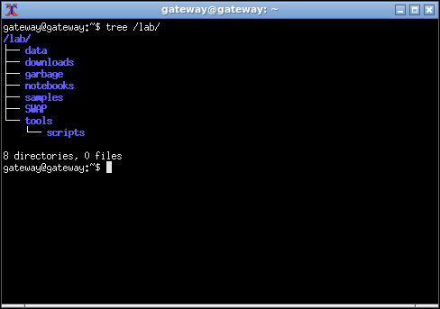

This is the second part of a series of articles detailing how I've built a Malware Analysis environment to execute, analyse and collect data from Malware samples. 

As a reference, Part I - A Logical View of The Lab article is available [here](). 

Part II details the steps to create and setup up a Virtual Machine that will take the role of a Gateway. This Gateway Virtual Machine, should be capable of simulating network services and have a minimum set of tools available for Static Analysis and Network monitoring duties.

# Software

I'm using VirtualBox as the Hypervisor due to it being free, easy to use and having all the features I need out of the box to setup a Malware Analysis Lab. Having said that, other hypervisors exist and you should be able to use any other to accomplish the same outcome.

I'll be using Ubuntu 20.04.2 Long Term Support as the OS on the Gateway Virtual Machine due to LTS (Long Term Support) edition comes with security updates until when it reaches its end of standard support, in April 2025.

## Operating System image

- You can download the OS image [Ubuntu 20.04.2 Server 64 Bit](http://www.releases.ubuntu.com/20.04/ubuntu-20.04.2-live-server-amd64.iso)

## Hypervisor

Depending on the guest OS you have different options to get VirtualBox up and running:
- **Windows/Mac OS**: [VirtualBox](https://www.virtualbox.org/wiki/Downloads) (Select "Windows hosts" or "OS X hosts" according to your Operating System)
- **Ubuntu Linux**: Use Ubuntu software repositories as Ubuntu's version uses Python 3. Run the following command from a terminal to install VirtualBox, VirtualBox Extensions Pack and VirtualBox Guest Additions ISO: 

<pre><code class="bash">sudo apt install virtualbox virtualbox-ext-pack virtualbox-guest-additions-iso -y</code></pre>

- **Other Linux flavours**: [VirtualBox website](https://www.virtualbox.org/wiki/Downloads) 

As a side note, if you are looking to see what other Hypervisors are available, please see this [Wikipedia](https://en.wikipedia.org/wiki/Comparison_of_platform_virtualization_software) comparison list.

# Network

## Creating a virtual internal network

The Gateway VM will be setup with two different Network Interface Cards (NIC). The first one will have a "NAT" Network type (Network Address Translation), this will allow the Virtual Machine to access the Internet.

The second network type will be an "Internal Network" type, VMs in this network will be able to communicate with each other but won't be acessible or able to communicate with other VMs or machines which are not part of the network.

<pre><code class="bash">VBoxManage dhcpserver add --netname malnet --ip 192.168.111.1 --netmask 255.255.255.0 --lowerip 192.168.111.2 --upperip 192.168.111.22 --enable</code></pre>

- netname is the name of the network,
- ip is the IP Address of the network,
- netmask is the Network Mask (255.255.255.0 means I can assign IP addresses 192.168.111.2-254 statically),
- lowerip represents the starting IP Address space available for VMs (192.168.111.1 is taken),
- upperip refers to the highest IP Address available for VMs (by using 192.168.111.22 allows for up to 20 guest VMs in the network with a static IP Address -- if you need more guests then just increase up to 254).

No DHCP server is necessary as the guest machines will be configured with a static IP addresses.

# Virtual machine creation and configuration

## Creating the Gateway virtual machine

<pre><code class="bash">VBoxManage createvm --name "Gateway" --basefolder "/backup/LAB/VMs/" --groups "/Malware Lab" --ostype Ubuntu_64 --register</code></pre>

- name is the name of this new Virtual Machine,
- basefolder is the directory path where you want to create the Virtual Machine in,
- groups allows to group VMs in a named group (all the VMs part of group can be started at the same time),
- ostype is the Operating System type (in this case I'm using Ubuntu 64 Bits, but you can use some other distribution if supported by the Hypervisor),
- register registers the Virtual Machine with VirtualBox allowing access through the UI.

The command VBoxManage can be used to show a list of Operating Systems supported by VirtualBox in case you want to use other Linux OS base image:

<pre><code class="bash">VBoxManage list ostypes</code></pre>

## Configuration of the Gateway virtual machine

<pre><code class="bash">VBoxManage modifyvm "Gateway" --memory 4096 --vram 128 --nic1 nat --nic2 intnet --intnet2 "malnet" --nicpromisc2 allow-vms --cpus 4 --graphicscontroller vmsvga --bioslogodisplaytime 0 --clipboard-mode hosttoguest</code></pre>

- memory sets 4 Giga-bytes of memory for the Virtual Machine (anything less than 2 Gyga-bytes is not recommended),
- vram sets 128 Mega-bytes of Video Card memory (16 Mega-bytes is also acceptable),
- nic1 the Network Card Interface number 1 is setup as "NAT" providing Internet access to the Virtual Machine,
- nic2 Network Card Interface number 2 is setup as "Internal Network" allowing the Virtual Machine to communicate with other Virtual Machines that are setup to access the Internal Network,
- nicproperty2 Network Card Interface number 2 will use the previously created internal network "malnet" on NIC 2,
- nicpromisc2 Network Card Interface number 2 will be set with Promiscuous Mode set to "Allow-VMs" (to allow the VM to capture the network traffic in the network),
- cpus I'm using 4 CPUs (depending on your hardware you might use less CPUs, these map to CPU cores on your physical hardware),
- graphicscontroller is set to "vmsvga",
- bioslogodisplaytime set to 0 to disable the BIOS logo,
- clipboard-mode set to hosttoguest to allow copy and paste from the Host machine to the Guest Virtual Machine (allows for easy copy and paste of any scripts to configure the VM post OS installation, can later be disabled when the functionality is not needed).

## Creating a virtual Hard-Disk file

<pre><code class="bash">VBoxManage createhd --filename "/backup/LAB/VMs/Gateway/Gateway.vdi" --size 100000 --format VDI</code></pre>

- filename location and name where the virtual Hard-Disk file will to be created,
- size is the size of the virtual Hard-Disk (you can set the value to a big size, it doesn't mean the virtual Hard-Disk file will occupy 100 Giga-bytes at creation but it is allowed to grow up to 100 Giga-bytes as more data is saved on the virtual Hard-Disk file),
- format "VDI" as the Hard-Disk file format.

## Setup of the Hard-Disk file

<pre><code class="bash">VBoxManage storagectl "Gateway" --name "SATA Controller" --add sata --controller IntelAhci</code></pre>

- name is the name of the Storage Device,
- add refers to the Storage Device type "SATA",
- controller sets the Storage Device controller type as "IntelAHCI".

## Attaching the Hard-Disk file to the Gateway virtual machine

<pre><code class="bash">VBoxManage storageattach "Gateway" --storagectl "SATA Controller" --port 0 --device 0 --type hdd --medium "/backup/LAB/VMs/Gateway/Gateway.vdi"</code></pre>

- storagectl is the name of the Storage Device,
- port is the port identifier,
- device refers to the device number,
- type sets the type as "HDD",
- medium is the location of the virtual Hard-Disk file.

## Setup of the CD-ROM ISO image

<pre><code class="bash">VBoxManage storagectl "Gateway" --name IDE --add ide</code></pre>

- name is the name of the Storage Device,
- add refers to the Storage Device type "IDE",

## Attaching the Operating System ISO image to the Gateway virtual machine

<pre><code class="bash">VBoxManage storageattach "Gateway" --storagectl IDE --port 0 --device 0 --type dvddrive --medium "/backup/LAB/ISOs/ubuntu-20.04-live-server-amd64.iso"</code></pre>

- storagectl is the name of the Storage Device,
- port is the port identifier,
- device refers to the device number,
- type sets the type as "DVDDRIVE",
- medium is the location of the OS ISO image file.

# Gateway Operating System

Installation of the Operating System is a straightforward process, although depending on the amount of times you end up performing the installation it's better to automate the process once all of the configurations and settings are set to stone. 

## Installing the OS

During manual installation of the OS, the installer walks you through various screens. The first screen asks you to select your language, the next one allows you to configure your keyboard. Of special interest is the "Network connections" screen, this is where the network configuration settings are input.

As 2 NICs were added to the Virtual Machine, there should be 2 entries listed for configuration.

The first entry uses IP address 10.0.2.15/24, you can leave it as is. This is VirtualBox virtual router address that VirtualBox uses to communicate with the Internet.

In the second entry we'll change the settings to use a static IP address by "Edit IPV4".

Change the "IPv4 Method" from "Automatic" to "Manual".

Set the "Subnet" to 192.168.111.0/24, "Address" will be 192.168.111.2 and leave all other fields empty. Select "Save".

Select "Done" to continue. In the "Configure Proxy" screen unless you're behind a proxy you can leave it as is. In the next screen select your prefered downloads mirror.

"Storage Configuration" screen allows to customize installation location and filesystem options, I've used the default settings for my installation. Select "Done" and the installer will ask you for confirmation, select "Continue" to begin the installation.

In the "Profile Setup" screen enter the server, username and the user password to continue. Select "Done" when ready.

The next screen will ask if you want to install OpenSSH server. Leave this blank as per default value and select "Done". The same on the next screen, leave all extra server options empty as there is no need to use any of that. Select "Done" and finally the installation begins.

After a few minutes, when the installation finishes, reboot the Virtual Machine.

# Post OS installation

## Cleaning up the new OS

After the installation completes, the first thing to do is to remove snapd and cloud-init. Removing snap during OS installation results in an error message and halting the installation, cloud-init removal breaks the ability of the user to login with the generated password.

<pre><code class="bash">sudo snap remove lxd
sudo snap remove core18
sudo snap remove snapd
sudo apt -y purge snapd cloud-init 
sudo rm -rf /etc/cloud/ /var/lib/cloud/</code></pre>

## Installing VirtualBox Guest additions

If you don't have the VirtualBox Guest Additions ISO file you can get the file by executing the following command in the Host machine:

<pre><code class="bash">sudo apt install virtualbox-guest-additions-iso -y</code></pre>

Alternatively the ISO file can be downloaded directly from [https://download.virtualbox.org/virtualbox](https://download.virtualbox.org/virtualbox)

After you make sure you have access to the file, attach the ISO file to the Guest Virtual Machine with the following command in the Host machine:

<pre><code class="bash">VBoxManage storageattach "Gateway" --storagectl IDE \
--port 0 --device 0 --type dvddrive \
--medium /usr/share/virtualbox/VBoxGuestAdditions.iso</code></pre>

- storagectl is the name of the Storage Device,
- port is the port identifier,
- device refers to the device number,
- type sets the type as "DVDDRIVE",
- medium is the location of the VBoxGuestAdditions ISO image file.

In the Guest Virtual Machine, first update the system to the lastest available updated packages. Proceed to install the essential development tools package and then install the VirtualBox Guest Additions:

<pre><code class="bash">sudo apt update && sudo apt upgrade -y && sudo apt install build-essential -y && sudo apt autoremove -y && sudo apt clean
sudo mount /dev/cdrom /mnt
sudo /mnt/./VBoxLinuxAdditions.run</code></pre>

## A minimal graphical workstation

Install a base minimal X graphical system to take advantage of increased resolution and allow for copy & paste from Host system to the Guest VM:

<pre><code class="bash">sudo apt -y install xserver-xorg xclip xsel xdm xterm openbox --no-install-recommends</code></pre>

When the installation is finished, reboot the system for the changes to take effect.

<pre><code class="bash">reboot</code></pre>

After login, looking at the Virtual Machine resources we can see that after the installation and a minimal set of packages were installed, the system consumes 2.7 Gigabytes of disk space and 163 Megabytes of memory.

## First snapshot

It's time to take the first snapshot of the lab and start building the lab toolset. To take a snapshot run the following commands in the Host terminal while the Guest VM is running:

<pre><code class="bash">VBoxManage controlvm "Gateway" savestate
VBoxManage snapshot "Gateway" take "OS Installation" --description "Base OS installation with minimal X server and no tools installed"</code></pre>

# Toolset

## The Lab directory structure

It's good practice to use a logical directory structure to keep files organized, I personally use the following structure, but feel free to use something else if you prefer:

The above directory structure can be created with the command:

<pre><code class="bash">sudo mkdir -p /lab && sudo chown $USER /lab && mkdir -p /lab/{SWAP,data,notebooks,downloads,garbage,tools,tools/scripts,samples}
</code></pre>

The lab has no tools installed yet, there is not much we can do with it. 
## Extra repositories 

Ubuntu by default ships old but stable versions of software, to workaround this issue we're going to use repositories provided by the tools authors to install and use the most recent versions of the tools in the Gateway Virtual Machine. With the Guest virtual machine running, execute the following commands in the terminal (if you installed VirtualBox Guest additions, copy & paste should be working):

[TOR](https://www.torproject.org/)

> "Tor is free and open-source software for enabling anonymous communication by directing Internet traffic through a free, worldwide, volunteer overlay network consisting of more than seven thousand relays[6] in order to conceal a user's location and usage from anyone conducting network surveillance or traffic analysis." [Wikipedia website](https://en.wikipedia.org/wiki/Tor_%28anonymity_network%29)

<pre><code class="bash">sudo curl https://deb.torproject.org/torproject.org/A3C4F0F979CAA22CDBA8F512EE8CBC9E886DDD89.asc | sudo gpg --import
sudo gpg --export A3C4F0F979CAA22CDBA8F512EE8CBC9E886DDD89 | sudo apt-key add - 
sudo sh -c 'echo "deb https://deb.torproject.org/torproject.org focal main" > /etc/apt/sources.list.d/tor.list'
sudo sh -c 'echo "deb-src https://deb.torproject.org/torproject.org focal main" >> /etc/apt/sources.list.d/tor.list'</code></pre>

[INetSim](https://www.inetsim.org/)

> "INetSim is a software suite for simulating common internet services in a lab environment, e.g. for analyzing the network behaviour of unknown malware samples." [INetSim website](https://www.inetsim.org/)

<pre><code class="bash">sudo sh -c 'echo "deb http://www.inetsim.org/debian/ binary/" > /etc/apt/sources.list.d/inetsim.list'
sudo wget -O - https://www.inetsim.org/inetsim-archive-signing-key.asc | sudo apt-key add - </code></pre>

[Microsoft Visual Studio Code](https://code.visualstudio.com/)

> "Visual Studio Code is a code editor redefined and optimized for building and debugging modern web and cloud applications. Visual Studio Code is free and available on your favorite platform - Linux, macOS, and Windows." [Microsoft Visual Studio Code website](https://code.visualstudio.com/)

<pre><code class="bash">curl https://packages.microsoft.com/keys/microsoft.asc | gpg --dearmor > ~/microsoft.gpg
sudo install -o root -g root -m 644 ~/microsoft.gpg /etc/apt/trusted.gpg.d/
sudo sh -c 'echo "deb [arch=amd64] https://packages.microsoft.com/repos/vscode stable main" > /etc/apt/sources.list.d/vscode.list'</code></pre>

[Wireshark](https://www.wireshark.org/)

> "Wireshark is the world’s foremost and widely-used network protocol analyzer. It lets you see what’s happening on your network at a microscopic level and is the de facto (and often de jure) standard across many commercial and non-profit enterprises, government agencies, and educational institutions." [Wireshark website](https://www.wireshark.org/)

<pre><code class="bash">sudo add-apt-repository ppa:wireshark-dev/stable -y</code></pre>

[PolarProxy](https://www.netresec.com/?page=PolarProxy)

> "PolarProxy is a transparent SSL/TLS proxy created for incident responders and malware researchers. PolarProxy is primarily designed to intercept and decrypt TLS encrypted traffic from malware. PolarProxy decrypts and re-encrypts TLS traffic, while also saving the decrypted traffic in a PCAP file that can be loaded into Wireshark or an intrusion detection system (IDS)." [PolarProxy website](https://www.netresec.com/?page=PolarProxy)

<pre><code class="bash">sudo adduser --system --shell /bin/bash proxyuser 
sudo mkdir /var/log/PolarProxy && sudo chown proxyuser:root /var/log/PolarProxy/ && sudo chmod 0775 /var/log/PolarProxy/ 
mkdir ~/PolarProxy && cd ~/PolarProxy
curl https://www.netresec.com/?download=PolarProxy | tar -xzvf - 
sudo mv ~/PolarProxy /home/proxyuser/
sudo chown -R proxyuser /home/proxyuser/PolarProxy/
sudo cp /home/proxyuser/PolarProxy/PolarProxy.service /etc/systemd/system/PolarProxy.service</code></pre>

## OS tools (command line)

 Name | Purpose
------|--------
 tree | Display directory structure
 ncdu | Display disk space usage
 bat  | Cat clone with many extra features
 htop | System monitoring
 mc   | Terminal file manager, editor, and many more
 arj, zip, unzip, p7zip, unrar | Support for compressed archives
 net-tools | System tools for Linux networking
 apt-transport-https | Allows the use of repositories accessed via the HTTP Secure protocol (HTTPS)
 fzy | A fuzzy text selector for the terminal
 iptables-persistent | Makes iptables rules persistent over reboots
 micro | An enhanced text editor 

<pre><code class="bash">sudo apt -y install tree ncdu bat htop most mc arj zip unzip p7zip unrar net-tools apt-transport-https fzy iptables-persistent --no-install-recommends
cd /usr/bin/; curl https://getmic.ro | sudo bash</code></pre>

When iptables-persistent asks "Save current IPv4 rules?", select Yes.

When iptables-persistent asks "Save current IPv6 rules?", select Yes.

## Graphical tools

 Name | Purpose
------|--------
caja  | Graphical file manager
engrampa | Compressed file handler
eom   | Image viewer
mousepad | Text editor
tilix | Terminal emulator
firefox | Web browser
zim   | A desktop wiki to document results from analysis
mate-polkit | Authentification agent for PolicyKit 
speedcrunch | Calculator
flameshot | Screenshot application
conky | Desktop system monitoring
rofi | Application launcher
dunst | Notification daemon
xfreerdp (freerdp2-x11) | RDP client
gvfs-backends | Various userspace virtual filesystem (ftp, samba and others)
caja-open-terminal | Open terminal from file manager in current directory 

<pre><code class="bash">sudo apt -y install caja engrampa eom mousepad tilix firefox zim mate-polkit speedcrunch flameshot conky rofi dunst freerdp2-x11 --no-install-recommends
sudo apt -y install gvfs-backends caja-open-terminal</code></pre>

## Frameworks

 Name | Purpose
------|--------
python3-pip | Package manager for Python 3
python3-venv | Virtual environments for Python 3
python-is-python3 | Convenience package which ships a symlink to point the /usr/bin/python interpreter at the current default python3
openjdk-14-jre-headless | Java JDK 14

<pre><code class="bash">sudo apt -y install python3-pip python3-venv python-is-python3 openjdk-14-jre-headless --no-install-recommends</code></pre>

## Analysis tools

 Name | Purpose
------|--------
TOR (deb.torproject.org-keyring) | Anonymization
Code | Code editor
Wireshark | Network analyzer and packet capture
INetSim | Network service simulation
netcat-openbsd | NetCat (Debian's fork of OpenBSD's netcat with extra features)
wrestool (icoutils) | Lists or extracts the resources from Windows PE files
InspIRCd | IRC server
yara | Identification and classification of Malware
ssdeep | Identification and classification of Malware through fuzzy hashes
exiftool | File meta data viewer
Volatility | The volatile memory extraction framework
Ghidra | A software reverse engineering (SRE) framework
Avalonia IL Spy | .NET decompiler
CAPA | Detects capabilities in executable files
CyberChef | A web tool enabling encoding like XOR or Base64, more complex encryption like AES, DES and Blowfish, creating binary and hexdumps, compression and decompression of data, calculating hashes and checksums, IPv6 and X.509 parsing, changing character encodings, and much more
Detect It Easy | Detects packers, determines types of files
FLOSS | Deobfuscates strings from malware binaries
JD-GUI | Java decompiler
PE-Bear | Reversing tool for PE files
Portex Analyzer | Library for static malware analysis of Portable Executable files
Binwalk | Tool for analyzing, reverse engineering, and extracting firmware images
RUPS | Tool to view PDF structure in a Swing GUI

<pre><code class="bash">sudo apt -y install tor deb.torproject.org-keyring code wireshark inetsim --no-install-recommends
sudo apt -y install netcat-openbsd inspircd yara ssdeep exiftool icoutils binwalk
git clone https://github.com/volatilityfoundation/volatility3.git /lab/tools/volatility3
LAB_NAME="/lab/tools/avalonia-ilspy" && REPO="icsharpcode/AvaloniaILSpy" && VERSION=$(git ls-remote --tags https://github.com/"$REPO" | cut -d/ -f3- | tail -n1) && wget https://github.com/"$REPO"/releases/download/"$VERSION"/ILSpy-linux-x64-Release.zip -O "$LAB_NAME".zip && unzip "$LAB_NAME".zip -d "$LAB_NAME" && rm "$LAB_NAME".zip && chmod +x "$LAB_NAME"/ILSpy
LAB_NAME="/lab/tools/capa" && wget $(curl -s https://api.github.com/repos/fireeye/capa/releases/latest | grep 'browser_' | cut -d\" -f4 | grep 'linux') -O "$LAB_NAME".zip && unzip "$LAB_NAME".zip -d "$LAB_NAME" && rm "$LAB_NAME".zip
LAB_NAME="/lab/tools/die" && wget $(curl -s https://api.github.com/repos/horsicq/DIE-engine/releases/latest | grep 'browser_' | cut -d\" -f4 | grep 'lin') -O "$LAB_NAME".tar.gz && mkdir -p "$LAB_NAME" && tar -xvf "$LAB_NAME".tar.gz -C "$LAB_NAME" --strip-components 1 && rm "$LAB_NAME".tar.gz
LAB_NAME="/lab/tools/floss" && wget $(curl -s https://api.github.com/repos/fireeye/flare-floss/releases/latest | grep 'browser_' | cut -d\" -f4 | grep 'linux') -O "$LAB_NAME".zip && unzip "$LAB_NAME".zip -d "$LAB_NAME" && rm "$LAB_NAME".zip
LAB_NAME="/lab/tools/jd-gui" && REPO="java-decompiler/jd-gui" && VERSION=$(git ls-remote --tags https://github.com/"$REPO" | cut -d/ -f3- | tail -n1 | sed 's/v//') && wget $(curl -s https://api.github.com/repos/$REPO/releases/latest | grep 'browser_' | cut -d\" -f4 | grep "jd-gui-$VERSION.jar") -P "$LAB_NAME"
LAB_NAME="/lab/tools/pebear" && wget $(curl -s https://api.github.com/repos/hasherezade/pe-bear-releases/releases/latest | grep 'browser_' | cut -d\" -f4 | grep 'linux') -O "$LAB_NAME".xz && mkdir -p "$LAB_NAME" && tar -xvf "$LAB_NAME".xz -C "$LAB_NAME" --strip-components 1 && rm "$LAB_NAME".xz
LAB_NAME="/lab/tools/portex" && mkdir -p "$LAB_NAME" && wget https://github.com/katjahahn/PortEx/raw/master/progs/PortexAnalyzer.jar -P "$LAB_NAME"
LAB_NAME="/lab/tools/cyberchef" && wget $(curl -s https://api.github.com/repos/gchq/CyberChef/releases/latest | grep 'browser_' | cut -d\" -f4 | grep 'CyberChef') -O "$LAB_NAME".zip && unzip "$LAB_NAME".zip -d "$LAB_NAME" && rm "$LAB_NAME".zip
LAB_NAME="/lab/tools/ghidra" && wget -r -l1 -H -t1 -nd -N -np -A.zip -erobots=off https://www.ghidra-sre.org -P "$LAB_NAME" && unzip "$LAB_NAME"/*.zip -d "$LAB_NAME" && rm "$LAB_NAME"/*.zip
LAB_NAME="/lab/tools/rups" && wget $(curl -s https://api.github.com/repos/itext/i7j-rups/releases/latest | grep 'browser_' | cut -d\" -f4 | grep 'only-jars') -O "$LAB_NAME".zip && unzip "$LAB_NAME".zip -d "$LAB_NAME" && rm "$LAB_NAME".zip</code></pre>

When Wireshark asks "Should non-superusers be able to capture packets?", select Yes.

## Pimp my lab!

<pre><code class="bash">sudo apt -y install obconf fonts-mononoki adwaita-icon-theme-full kde-style-breeze qt5ct</code></pre>

# Keeping the lab updated

asdsad
# Automation

## Virtual Machine creation and Operating System installation

Ubuntu allows to customize the installer building a "remixed" version of the Ubuntu distribution. The following script automates the OS installation process following the predefined configuration. A customized ISO image will be available after the script finishes. 

Note this script depends on 7z, mkisofs and mkpasswd to be installed on the Host system, if necessary (in Ubuntu) execute from a terminal console to install the missing software:
<pre><code class="bash">sudo apt install whois p7zip-full -y</code></pre>

After the script finishes, a working Virtual Machine should be up and running. The following are a list of variables that can be modified to customize the build process:

- VM_NAME is the Virtual Machine name,
- VM_GROUP_NAME is the Group name that the VM will be part of,
- VM_USERNAME the VM username,
- VM_PASSWORD the VM password,
- VM_HOSTNAME the VM hostname (so you can identify the machine),
- VM_LOCALE change according to you location,
- VM_TIMEZONE change according to your timezone preference,
- VM_KEYBOARD change according to your keyboard,
- VM_IP_ADDRESS the static IP address the VM will use,
- VM_INTERNAL_NETWORK_NAME is the name of the virtual Internal Network (malnet),
- VM_INTERNAL_NETWORK_NETMASK is the virtual Internal Network netmask,
- VM_INTERNAL_NETWORK_LOWERIP is the virtual Internal Network lowest IP address that can be assigned,
- VM_INTERNAL_NETWORK_UPPERIP is the virtual Internal Network highest IP address that can be assigned,
- VM_INTERNAL_NETWORK_IP used by DHCP server,
- VM_CPUS number of CPUs the VM will use (change accordingly to your hardware, if your system has 16 cores or more keep 4 as default),
- VM_RAM the RAM allocated to the machine (change accordingly to your hardware),
- VM_VRAM the Video RAM (16 should be enough, although I'm using 128),
- VM_HDD_SIZE the size of the virtual Hard-Disk file (note it doesn't create a file with this size, but instead is the tsize the file can grow up to),
- BASE_DIRECTORY sets the lab location, change accordingly,
- VM_IMAGES_DIRECTORY location of where the ISO files are to be located,
- VM_VMS_DIRECTORY location of where the Virtual Machines are to be located,
- VM_OS_ISO is the filename of the OS,
- VM_REMIX_ISO_NAME is the filename of the remixed OS.

<pre><code class="bash">#! /bin/bash

VM_NAME="Gateway"
VM_GROUP_NAME="Malware Lab"
VM_USERNAME="gateway"
VM_PASSWORD="53cur35y5t3m"
VM_HOSTNAME="gateway"
VM_LOCALE="en_US.UTF-8"
VM_TIMEZONE="Europe/London"
VM_KEYBOARD="pt"
VM_IP_ADDRESS="192.168.111.2/24" # Static IP Address
VM_INTERNAL_NETWORK_NAME="malnet" # Internal Network name
VM_INTERNAL_NETWORK_NETMASK="255.255.255.0"
VM_INTERNAL_NETWORK_LOWERIP="192.168.111.2"
VM_INTERNAL_NETWORK_UPPERIP="192.168.111.22"
VM_INTERNAL_NETWORK_IP="192.168.111.1"
VM_CPUS=4
VM_RAM=4096 # 4 Giga-Bytes
VM_VRAM=128 # 128 Mega-Bytes
VM_HDD_SIZE=100000 # 100 Giga-Bytes

BASE_DIRECTORY="~/LAB" # Location of the lab
VM_IMAGES_DIRECTORY="$BASE_DIRECTORY/ISOs" # Location of the ISO images both regular Ubuntu and Remixed version
VM_VMS_DIRECTORY="$BASE_DIRECTORY/VMs/" # Location of the Virtual Machines
VM_OS_ISO="ubuntu-20.04.2-live-server-amd64.iso"
VM_REMIX_ISO_NAME="ubuntu-20.04.2-live-server-remixed-amd64.iso"

# --------------------------------------

VM_HDD_LOCATION="$VM_VMS_DIRECTORY/$VM_NAME/$VM_NAME.vdi"
VAR_BUILD="$BASE_DIRECTORY/$VM_NAME/build"
VAR_DATA="$BASE_DIRECTORY/$VM_NAME/data"
VM_OS_REMIX_ISO_LOCATION="$VM_IMAGES_DIRECTORY/$VM_REMIX_ISO_NAME"

function make_remix() {
	local directory_automation="$VAR_DATA/automation"
	local directory_iso_settings="$VAR_BUILD/nocloud"
	mkdir -p "$directory_automation"
	touch "$directory_automation/meta-data"
	local user_password=$(echo "$VM_PASSWORD" | mkpasswd -m sha512crypt --stdin)
	printf "Creating automated installation configuration file ..."
	cat <<-EOF > "$directory_automation/user-data"
	#cloud-config
        autoinstall:
          version: 1
          early-commands:
            - systemctl stop ssh
          locale: $VM_LOCALE
          userdata:
            timezone: $VM_TIMEZONE
          keyboard:
            layout: $VM_KEYBOARD
          ssh:
            install-server: false
            allow-pw: false
          identity:
            hostname: $VM_HOSTNAME
            password: $user_password # $VM_PASSWORD
            username: $VM_USERNAME
          user-data:
            disable_root: true
          network:
            network:
              version: 2
              ethernets:
                eth0:
                  dhcp4: true
                eth1:
                  dhcp4: false
                  addresses: 
                  - $VM_IP_ADDRESS
                  nameservers: {}
          apt:
            preserve_sources_list: false
            primary:
              - arches: [amd64]
                uri: "http://archive.ubuntu.com/ubuntu/"
          storage:
            swap:
              size: 0
            config:
            - {ptable: gpt, path: /dev/sda, wipe: superblock-recursive, preserve: false, name: '', grub_device: true, type: disk, id: disk-sda}
            - {device: disk-sda, size: 512M, flag: bios_grub, number: 1, preserve: false, type: partition, id: partition-0}
            - {device: disk-sda, size: -1, wipe: superblock, flag: '', number: 2, preserve: false, type: partition, id: partition-1}
            - {fstype: ext4, volume: partition-1, preserve: false, type: format, id: format-0}
            - {device: format-0, path: /, type: mount, id: mount-0}
          packages:
          - open-vm-tools
          late-commands:
          - curtin in-target --target=/target -- apt-get --purge -y --quiet=2 remove apport bcache-tools friendly-recovery fwupd landscape-common lxd-agent-loader popularity-contest sosreport ufw byobu
          - curtin in-target --target=/target -- apt-get --purge -y --quiet=2 autoremove
          - curtin in-target --target=/target -- apt-get clean
          - echo '$VM_USERNAME ALL=(ALL) NOPASSWD:ALL' > /target/etc/sudoers.d/$VM_USERNAME
          - sed -ie 's/GRUB_CMDLINE_LINUX=.*/GRUB_CMDLINE_LINUX="quiet net.ifnames=0 ipv6.disable=1 biosdevname=0"/' /target/etc/default/grub
          - curtin in-target --target /target update-grub2
          - sed -i 's/ENABLED=1/ENABLED=0/' /target/etc/default/motd-news
	EOF
	mkdir -p "$directory_iso_settings"
	printf "Extracting ISO data: $(7z x "$VM_IMAGES_DIRECTORY/$VM_OS_ISO" -o"$VAR_BUILD" -y)\n"
	printf "Copying automation script files:\n$(cp --verbose -r "$directory_automation/"* "$directory_iso_settings")\n"
	printf "Preparing ISO:\n$(rm -rfv "$VAR_BUILD/[BOOT]/")\n"
	sed -i 's|---|autoinstall ds=nocloud\\\;s=/cdrom/nocloud/ ---|g' "$VAR_BUILD/boot/grub/grub.cfg"
	sed -i 's|---|autoinstall ds=nocloud;s=/cdrom/nocloud/ ---|g' "$VAR_BUILD/isolinux/txt.cfg"
	sed -i 's/timeout 50/timeout 10/g' "$VAR_BUILD/isolinux/isolinux.cfg"
	cat <<-EOF > "$VAR_BUILD/README.diskdefines"
	#define DISKNAME  Ubuntu-Server 20.04.2 LTS "Focal Fossa" - Release amd64 (REMIXED)
	#define TYPE  binary
	#define TYPEbinary  1
	#define ARCH  amd64
	#define ARCHamd64  1
	#define DISKNUM  1
	#define DISKNUM1  1
	#define TOTALNUM  0
	#define TOTALNUM0  1
	EOF
	md5sum "$VAR_BUILD/README.diskdefines" > "$VAR_BUILD/md5sum.txt"
	sed -i 's|'"$VAR_BUILD/"'|./|g' "$VAR_BUILD/md5sum.txt"
	printf "Generating $VM_REMIX_ISO_NAME ISO file ...\n"
	mkisofs -o "$VM_IMAGES_DIRECTORY/$VM_REMIX_ISO_NAME" -b isolinux/isolinux.bin -c isolinux/boot.cat -no-emul-boot -boot-load-size 4 -boot-info-table -J -l -V "${VM_NAME^} OS ISO" "$VAR_BUILD"
	printf "$(file "$VM_IMAGES_DIRECTORY/$VM_REMIX_ISO_NAME")\n"
}

function create_vm(){
	VBoxManage dhcpserver add \
	    --netname "$VM_INTERNAL_NETWORK_NAME" \
	    --ip "$VM_INTERNAL_NETWORK_IP" \
	    --netmask "$VM_INTERNAL_NETWORK_NETMASK" \
	    --lowerip "$VM_INTERNAL_NETWORK_LOWERIP" \
	    --upperip "$VM_INTERNAL_NETWORK_UPPERIP" \
	    --enable

	VBoxManage createvm \
	    --name "$VM_NAME" \
	    --basefolder "$VM_VMS_DIRECTORY" \
	    --groups "/$VM_GROUP_NAME" \
	    --ostype Ubuntu_64 \
	    --register

	VBoxManage modifyvm "$VM_NAME" \
	    --memory $VM_RAM \
	    --vram $VM_VRAM \
	    --nic1 nat \
	    --nic2 intnet \
	    --intnet2 "$VM_INTERNAL_NETWORK_NAME" \
	    --nicpromisc2 allow-vms \
	    --cpus $VM_CPUS \
	    --graphicscontroller vmsvga \
	    --bioslogodisplaytime 0 \
	    --clipboard-mode hosttoguest

	VBoxManage createhd \
	    --filename "$VM_HDD_LOCATION" \
	    --size $VM_HDD_SIZE \
	    --format VDI

	VBoxManage storagectl "$VM_NAME" \
	    --name "SATA Controller" \
	    --add sata \
	    --controller IntelAhci

	VBoxManage storageattach "$VM_NAME" \
	    --storagectl "SATA Controller" \
	    --port 0 \
	    --device 0 \
	    --type hdd \
	    --medium "$VM_HDD_LOCATION"

	VBoxManage storagectl "$VM_NAME" \
	    --name IDE \
	    --add ide

	VBoxManage storageattach "$VM_NAME" \
	    --storagectl IDE \
	    --port 0 \
	    --device 0 \
	    --type dvddrive \
	    --medium "$VM_OS_REMIX_ISO_LOCATION"
	    
	VBoxManage startvm "$VM_NAME"
}

make_remix
create_vm</code></pre>
## Lab toolset installation

Create a new script file in the Guest VM and copy & paste the following bash script:

<pre><code class="bash">#! /bin/bash

USER_NAME="gateway"

printf "\nRemove packages ...\n\n"
sudo apt -y purge cloud-init
sudo rm -rf /etc/cloud/
sudo rm -rf /var/lib/cloud/

printf "\nCreate lab directory structure ...\n\n"
sudo mkdir -p /lab && sudo chown $USER /lab && mkdir -p /lab/{SWAP,data,notebooks,downloads,garbage,tools,tools/scripts,samples}

printf "\nAdd analysis tools repositories ...\n\n"
printf "\nTOR\n"
sudo curl https://deb.torproject.org/torproject.org/A3C4F0F979CAA22CDBA8F512EE8CBC9E886DDD89.asc | sudo gpg --import
sudo gpg --export A3C4F0F979CAA22CDBA8F512EE8CBC9E886DDD89 | sudo apt-key add - 
sudo sh -c 'echo "deb https://deb.torproject.org/torproject.org focal main" > /etc/apt/sources.list.d/tor.list'
sudo sh -c 'echo "deb-src https://deb.torproject.org/torproject.org focal main" >> /etc/apt/sources.list.d/tor.list'
printf "\nINetSim\n"
sudo echo "deb http://www.inetsim.org/debian/ binary/" > /etc/apt/sources.list.d/inetsim.list
sudo wget -O - https://www.inetsim.org/inetsim-archive-signing-key.asc | sudo apt-key add - 
printf "\nCode\n"
curl https://packages.microsoft.com/keys/microsoft.asc | gpg --dearmor > ~/microsoft.gpg
sudo install -o root -g root -m 644 ~/microsoft.gpg /etc/apt/trusted.gpg.d/
sudo sh -c 'echo "deb [arch=amd64] https://packages.microsoft.com/repos/vscode stable main" > /etc/apt/sources.list.d/vscode.list'
printf "\nWireshark\n"
sudo add-apt-repository ppa:wireshark-dev/stable -y

printf "\nPolarProxy\n"
sudo adduser --system --shell /bin/bash proxyuser 
sudo mkdir /var/log/PolarProxy
sudo chown proxyuser:root /var/log/PolarProxy/
sudo chmod 0775 /var/log/PolarProxy/ 
mkdir ~/PolarProxy
cd ~/PolarProxy
curl https://www.netresec.com/?download=PolarProxy | tar -xzvf - 
sudo mv ~/PolarProxy /home/proxyuser/
sudo chown -R proxyuser /home/proxyuser/PolarProxy/
sudo cp /home/proxyuser/PolarProxy/PolarProxy.service /etc/systemd/system/PolarProxy.service 

printf "\nUpdates ...\n\n"
sudo apt update
printf "\nInstall utilities ...\n\n"
sudo apt -y install tree ncdu bat htop most mc arj zip p7zip unzip unrar unarj net-tools apt-transport-https fzy --no-install-recommends
sudo debconf-set-selections <<EOF
iptables-persistent iptables-persistent/autosave_v4 boolean true
iptables-persistent iptables-persistent/autosave_v6 boolean true
EOF
sudo apt-get -y install iptables-persistent
cd /usr/bin/; curl https://getmic.ro | sudo bash
printf "\nInstall graphical utilities ...\n\n"
sudo apt -y install caja engrampa eom mousepad tilix conky rofi dunst firefox zim fonts-mononoki adwaita-icon-theme-full mate-polkit obconf speedcrunch flameshot kde-style-breeze qt5ct --no-install-recommends
sudo apt -y install gvfs-backends caja-open-terminal
printf "\nInstall build tools ...\n\n"
sudo apt -y install build-essential python3-pip python3-venv python-is-python3 openjdk-14-jre-headless --no-install-recommends

printf "\nInstall analysis tools ...\n\n"
sudo apt -y install tor deb.torproject.org-keyring code wireshark iptables-persistent netcat-openbsd inetsim yara ssdeep exiftool inspircd --no-install-recommends
git clone https://github.com/volatilityfoundation/volatility3.git /lab/tools/volatility3
ln -s /lab/tools/volatility3/vol*.py /lab/tools/scripts/

printf "\nSetup Wireshark ...\n\n"
sudo usermod -a -G wireshark "$USER_NAME"

printf "\nSetup INetSim manager ...\n\n"
sudo usermod -a -G inetsim "$USER_NAME"
sudo chgrp -R inetsim /var/log/inetsim
sudo chmod 770 /var/log/inetsim

printf "\nDisable services ...\n\n"
sudo systemctl disable tor.service
sudo systemctl disable inspircd.service
sudo systemctl disable inetsim.service

printf "\nClean-up ...\n\n"
sudo apt -y autoremove
sudo apt clean</code></pre>
