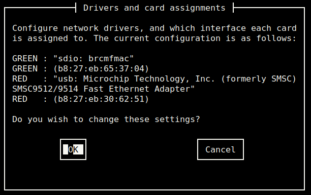
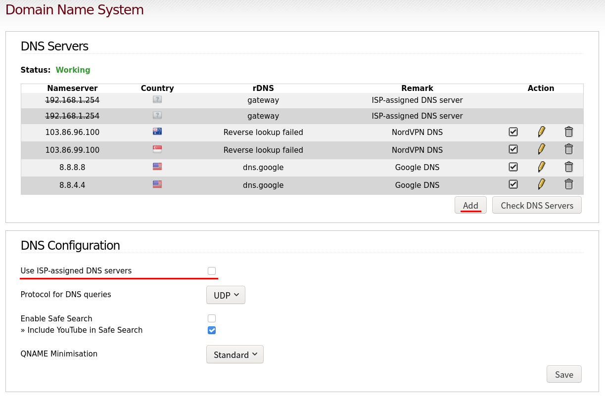

# Introduction

Post [Malware Analysis Lab - Part 1 - The Gateway](), details the steps taken to create a "Gateway" virtual machine hat can be used on a Malware Analysys environment. 

A Raspberry Pi computer board allied with IPFire Operating System can be used to extend the environment capabilitites to include Router, Firewall and OpenVPN client capabilities. 

## Logical architecture

The following image shows the logical architecture of the lab environment. Changes to the environment are at the top of the image in the "Physical" layer of the diagram. Every other aspect of the environment is unchanged:


# Hardware

Please note that <span class="highlight-red"> a Raspberry Pi computer board is required to follow the instructions in this post</span>.  

# Software

IPFire will be used as the Operating System. For more information about which Raspberry Pi versions are supported by IPFire, please see this link: [https://wiki.ipfire.org/hardware/arm/rpi](https://wiki.ipfire.org/hardware/arm/rpi)

> "IPFire is a hardened, versatile, state-of-the-art Open Source firewall based on Linux. Its ease of use, high performance in any scenario and extensibility make it usable for everyone." [IPFire website](https://www.ipfire.org/)

Download the OS image for the Raspberry Pi model used from [https://www.ipfire.org/](https://www.ipfire.org).

# Flashing IPFire image

When the download finishes, flash the downloaded image to an SD Card. If using Linux, the following commands can be run to flash the image to the SD Card ([IPFire website](https://wiki.ipfire.org/hardware/arm/rpi/three) provides instructions for other Operating Systems):

1. <pre><code class="bash">lsblk</code></pre> shows the devices currently mounted and can be used to identify the SD Card,
2. <pre><code class="bash">umount /dev/sd<span class="highlight-green">X</span></code></pre> unmount the "sdX" (SD Card) drive partitions,
3. <pre><code class="bash">xzcat <span class="highlight-green">/path/to</span>/<span class="highlight-green">IPFIRE_IMAGE</span>.img.xz | sudo dd bs=1M of=/dev/sd<span class="highlight-green">X</span></code></pre> writes the "IPFIRE_IMAGE" image located in the absolute path "/path/to" to device "X",

4. In my case I had to edit the "uENV.txt" file and change "SERIAL-CONSOLE" from "ON" to "OFF" to enable HDMI output and USB keyboard, 

5. <pre><code class="bash">eject /dev/sd<span class="highlight-green">X</span></code></pre> unmounts and ejects the "sdX" drive from the computer. 

When the process finishes, the SD Card can then be removed from the computer.

# OS Configuration

Plug the SD Card in the Raspberry Pi, connect the Raspberry Pi to your ISP modem and connect the Rapberry Pi to a power source. Wait a couple of minutes for the Operating System to boot. IPFire comes with a handy setup tool to guide through the initial configuration process. 

The first screen allows to choose the "Keyboard" map to use, the next screen selects the "Timezone", followed by "Hostname" and "Domain name" setup screens. 

The installation process then goes through setting the root user password for access to the Raspberry Pi box, followed by the admin user password, required for access to the web interface.

Unfortunately, I didn't take pictures of the configuration screens when I was configuring my system. The following images were taken after the configuration using a SSH remote connection to capture the configuration details.

In the "Network configuration menu" select "Network configuration type" and make sure to use "GREEN + RED". The Raspberry Pi has 2 network cards out of the box, we can only create 2 network interfaces.


The "Drivers and card assignments" allows to map Raspberry Pi's network cards to network interfaces. Map the Wireless card "sdio: brcmfmac" to the GREEN interface. "usb: SMSC9512/9514" should map to the RED interface. 

For more information, please see [https://wiki.ipfire.org/installation/step5](https://wiki.ipfire.org/installation/step5).



The "Address settings" can be used to configure the created network interfaces. Note that when configuring the "GREEN" interface a warning message will display, this is normal. 

I've used "IP address" 192.168.2.10, and "Network mask" 255.255.255.0 for my setup.


For the RED interface, DHCP was used and all values were left as default.


Select "Ok" and then "Done" until the "DHCP server configuration" screen appears. 

In this screen I've assigned IP values to "Start Address" 192.168.2.11, "End Address" 192.168.2.20 and "Primary DNS" I've used my ISP modem IP address, "Secondary DNS" 192.168.2.1. 

Note the range 11 to 20 allows up to 19 hosts to be added on the network. If you require more hosts to be able to connect, then increase the values.

The message "Setup is complete" is displayed when the process is complete. 

# Enabling Wireless Access

Wireless access is disabled by default. In order to enable wireless, additional software needs to be installed and interface settings have to change to match the installation configuration settings. 

Login with the root account and install "hostapd" application using the following command:

<pre><code class="bash">pakfire install hostapd</code></pre> 

The hostapd.conf file by default uses the BLUE interface. As no BLUE interface was created, change it to use the GREEN one instead:

<pre><code class="bash">sed -i 's/interface=blue0/interface=green0/g' /etc/hostapd.conf</code></pre> 

The same applies to /etc/init.d/hostapd file, change the default interface from BLUE to GREEN:

<pre><code class="bash">sed -i 's/INTERFACE="blue0"/INTERFACE="green0"/g' /etc/init.d/hostapd</code></pre> 

If necessary to customize the network name, change the ssid variable in /etc/hostapd.conf file.

The configuration file /etc/hostapd.conf comes with a default password set. Change "MY_PASSWORD" to your prefered password (this is the WiFi password used to access the network):

<pre><code class="bash">sed -i 's/wpa_passphrase=IPFire-2.x/wpa_passphrase=<span class="highlight-green">MY_PASSWORD</span>/g' /etc/hostapd.conf</code></pre> 

Reboot the system for settings to take effect:

<pre><code class="bash">reboot</code></pre>

# IPFire Web interface

After the system finishes booting, connect to the Wifi network. 

The web interface can be accessed through the URL [https://192.168.1.1:444](https://192.168.1.1:444). Use your admin user details to login.

## SSH Access

SSH configuration details can be accessed through the top bar navigation menu in "System" -> "SSH Access":


Instead of having SSH always enabled it's best to allow temporary connections instead. Make sure "SSH Access" and "Set SSH port to default 22 (222) is used otherwise" options are unticked. 

New SSH sessions can ben enabled temporarily lasting for as long as 15 minutes using the "Stop SSH demon in 15 minutes" button. Only then connections throught SSH are allowed.

## OpenVPN Server list

Create an SSH connection session with the following command:

<pre><code class="bash">ssh root@192.168.1.1 -p 222</code></pre>

Save your VPN authentification details in a file for automated authentification upon connecting to the VPN. Replace "<span class="highlight-green">USER_NAME</span>" and "<span class="highlight-green">USER_PASSWORD</span>" with your VPN account details and copy and paste into the SSH session terminal window:

<pre><code class="bash">mkdir -p /etc/openvpn && printf "USER_NAME\nUSER_PASSWORD\n" > /etc/openvpn/auth.conf && sudo chmod 600 /etc/openvpn/auth.conf
</code></pre>

Download your VPN provider "ovpn" configuration files. In the next example I use NordVPN service, other providers should be similar but with a different download link:

<pre><code class="bash">mkdir -p /etc/openvpn/ovpn && wget https://downloads.nordcdn.com/configs/archives/servers/ovpn.zip -P /etc/openvpn && unzip /etc/openvpn/ovpn.zip -d /etc/openvpn/ovpn && rm /etc/openvpn/ovpn.zip</code></pre>

Keep in mind that from time to time an updated list of servers should be downloaded for the most up-to-date ovpn configuration files.

Symlink your desired location and server file, replacing "YOUR_OVPN_SERVER" with your VPN server selection to establish a connection to during the VPN session:

<pre><code class="bash">ln -sf /etc/openvpn/ovpn/<span class="highlight-green">YOUR_VPN_SERVER</span> /etc/openvpn/vpn.ovpn</code></pre>

Whenever necessary to change servers, enable SSH sessions, login and re-create the symlink to point to a new ovpn file. 

## Firewall rule

Add the following IP Tables rule to /etc/sysconfig/firewall.local file, just below the line "##add your 'start' rules here". Assuming you used the network IP details listed throughout the post, this rule will route all traffic from the 192.168.0.0/16 network through the VPN tunnel. In case you used different network IP details then change accordingly:

<pre><code class="bash">iptables -t nat -A POSTROUTING -s 192.168.0.0/16 -o tun0 -j MASQUERADE</code></pre>

## DNS

To prevent DNS leaks, ISP DNS should be disabled. Instead, use the VPN service provider or Google DNS server adresses.  These details can be changed in "Network" -> "Domain Name System" web interface menu. 

Untick the "Use ISP-assigned DNS Servers" option and add the DNS servers IPs list details to use with the "Add" button. Fill in the required details and make sure each entry is ticked in the list of IPs.

The VPN connection can be tested for DNS leaks using [https://www.dnsleaktest.com/](https://www.dnsleaktest.com/). 



For reference, a list of public DNS servers is available in [IPFire website](https://wiki.ipfire.org/dns/public-servers).

## Starting OpenVPN

The following script can be used to deal with initializeng the VPN client:

<pre><code class="bash">cat <<-'EOF' > "/$HOME/start-vpn.sh"
#! /bin/bash

mkdir -p /dev/net
mknod /dev/net/tun c 10 200
chmod 600 /dev/net/tun
openvpn --config /etc/openvpn/vpn.ovpn --auth-user-pass /etc/openvpn/auth.conf --auth-nocache
EOF
chmod +x /$HOME/start-vpn.sh
</code></pre>

Execute the script ```start-vpn.sh``` and if everything is working correctly, the message "Initialization Sequence Completed" is shown. 

Finally, to make use of the VPN, connect a device through to the WiFi's network (look for the ssid name). Once connected, public IP should match the chosen server IP address and not the public IP assigned by the ISP.

The website [https://ipleak.net/](https://ipleak.net/) can be used to check the details.

# Adding a firewall rule in the Gateway VM

To protect the subnet, add the following iptable rule to the Gateway guest VM:

<pre><code class="bash">sudo iptables -I OUTPUT -d 192.168.2.0/24 -j DROP && sudo bash -c "iptables-save > /etc/iptables/rules.v4"</code></pre>